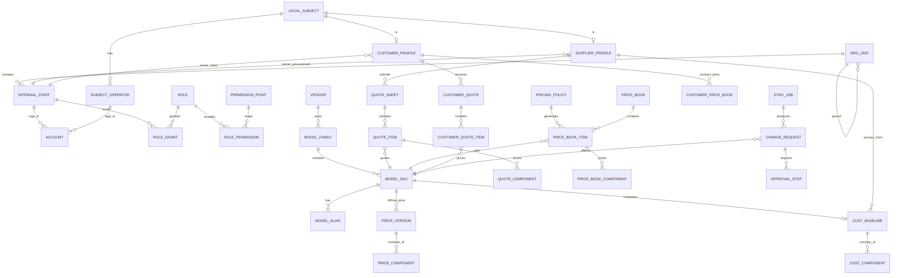
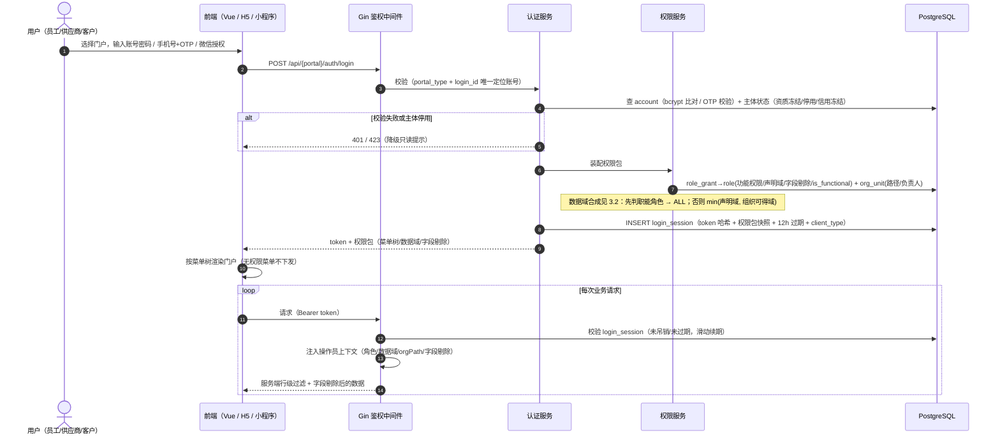
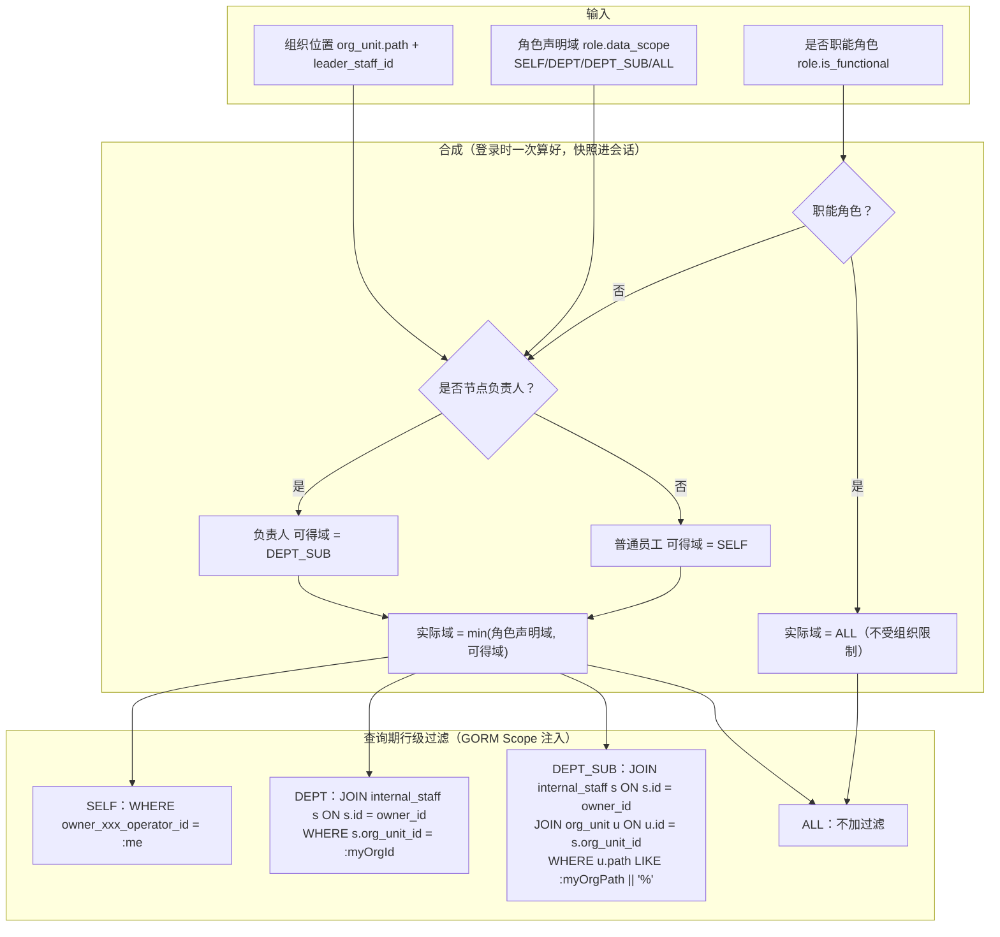
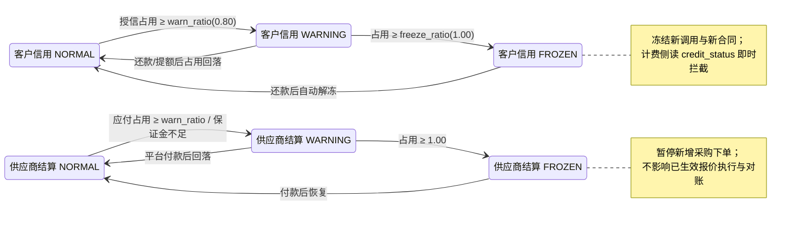
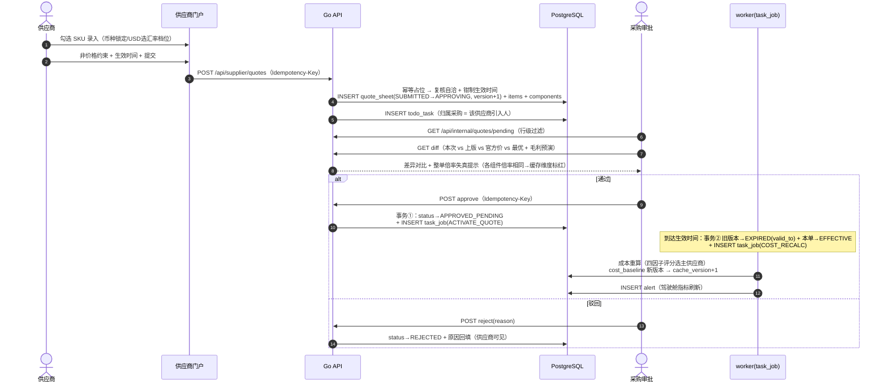
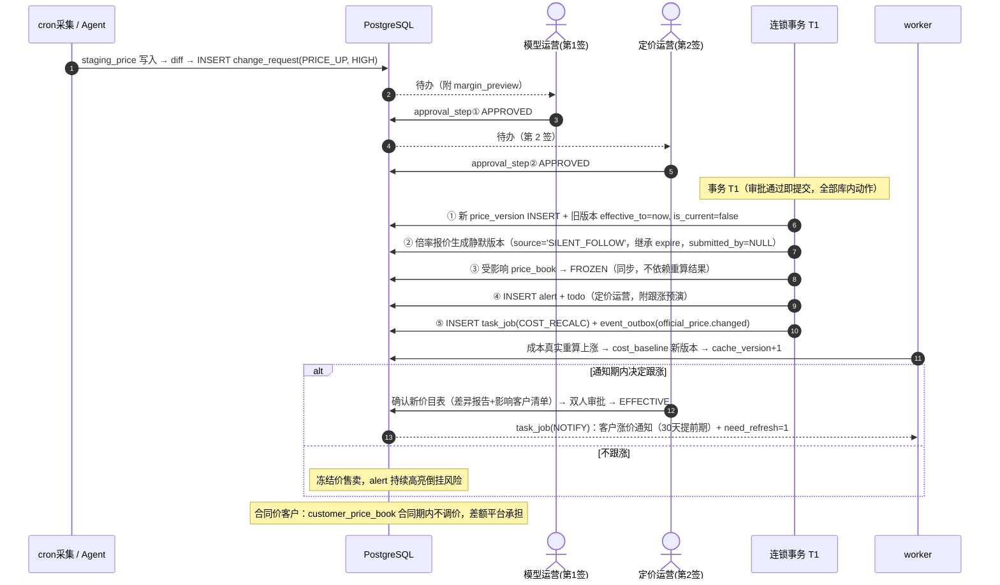

# 模型管理与定价中心 — 详细设计文档

> **版本** v1.1　**日期** 2026-09-08　**输入** 需求规格说明书 v1.4 + 《技术选型与一致性修订决议》v1.0
> **技术栈**：前端 Vue 3（Element Plus）｜H5 小程序（uni-app）｜后端 Go 1.22（Gin + GORM）｜数据库 PostgreSQL 15｜Redis 7（可选加速层，非强依赖）
> **本版相对 v1.0 的变更**：
> ① 数据库由 MySQL 8 迁移至 **PostgreSQL 15**（与既有 Dify 共用实例、独立 database），时间字段统一 `timestamptz`；
> ② 成本基线改为**不可变版本 + 生效区间 + 部分唯一索引**，兑现「历史时点成本可追溯」红线；
> ③ 逐组件价格从 JSON 拆为**独立组件表**（`*_component`），支撑缓存倒挂校验与 SQL 层比价；
> ④ 新增**幂等表**（含 `biz_key`，适配 Agent 调用）、**事件出站表**（对外集成）、**客户专属价目表**；
> ⑤ 新增第 8.11 开放接口、8.12 MCP Server 工具清单、8.13 多端适配约定、第 12 章 Redis 使用边界；
> ⑥ 补齐 v1.0 缺失的 DDL（`fx_rate_lock` / `pricing_policy` / `customer_quote_item` / `vendor` / `model_family` / `model_alias` / `subject_operator` / `staging_price` / `cache_version` 等）与 `sys_config` / `role_mutex`。

---

## 1 总体设计

### 1.1 技术选型与部署形态

| 层 | 选型 | 说明 |
| --- | --- | --- |
| 内部后台 / 双门户 | Vue 3 + Element Plus + Vite | 构建产物用 Go `embed.FS` 内嵌，单二进制交付 |
| 客户端 H5 | uni-app（编译 H5 + 微信小程序） | 客户侧自助场景；与 Vue 门户**共用同一套 REST 接口** |
| 后端 | Go 1.22 + Gin + GORM | 单进程承载：HTTP API + 内置 worker（任务表轮询）+ 进程内定时器（robfig/cron） |
| 数据库 | **PostgreSQL 15** | 唯一持久化与协调中心：业务数据、会话、任务队列、定时锁、版本号全部落库。与 Dify 共用实例、**独立 database 与 role** |
| 缓存 | **Redis 7（可选）** | 仅用于「有必要」的场景（见第 12 章）；**非强依赖**，不可用时系统功能不降级 |
| 部署 | 单台 CVM：nginx（SSL/反代）→ Go 单进程 → PostgreSQL | systemd 守护；每日 `pg_dump` + WAL 归档 |

> **为什么是 PostgreSQL**：本机已部署 Dify，其官方编排强制依赖 `postgres:15` 与 `redis:6`——PG 与 Redis 已在运行。选 MySQL 等于**再新增一套存储**（3 套存储 / 2 套备份策略 / +350~600MB 常驻内存）；选 PG 则是**不新增任何组件**（2 套存储 / 1 套备份 / 新增 database 几乎零内存增量）。此外，部分唯一索引、排他约束、`timestamptz`、`jsonb` 是本系统多个核心约束的唯一干净解法（见 2.5）。

### 1.2 关键能力映射：哪些约束靠数据库保证

v1.0 中大量一致性靠应用层代码保证，本版把能下推的约束**全部下推到 PostgreSQL**，让并发场景下"错不了"而不是"尽量不要错"。

| 业务约束 | 实现方式 | MySQL 能否做到 |
| --- | --- | --- |
| 每个 SKU 只有一个当前成本基线 | `UNIQUE INDEX ... WHERE is_current`（部分唯一索引） | 否 |
| 每个供应商同时最多一条生效报价、一条待生效报价 | 两个 `WHERE status=...` 部分唯一索引 | 否 |
| 每个客户等级同时最多一个生效价目表 | 同上 | 否 |
| 同一 SKU 的官方价版本区间不重叠 | `EXCLUDE USING gist (sku_id WITH =, 区间 WITH &&)` | 否 |
| 公司主体按 USCC 唯一、个人主体按手机号唯一（互不影响） | 两个 `WHERE subject_type=...` 部分唯一索引 | 否 |
| UTC 存储 + 按 Asia/Shanghai 判定生效 | `timestamptz` | 否（仅 `DATETIME`） |

### 1.3 进程内结构

```
Go 单进程
├── HTTP 层（Gin）
│   ├── 鉴权中间件（login_session 解析 → 操作员上下文）
│   ├── 幂等中间件（idempotency_key：request_id / biz_key / request_hash）
│   ├── 权限中间件（功能权限点校验 + 数据域注入 + 字段剔除）
│   └── 路由（/api/internal/**  /api/supplier/**  /api/customer/**  /api/open/**  /mcp/**）
├── 领域服务层
│   ├── 模型服务 / 同步服务 / 报价服务 / 成本服务 / 定价服务 / 客户报价服务
│   ├── 权限服务（角色/组织/权域合成）/ 商务服务（授信/押金）
│   └── 审计服务（append-only 写入）
├── 后台执行层
│   ├── cron 调度器（采集/重算/到期扫描/信用检查/提醒）
│   └── worker 池（task_job 轮询：成本重算/通知/级联生效/事件出站）
└── 基础设施层
    ├── GORM（连接池，PGX 驱动）/ 事务管理器（本地消息表）
    ├── 缓存门面（进程内 sync.Map 为主；Redis 可用时加速，不可用时自动降级）
    └── excelize（导入解析）/ robfig/cron / go-redis（可选）
```

### 1.4 多端接入形态

| 端 | 技术 | 账号 | 说明 |
| --- | --- | --- | --- |
| 内部运营后台 | Vue 3 + Element Plus | `internal_staff` + `account`（工号/手机号 + 密码） | 全功能，按角色渲染菜单 |
| 供应商门户 | Vue 3 + Element Plus | `subject_operator` + `account`（手机号 + OTP/密码） | 仅本主体数据 |
| 客户门户（浏览器） | Vue 3 + Element Plus | 同上 | 仅本主体数据 |
| 客户 H5 / 小程序 | uni-app | 微信授权 → 绑定 `subject_operator`；或手机号 + OTP | 与浏览器端**同一套接口**，见 8.13 适配约定 |

> 小程序端与浏览器端**不做接口分叉**：同一 REST 契约、同一鉴权、同一数据域与字段剔除规则。差异仅在 8.13 约定的聚合接口与鉴权入口。

---

## 2 数据模型设计（PostgreSQL 15）

### 2.1 核心对象关联

**图 D-1 核心对象关联总览**



### 2.2 表清单（45 张）

| 分组 | 表 | 说明 |
| --- | --- | --- |
| 账号权限组（9） | `org_unit` / `internal_staff` / `account` / `login_session` / `role` / `permission_point` / `role_permission` / `role_grant` / `role_mutex` | 组织树、员工、登录、会话、RBAC、互斥 |
| 主体档案组（6） | `legal_subject` / `subject_operator` / `supplier_profile` / `customer_profile` / `credit_txn` / `deposit_txn` | 外部主体、双边档案、授信/押金流水 |
| 模型主数据组（6） | `vendor` / `model_family` / `model_sku` / `model_alias` / `price_version` / `price_component` | 模型档案与官方价不可变版本 |
| 报价成本组（6） | `quote_sheet` / `quote_item` / `quote_component` / `cost_baseline` / `cost_component` / `fx_rate_lock` | 供应商报价、成本基线、汇率锁定 |
| 定价销售组（7） | `pricing_policy` / `price_book` / `price_book_item` / `price_book_component` / `customer_quote` / `customer_quote_item` / `customer_price_book` | 策略、价目表、客户报价、合同价 |
| 流程审计组（10） | `sync_job` / `staging_price` / `change_request` / `approval_step` / `model_application` / `task_job` / `event_outbox` / `idempotency_key` / `audit_log` / `alert` / `todo_task` | 采集、变更审批、异步任务、事件、幂等、审计告警 |
| 系统支撑（3） | `cache_version` / `cron_lock` / `sys_config` | 缓存版本、定时锁、系统参数 |

> 相对 v1.0 新增：`role_mutex`、`quote_component`、`cost_component`、`price_book_component`、`customer_price_book`、`event_outbox`、`idempotency_key`、`sys_config`。
> 相对 v1.0 移除：无（`supplier_binding`、`settlement_account` 本期不做，已从需求 ER 中移除）。

### 2.3 通用设计模式

**不可变版本模式**（官方价 / 报价单 / 价目表 / 客户报价 / **成本基线** 共用）：

```
version_no 单调递增 + valid_from/valid_to 生效区间 + is_current 当前标记
+ change_reason 变更原因 + created_by/created_at 审计
```

- 改值 = 同事务「新版本 INSERT + 旧版本 `valid_to = :event_time, is_current = false`」；
- 每实体一个**部分唯一索引** `UNIQUE(sku_id/...) WHERE is_current`，由数据库保证「最多一个当前版本」；
- 历史时点查询：`WHERE xx_id = :id AND valid_from <= :t AND (valid_to IS NULL OR valid_to > :t)`；
- **值未变则不产生新版本**（避免日终全量重算造成版本膨胀，见 5.4）。

**本地消息表**（替代 MQ）：异步连锁动作（成本重算、通知、事件出站）一律 `INSERT task_job / event_outbox` 与业务变更**同事务**提交；worker 轮询执行，失败指数退避重试 5 次后 `DEAD` 并告警。

**幂等**：写接口经 `idempotency_key` 中间件，见 2.4.7 与第 12 章。

**精度**：金额一律 `numeric(20,8)`，Go 侧用 `shopspring/decimal`，全程禁止 `float64` 参与金额运算。

**时间**：一律 `timestamptz` 存 UTC；展示按用户时区；**生效时间判定统一按 `Asia/Shanghai`**（Go 侧 `time.LoadLocation` 换算后与库比较）。

> **注意**：PostgreSQL 无 `ON UPDATE CURRENT_TIMESTAMP`。所有 `updated_at` 由 GORM 的 `AutoUpdateTime` 在应用层维护，审计场景亦依赖此时间戳。

### 2.4 核心表 DDL

```sql
CREATE EXTENSION IF NOT EXISTS btree_gist;   -- 排他约束需要
CREATE EXTENSION IF NOT EXISTS pg_trgm;      -- 模型名模糊查重（编辑距离/相似度）
```

#### 2.4.1 账号权限组

```sql
CREATE TABLE org_unit (
  id               bigint GENERATED ALWAYS AS IDENTITY PRIMARY KEY,
  parent_id        bigint NULL REFERENCES org_unit(id),
  name             varchar(64)  NOT NULL,
  unit_type        varchar(16)  NOT NULL DEFAULT 'DEPT',   -- COMPANY/DEPT/TEAM
  leader_staff_id  bigint NULL,                            -- 负责人 → DEPT_SUB 覆盖
  path             varchar(512) NOT NULL,                  -- 物化路径 '/1/3/7/'
  status           varchar(16)  NOT NULL DEFAULT 'ACTIVE',
  created_at       timestamptz  NOT NULL DEFAULT now(),
  updated_at       timestamptz  NOT NULL DEFAULT now()
);
CREATE INDEX idx_org_parent ON org_unit(parent_id);
CREATE INDEX idx_org_path   ON org_unit(path);

CREATE TABLE internal_staff (
  id          bigint GENERATED ALWAYS AS IDENTITY PRIMARY KEY,
  org_unit_id bigint      NOT NULL REFERENCES org_unit(id),
  name        varchar(64) NOT NULL,
  mobile      varchar(20) NOT NULL,
  email       varchar(128) NULL,
  status      varchar(16) NOT NULL DEFAULT 'ACTIVE',        -- ACTIVE/SUSPENDED
  created_at  timestamptz NOT NULL DEFAULT now(),
  updated_at  timestamptz NOT NULL DEFAULT now()
);
CREATE UNIQUE INDEX uk_staff_mobile ON internal_staff(mobile);
CREATE INDEX idx_staff_org ON internal_staff(org_unit_id);

CREATE TABLE account (
  id            bigint GENERATED ALWAYS AS IDENTITY PRIMARY KEY,
  portal_type   varchar(16) NOT NULL,                       -- INTERNAL/SUPPLIER/CUSTOMER
  owner_type    varchar(16) NOT NULL,                       -- STAFF/OPERATOR
  owner_id      bigint      NOT NULL,                       -- internal_staff.id 或 subject_operator.id
  login_id      varchar(64) NOT NULL,
  password_hash varchar(128) NULL,                          -- OTP-only 账号可为空
  wx_openid     varchar(64) NULL,                           -- 小程序绑定（客户/供应商端）
  status        varchar(16) NOT NULL DEFAULT 'ACTIVE',
  last_login_at timestamptz NULL,
  created_at    timestamptz NOT NULL DEFAULT now(),
  CONSTRAINT uk_portal_login UNIQUE (portal_type, login_id) -- 按门户隔离账号空间
);
CREATE UNIQUE INDEX uk_account_owner ON account(owner_type, owner_id);
CREATE INDEX idx_account_openid ON account(wx_openid) WHERE wx_openid IS NOT NULL;

CREATE TABLE login_session (
  id            bigint GENERATED ALWAYS AS IDENTITY PRIMARY KEY,
  account_id    bigint      NOT NULL REFERENCES account(id),
  token_hash    char(64)    NOT NULL,                       -- sha256(token)
  portal_type   varchar(16) NOT NULL,
  client_type   varchar(16) NOT NULL DEFAULT 'WEB',         -- WEB/H5/MP/OPEN
  operator_type varchar(16) NOT NULL,                       -- STAFF/SUPPLIER/CUSTOMER
  operator_id   bigint      NOT NULL,
  role_snapshot jsonb       NOT NULL,                       -- 权限包快照：角色/数据域/字段剔除
  expires_at    timestamptz NOT NULL,                       -- 12h 滑动续期
  revoked       boolean     NOT NULL DEFAULT false,
  created_at    timestamptz NOT NULL DEFAULT now()
);
CREATE UNIQUE INDEX uk_session_token ON login_session(token_hash);
CREATE INDEX idx_session_expiry ON login_session(expires_at);
CREATE INDEX idx_session_operator ON login_session(operator_type, operator_id);

CREATE TABLE role (
  id         bigint GENERATED ALWAYS AS IDENTITY PRIMARY KEY,
  code       varchar(32) NOT NULL,                          -- PLATFORM_ADMIN/MODEL_OPS/PROCUREMENT/...
  name       varchar(64) NOT NULL,
  data_scope varchar(16) NOT NULL,                          -- SELF/DEPT/DEPT_SUB/ALL
  field_mask jsonb       NULL,                              -- {"hide":["cost","margin"]}
  is_functional boolean  NOT NULL DEFAULT false,            -- 职能角色：不受组织位置限制，直接 ALL
  CONSTRAINT uk_role_code UNIQUE (code)
);

CREATE TABLE permission_point (
  id          bigint GENERATED ALWAYS AS IDENTITY PRIMARY KEY,
  module_code varchar(8)  NOT NULL,                         -- M1..M12（见 3.4 对照表）
  action_code varchar(8)  NOT NULL,                         -- V/E/A/C/P
  name        varchar(64) NOT NULL,
  CONSTRAINT uk_module_action UNIQUE (module_code, action_code)
);

CREATE TABLE role_permission (
  role_id             bigint NOT NULL REFERENCES role(id),
  permission_point_id bigint NOT NULL REFERENCES permission_point(id),
  PRIMARY KEY (role_id, permission_point_id)
);

CREATE TABLE role_grant (
  id         bigint GENERATED ALWAYS AS IDENTITY PRIMARY KEY,
  staff_id   bigint      NOT NULL REFERENCES internal_staff(id),
  role_id    bigint      NOT NULL REFERENCES role(id),
  granted_by bigint      NOT NULL,
  granted_at timestamptz NOT NULL DEFAULT now(),
  expires_at timestamptz NULL
);
CREATE INDEX idx_grant_staff ON role_grant(staff_id);

CREATE TABLE role_mutex (
  role_a varchar(32) NOT NULL,
  role_b varchar(32) NOT NULL,
  PRIMARY KEY (role_a, role_b)
);
-- 初始数据：销售不得兼任定价运营或采购
INSERT INTO role_mutex VALUES ('SALES','PRICING_OP'), ('SALES','PROCUREMENT');
```

#### 2.4.2 主体档案组

```sql
CREATE TABLE legal_subject (
  id                  bigint GENERATED ALWAYS AS IDENTITY PRIMARY KEY,
  subject_type        varchar(16) NOT NULL,                 -- COMPANY/INDIVIDUAL
  legal_name          varchar(128) NOT NULL,
  uscc                varchar(18) NULL,                     -- 公司：统一社会信用代码
  mobile              varchar(20) NULL,                     -- 个人/联系人手机号
  real_name           varchar(64) NULL,
  verification_status varchar(16) NOT NULL DEFAULT 'PENDING',
  created_at          timestamptz NOT NULL DEFAULT now()
);
-- 类型作用域唯一：公司按 USCC，个人按手机号，互不干扰
CREATE UNIQUE INDEX uk_subject_uscc   ON legal_subject(uscc)   WHERE subject_type = 'COMPANY';
CREATE UNIQUE INDEX uk_subject_mobile ON legal_subject(mobile) WHERE subject_type = 'INDIVIDUAL';

CREATE TABLE subject_operator (
  id          bigint GENERATED ALWAYS AS IDENTITY PRIMARY KEY,
  subject_id  bigint      NOT NULL REFERENCES legal_subject(id),
  name        varchar(64) NOT NULL,
  mobile      varchar(20) NOT NULL,
  is_primary  boolean     NOT NULL DEFAULT false,           -- 主操作员
  status      varchar(16) NOT NULL DEFAULT 'ACTIVE',
  created_at  timestamptz NOT NULL DEFAULT now()
);
CREATE UNIQUE INDEX uk_operator_mobile ON subject_operator(mobile);
CREATE INDEX idx_operator_subject ON subject_operator(subject_id);

CREATE TABLE supplier_profile (
  id                            bigint GENERATED ALWAYS AS IDENTITY PRIMARY KEY,
  subject_id                    bigint NOT NULL REFERENCES legal_subject(id),
  channel_type                  varchar(24) NOT NULL,       -- 官方直连/官方转售/中转聚合/逆向
  settle_type                   varchar(16) NOT NULL DEFAULT 'PREPAID',  -- PREPAID/MONTHLY
  billing_cycle                 integer     NOT NULL DEFAULT 30,
  min_recharge                  numeric(20,2) NOT NULL DEFAULT 0,
  credit_line                   numeric(20,2) NOT NULL DEFAULT 0,
  credit_used                   numeric(20,2) NOT NULL DEFAULT 0,
  deposit_amount                numeric(20,2) NOT NULL DEFAULT 0,
  settle_status                 varchar(16) NOT NULL DEFAULT 'NORMAL',   -- NORMAL/WARNING/FROZEN
  qual_status                   varchar(16) NOT NULL DEFAULT 'VALID',    -- VALID/EXPIRING/FROZEN
  owner_procurement_operator_id bigint NOT NULL REFERENCES internal_staff(id),
  status                        varchar(16) NOT NULL DEFAULT 'ACTIVE',
  created_at                    timestamptz NOT NULL DEFAULT now(),
  updated_at                    timestamptz NOT NULL DEFAULT now()
);
CREATE UNIQUE INDEX uk_supplier_subject ON supplier_profile(subject_id);
CREATE INDEX idx_supplier_owner ON supplier_profile(owner_procurement_operator_id);  -- 行级过滤

CREATE TABLE customer_profile (
  id                      bigint GENERATED ALWAYS AS IDENTITY PRIMARY KEY,
  subject_id              bigint NOT NULL REFERENCES legal_subject(id),
  level_code              varchar(16) NOT NULL DEFAULT 'BASIC',   -- FREE/BASIC/PRO/ENTERPRISE
  payment_type            varchar(16) NOT NULL DEFAULT 'PREPAID', -- PREPAID/MONTHLY/PAYG
  billing_cycle           integer     NOT NULL DEFAULT 30,
  credit_limit            numeric(20,2) NOT NULL DEFAULT 0,
  credit_used             numeric(20,2) NOT NULL DEFAULT 0,
  deposit_amount          numeric(20,2) NOT NULL DEFAULT 0,
  deposit_status          varchar(16) NOT NULL DEFAULT 'UNPAID',  -- UNPAID/PAID/FROZEN/REFUNDED
  credit_status           varchar(16) NOT NULL DEFAULT 'NORMAL',  -- NORMAL/WARNING/FROZEN
  invoice_type            varchar(16) NOT NULL DEFAULT 'SPECIAL',
  owner_sales_operator_id bigint NOT NULL REFERENCES internal_staff(id),
  status                  varchar(16) NOT NULL DEFAULT 'ACTIVE',
  created_at              timestamptz NOT NULL DEFAULT now(),
  updated_at              timestamptz NOT NULL DEFAULT now()
);
CREATE UNIQUE INDEX uk_customer_subject ON customer_profile(subject_id);
CREATE INDEX idx_customer_owner ON customer_profile(owner_sales_operator_id);

CREATE TABLE credit_txn (                                    -- 授信流水 append-only
  id          bigint GENERATED ALWAYS AS IDENTITY PRIMARY KEY,
  customer_id bigint NOT NULL REFERENCES customer_profile(id),
  direction   varchar(8)   NOT NULL,                         -- CONSUME/REPAY/ADJUST
  amount      numeric(20,2) NOT NULL,
  balance_after numeric(20,2) NOT NULL,
  ref_type    varchar(32) NULL,
  ref_id      bigint NULL,
  operator_id bigint NOT NULL,
  created_at  timestamptz NOT NULL DEFAULT now()
);
CREATE INDEX idx_credit_cust ON credit_txn(customer_id, created_at);

CREATE TABLE deposit_txn (                                   -- 押金流水 append-only
  id          bigint GENERATED ALWAYS AS IDENTITY PRIMARY KEY,
  subject_side varchar(8) NOT NULL,                          -- CUSTOMER/SUPPLIER
  profile_id  bigint NOT NULL,
  direction   varchar(8)  NOT NULL,                          -- PAY/DEDUCT/REFUND
  amount      numeric(20,2) NOT NULL,
  balance_after numeric(20,2) NOT NULL,
  reason      varchar(256) NULL,
  operator_id bigint NOT NULL,
  created_at  timestamptz NOT NULL DEFAULT now()
);
CREATE INDEX idx_deposit_profile ON deposit_txn(subject_side, profile_id, created_at);
```

#### 2.4.3 模型主数据组

```sql
CREATE TABLE vendor (
  id         bigint GENERATED ALWAYS AS IDENTITY PRIMARY KEY,
  code       varchar(32) NOT NULL,
  name       varchar(128) NOT NULL,
  country    varchar(32) NULL,
  created_at timestamptz NOT NULL DEFAULT now(),
  CONSTRAINT uk_vendor_code UNIQUE (code)
);

CREATE TABLE model_family (
  id         bigint GENERATED ALWAYS AS IDENTITY PRIMARY KEY,
  vendor_id  bigint NOT NULL REFERENCES vendor(id),
  name       varchar(128) NOT NULL,                          -- 如 GPT-5
  created_at timestamptz NOT NULL DEFAULT now()
);
CREATE UNIQUE INDEX uk_family ON model_family(vendor_id, name);

CREATE TABLE model_sku (
  id              bigint GENERATED ALWAYS AS IDENTITY PRIMARY KEY,
  vendor_id       bigint NOT NULL REFERENCES vendor(id),
  family_id       bigint NOT NULL REFERENCES model_family(id),
  sku_code        varchar(128) NOT NULL,                     -- gpt-5-2026-04-11
  model_type      varchar(24) NOT NULL,                      -- 对话/推理/多模态/向量/...
  native_currency char(3)   NOT NULL,                        -- USD/CNY
  context_window  integer   NULL,
  capability      jsonb     NULL,                            -- 能力参数（内联，原 MODEL_CAPABILITY 实体）
  verify_status   varchar(16) NOT NULL DEFAULT 'UNVERIFIED', -- UNVERIFIED/MANUAL/PROBED
  tier_tag        varchar(16) NULL,                          -- 旗舰/主力/经济/长尾
  is_sensitive    boolean   NOT NULL DEFAULT false,
  cross_border    boolean   NOT NULL DEFAULT false,
  lifecycle_status varchar(16) NOT NULL DEFAULT 'DRAFT',
  sunset_date     date      NULL,
  created_at      timestamptz NOT NULL DEFAULT now(),
  updated_at      timestamptz NOT NULL DEFAULT now(),
  CONSTRAINT uk_sku_code UNIQUE (sku_code)
);
CREATE INDEX idx_sku_family ON model_sku(family_id);
CREATE INDEX idx_sku_status ON model_sku(lifecycle_status);
CREATE INDEX idx_sku_name_trgm ON model_sku USING gin (sku_code gin_trgm_ops);  -- 查重

CREATE TABLE model_alias (
  id         bigint GENERATED ALWAYS AS IDENTITY PRIMARY KEY,
  sku_id     bigint NOT NULL REFERENCES model_sku(id),
  alias      varchar(128) NOT NULL,
  source     varchar(16) NOT NULL DEFAULT 'MANUAL',          -- MANUAL/MERGE/IMPORT
  created_at timestamptz NOT NULL DEFAULT now(),
  CONSTRAINT uk_alias UNIQUE (alias)                         -- 一个别名只能指向一个 SKU
);
CREATE INDEX idx_alias_sku ON model_alias(sku_id);

CREATE TABLE price_version (                                 -- 官方价：不可变版本
  id                bigint GENERATED ALWAYS AS IDENTITY PRIMARY KEY,
  sku_id            bigint NOT NULL REFERENCES model_sku(id),
  version_no        integer NOT NULL,
  currency          char(3) NOT NULL,
  tax_basis         varchar(16) NOT NULL,                    -- GROSS/NET
  effective_from    timestamptz NOT NULL,
  effective_to      timestamptz NULL,
  is_current        boolean NOT NULL DEFAULT true,
  source            varchar(24) NOT NULL,                    -- MANUAL/IMPORT/SYNC/SILENT_FOLLOW
  confidence        varchar(8) NULL,
  change_request_id bigint NULL,
  created_by        bigint NOT NULL,
  created_at        timestamptz NOT NULL DEFAULT now(),
  CONSTRAINT uk_price_ver UNIQUE (sku_id, version_no)
);
CREATE UNIQUE INDEX uk_price_current ON price_version(sku_id) WHERE is_current;
CREATE INDEX idx_price_range ON price_version(sku_id, effective_from, effective_to);
-- DB 层保证：同一 SKU 的官方价版本区间不重叠
ALTER TABLE price_version ADD COLUMN eff_range tstzrange
  GENERATED ALWAYS AS (tstzrange(effective_from, effective_to)) STORED;
ALTER TABLE price_version ADD CONSTRAINT ex_price_no_overlap
  EXCLUDE USING gist (sku_id WITH =, eff_range WITH &&);

CREATE TABLE price_component (                               -- 逐组件计价
  id               bigint GENERATED ALWAYS AS IDENTITY PRIMARY KEY,
  price_version_id bigint NOT NULL REFERENCES price_version(id),
  component_type   varchar(32) NOT NULL,                     -- input/output/cached_input/cache_write_5m/...
  unit_price       numeric(20,8) NOT NULL,                   -- 每百万 token 单价
  tier_rules       jsonb NULL,                               -- 阶梯规则（非价格，可 JSON）
  CONSTRAINT uk_pc UNIQUE (price_version_id, component_type)
);
CREATE INDEX idx_pc_type ON price_component(component_type);
```

#### 2.4.4 报价成本组

```sql
CREATE TABLE quote_sheet (                                   -- 供应商报价单：不可变版本
  id            bigint GENERATED ALWAYS AS IDENTITY PRIMARY KEY,
  supplier_id   bigint NOT NULL REFERENCES supplier_profile(id),
  version_no    integer NOT NULL,
  status        varchar(24) NOT NULL DEFAULT 'DRAFT',
  valid_from    timestamptz NOT NULL,                        -- 生效时间（必填，可预约）
  valid_to      timestamptz NOT NULL,                        -- 有效期止
  source        varchar(16) NOT NULL DEFAULT 'MANUAL',       -- MANUAL/IMPORT/RETRO/SILENT_FOLLOW
  retroactive   boolean NOT NULL DEFAULT false,
  audit_reason  text NULL,
  change_request_id bigint NULL,                             -- 静默跟随的触发变更单
  submitted_by  bigint NULL,                                 -- 静默版本为 NULL（系统生成）
  submitted_at  timestamptz NULL,
  created_at    timestamptz NOT NULL DEFAULT now(),
  CONSTRAINT uk_quote_ver UNIQUE (supplier_id, version_no)
);
-- DB 层保证：同一供应商最多一条「已生效」、最多一条「已批准·待生效」
CREATE UNIQUE INDEX uk_quote_effective ON quote_sheet(supplier_id) WHERE status = 'EFFECTIVE';
CREATE UNIQUE INDEX uk_quote_pending   ON quote_sheet(supplier_id) WHERE status = 'APPROVED_PENDING';
CREATE INDEX idx_quote_status_from ON quote_sheet(status, valid_from);
CREATE INDEX idx_quote_expire      ON quote_sheet(status, valid_to);

CREATE TABLE quote_item (
  id             bigint GENERATED ALWAYS AS IDENTITY PRIMARY KEY,
  quote_sheet_id bigint NOT NULL REFERENCES quote_sheet(id),
  sku_id         bigint NOT NULL REFERENCES model_sku(id),
  currency       char(3) NOT NULL,                           -- 锁定 = 模型币种
  fx_tier        numeric(6,3) NULL,                          -- 汇率档位（仅 USD 模型）
  constraints_   jsonb NULL,                                 -- 非价格约束（RPM/TPM/配额/上下文/兼容度）
  CONSTRAINT uk_quote_item UNIQUE (quote_sheet_id, sku_id)
);
CREATE INDEX idx_qi_sku ON quote_item(sku_id);

CREATE TABLE quote_component (                               -- 逐组件报价（从 JSON 拆出）
  id             bigint GENERATED ALWAYS AS IDENTITY PRIMARY KEY,
  quote_item_id  bigint NOT NULL REFERENCES quote_item(id),
  component_type varchar(32) NOT NULL,
  multiplier     numeric(12,6) NULL,                         -- 倍率模式：相对官方价
  unit_price     numeric(20,8) NOT NULL,                     -- 折算后单价（每百万 token）
  CONSTRAINT uk_qc UNIQUE (quote_item_id, component_type)
);
CREATE INDEX idx_qc_type ON quote_component(component_type, unit_price);  -- 比价/最低价

CREATE TABLE cost_baseline (                                 -- 成本基线：不可变版本（红线 2）
  id                  bigint GENERATED ALWAYS AS IDENTITY PRIMARY KEY,
  sku_id              bigint NOT NULL REFERENCES model_sku(id),
  version             integer NOT NULL,
  currency            char(3) NOT NULL,
  primary_supplier_id bigint NOT NULL REFERENCES supplier_profile(id),
  loss_rate           numeric(8,4) NOT NULL,
  channel_rate        numeric(8,4) NOT NULL,
  backup_sequence     jsonb NULL,
  calc_snapshot       jsonb NOT NULL,                        -- 报价版本/官方价版本/汇率/参数版本
  locked_manual       boolean NOT NULL DEFAULT false,
  change_reason       varchar(32) NOT NULL,                  -- 见下方枚举
  valid_from          timestamptz NOT NULL,
  valid_to            timestamptz NULL,
  is_current          boolean NOT NULL DEFAULT true,
  created_by          bigint NOT NULL,
  created_at          timestamptz NOT NULL DEFAULT now(),
  CONSTRAINT uk_cost_ver UNIQUE (sku_id, version)
);
CREATE UNIQUE INDEX uk_cost_current ON cost_baseline(sku_id) WHERE is_current;
CREATE INDEX idx_cost_asof ON cost_baseline(sku_id, valid_from, valid_to);
-- 可选：区间不重叠（与 price_version 同法）
ALTER TABLE cost_baseline ADD COLUMN valid_range tstzrange
  GENERATED ALWAYS AS (tstzrange(valid_from, valid_to)) STORED;
ALTER TABLE cost_baseline ADD CONSTRAINT ex_cost_no_overlap
  EXCLUDE USING gist (sku_id WITH =, valid_range WITH &&);
```

> `change_reason` 枚举：`QUOTE_EFFECTIVE` 报价生效 / `OFFICIAL_PRICE_CHANGE` 官方调价 / `RETRO` 特权补录 / `PARAM_CHANGE` 成本参数调整 / `MANUAL_LOCK` 人工锁定主供应商 / `DAILY_RECALC` 日终重算 / `SUPPLIER_SWITCH` 备选切换 / `EXPIRE_REMOVE` 到期剔除。
> **写入规则**：同事务「旧版本 `is_current=false, valid_to=:event_time` + 新版本 INSERT」；**若新值与当前版本的组件价格、`loss_rate`、`channel_rate`、`primary_supplier_id` 全部相同，则跳过不产生新版本**（防止日终全量重算把表撑成 182 万行/年）。

```sql
CREATE TABLE cost_component (                                -- 成本逐组件（从 JSON 拆出）
  id              bigint GENERATED ALWAYS AS IDENTITY PRIMARY KEY,
  cost_baseline_id bigint NOT NULL REFERENCES cost_baseline(id),
  component_type  varchar(32) NOT NULL,
  unit_cost       numeric(20,8) NOT NULL,                    -- 完全成本口径
  supplier_cost   numeric(20,8) NOT NULL,                    -- 供应商原始成本（溯源）
  CONSTRAINT uk_cc UNIQUE (cost_baseline_id, component_type)
);
CREATE INDEX idx_cc_type ON cost_component(component_type, unit_cost);

CREATE TABLE fx_rate_lock (                                  -- 月度汇率锁定
  id         bigint GENERATED ALWAYS AS IDENTITY PRIMARY KEY,
  ym         char(7)     NOT NULL,                           -- '2026-09'
  fx_tier    numeric(6,3) NOT NULL,                          -- 8 档之一
  locked_by  bigint NOT NULL,
  locked_at  timestamptz NOT NULL DEFAULT now(),
  adjust_reason varchar(256) NULL,                           -- 月中调整：双人审批 + 理由
  CONSTRAINT uk_fx_ym UNIQUE (ym)
);
```

#### 2.4.5 定价销售组

```sql
CREATE TABLE pricing_policy (
  id            bigint GENERATED ALWAYS AS IDENTITY PRIMARY KEY,
  code          varchar(32) NOT NULL,
  name          varchar(64) NOT NULL,
  scope_type    varchar(16) NOT NULL,                        -- ALL/MODEL_TYPE/VENDOR/FAMILY/SKU
  scope_id      bigint NULL,
  level_code    varchar(16) NULL,                            -- 叠加客户等级；NULL=全部
  customer_id   bigint NULL,                                 -- 特定客户优先
  price_method  varchar(16) NOT NULL,                        -- MARGIN/COST_UP/OFFICIAL_ANCHOR/FIXED
  param_value   numeric(12,6) NOT NULL,                      -- 目标毛利率/加成率/锚定倍数/固定价
  rounding_rule varchar(16) NOT NULL DEFAULT 'CEIL',         -- 尾数向上取整
  priority      integer NOT NULL DEFAULT 100,                -- 越小越优先
  status        varchar(16) NOT NULL DEFAULT 'ACTIVE',
  created_at    timestamptz NOT NULL DEFAULT now()
);
CREATE INDEX idx_policy_scope ON pricing_policy(scope_type, scope_id, priority);

CREATE TABLE price_book (
  id             bigint GENERATED ALWAYS AS IDENTITY PRIMARY KEY,
  version_no     integer NOT NULL,
  level_code     varchar(16) NOT NULL,                       -- 客户等级
  status         varchar(24) NOT NULL DEFAULT 'DRAFT',
  effective_time timestamptz NULL,
  valid_to       timestamptz NULL,
  rollback_of    bigint NULL,
  diff_report    jsonb NULL,
  created_by     bigint NOT NULL,
  created_at     timestamptz NOT NULL DEFAULT now(),
  CONSTRAINT uk_pb_ver UNIQUE (level_code, version_no)
);
CREATE UNIQUE INDEX uk_pb_effective ON price_book(level_code) WHERE status = 'EFFECTIVE';
CREATE INDEX idx_pb_status ON price_book(status, effective_time);

CREATE TABLE price_book_item (
  id               bigint GENERATED ALWAYS AS IDENTITY PRIMARY KEY,
  price_book_id    bigint NOT NULL REFERENCES price_book(id),
  sku_id           bigint NOT NULL REFERENCES model_sku(id),
  currency         char(3) NOT NULL,
  floor_price      numeric(20,8) NOT NULL,                   -- 完全成本 /(1-15%)，销售侧唯一下限
  policy_id        bigint NOT NULL REFERENCES pricing_policy(id),
  baseline_version integer NOT NULL,
  CONSTRAINT uk_pbi UNIQUE (price_book_id, sku_id)
);
CREATE INDEX idx_pbi_sku ON price_book_item(sku_id, currency);

CREATE TABLE price_book_component (
  id                bigint GENERATED ALWAYS AS IDENTITY PRIMARY KEY,
  price_book_item_id bigint NOT NULL REFERENCES price_book_item(id),
  component_type    varchar(32) NOT NULL,
  unit_price        numeric(20,8) NOT NULL,
  CONSTRAINT uk_pbc UNIQUE (price_book_item_id, component_type)
);

CREATE TABLE customer_quote (
  id                      bigint GENERATED ALWAYS AS IDENTITY PRIMARY KEY,
  customer_id             bigint NOT NULL REFERENCES customer_profile(id),
  version_no              integer NOT NULL,
  status                  varchar(24) NOT NULL DEFAULT 'DRAFT',
  need_refresh            boolean NOT NULL DEFAULT false,
  refresh_diff            jsonb NULL,
  special_price_status    varchar(16) NULL,
  valid_until             timestamptz NULL,
  price_book_version      integer NOT NULL,
  owner_sales_operator_id bigint NOT NULL REFERENCES internal_staff(id),
  origin_owner_id         bigint NULL,                       -- 移交前的原归属（业绩核算用）
  created_by              bigint NOT NULL,
  created_at              timestamptz NOT NULL DEFAULT now(),
  CONSTRAINT uk_cq_ver UNIQUE (customer_id, version_no)
);
CREATE UNIQUE INDEX uk_cq_formal ON customer_quote(customer_id) WHERE status = 'FORMAL';
CREATE INDEX idx_cq_owner ON customer_quote(owner_sales_operator_id);

CREATE TABLE customer_quote_item (
  id                bigint GENERATED ALWAYS AS IDENTITY PRIMARY KEY,
  customer_quote_id bigint NOT NULL REFERENCES customer_quote(id),
  sku_id            bigint NOT NULL REFERENCES model_sku(id),
  currency          char(3) NOT NULL,
  unit_price        numeric(20,8) NOT NULL,                  -- 价格快照
  floor_price       numeric(20,8) NOT NULL,                  -- 当时 floor（快照）
  CONSTRAINT uk_cqi UNIQUE (customer_quote_id, sku_id)
);

CREATE TABLE customer_price_book (                           -- 客户专属价目表（合同价载体）
  id          bigint GENERATED ALWAYS AS IDENTITY PRIMARY KEY,
  customer_id bigint NOT NULL REFERENCES customer_profile(id),
  sku_id      bigint NOT NULL REFERENCES model_sku(id),
  currency    char(3) NOT NULL,
  unit_price  numeric(20,8) NOT NULL,
  contract_from timestamptz NOT NULL,
  contract_to   timestamptz NOT NULL,                        -- 合同期内价格受保护
  source_quote_id bigint NULL,
  created_at  timestamptz NOT NULL DEFAULT now(),
  CONSTRAINT uk_cpb UNIQUE (customer_id, sku_id, contract_from)
);
CREATE INDEX idx_cpb_customer ON customer_price_book(customer_id, contract_to);
```

#### 2.4.6 流程审计组与系统支撑

```sql
CREATE TABLE sync_job (
  id          bigint GENERATED ALWAYS AS IDENTITY PRIMARY KEY,
  job_type    varchar(32) NOT NULL,                          -- SYNC_MODELS/SYNC_PRICES/SYNC_COMMUNITY
  source      varchar(32) NOT NULL,
  status      varchar(16) NOT NULL DEFAULT 'RUNNING',        -- RUNNING/SUCCESS/FAILED
  started_at  timestamptz NOT NULL DEFAULT now(),
  finished_at timestamptz NULL,
  error_msg   text NULL,
  item_count  integer NULL
);
CREATE INDEX idx_syncjob_type ON sync_job(job_type, started_at DESC);

CREATE TABLE staging_price (                                 -- 采集暂存区，绝不直接写生产
  id            bigint GENERATED ALWAYS AS IDENTITY PRIMARY KEY,
  sync_job_id   bigint NOT NULL REFERENCES sync_job(id),
  sku_id        bigint NULL,
  raw_sku_code  varchar(128) NULL,
  currency      char(3) NULL,
  payload       jsonb NOT NULL,                              -- 逐组件原始采集值
  source        varchar(32) NOT NULL,
  confidence    varchar(8) NULL,
  match_status  varchar(16) NOT NULL DEFAULT 'UNMATCHED',    -- UNMATCHED/MATCHED/CONFLICT
  processed     boolean NOT NULL DEFAULT false,
  created_at    timestamptz NOT NULL DEFAULT now()
);
CREATE INDEX idx_staging_job ON staging_price(sync_job_id, processed);

CREATE TABLE change_request (
  id            bigint GENERATED ALWAYS AS IDENTITY PRIMARY KEY,
  change_type   varchar(24) NOT NULL,                        -- NEW_MODEL/CAPABILITY/PRICE_DOWN/PRICE_UP/DEPRECATE
  sku_id        bigint NOT NULL REFERENCES model_sku(id),
  risk_level    varchar(8) NOT NULL,                         -- LOW/MID/HIGH
  payload       jsonb NOT NULL,
  status        varchar(24) NOT NULL DEFAULT 'PENDING',
  margin_preview jsonb NULL,
  confirm_required boolean NOT NULL DEFAULT false,           -- 多源不一致 → 强制人工确认
  created_by    varchar(24) NOT NULL DEFAULT 'SYNC_JOB',
  created_at    timestamptz NOT NULL DEFAULT now()
);
CREATE INDEX idx_cr_status ON change_request(status, created_at);

CREATE TABLE approval_step (
  id            bigint GENERATED ALWAYS AS IDENTITY PRIMARY KEY,
  biz_type      varchar(24) NOT NULL,                        -- CHANGE_REQUEST/PRICE_BOOK/SPECIAL_PRICE/RETRO_GRANT/DEPRECATE
  biz_id        bigint NOT NULL,
  step_no       integer NOT NULL,
  required_role varchar(32) NOT NULL,
  approver_id   bigint NULL,
  decision      varchar(16) NULL,
  comment       varchar(512) NULL,
  decided_at    timestamptz NULL,
  CONSTRAINT uk_step UNIQUE (biz_type, biz_id, step_no)
);
CREATE INDEX idx_appr_biz ON approval_step(biz_type, biz_id);

CREATE TABLE model_application (
  id          bigint GENERATED ALWAYS AS IDENTITY PRIMARY KEY,
  supplier_id bigint NOT NULL REFERENCES supplier_profile(id),
  model_name  varchar(128) NOT NULL,
  vendor_id   bigint NULL,
  payload     jsonb NOT NULL,
  dup_top3    jsonb NULL,
  status      varchar(16) NOT NULL DEFAULT 'SUBMITTED',      -- SUBMITTED/MERGED/APPROVED/REJECTED
  merged_sku_id bigint NULL,
  reject_reason varchar(512) NULL,
  created_at  timestamptz NOT NULL DEFAULT now()
);
CREATE INDEX idx_ma_supplier ON model_application(supplier_id, status);

CREATE TABLE task_job (                                      -- 本地消息表
  id          bigint GENERATED ALWAYS AS IDENTITY PRIMARY KEY,
  job_type    varchar(32) NOT NULL,                          -- COST_RECALC/NOTIFY/ACTIVATE_QUOTE/...
  payload     jsonb NOT NULL,
  status      varchar(16) NOT NULL DEFAULT 'PENDING',
  retry_count integer NOT NULL DEFAULT 0,
  next_run_at timestamptz NOT NULL DEFAULT now(),
  last_error  text NULL,
  created_at  timestamptz NOT NULL DEFAULT now()
);
CREATE INDEX idx_task_poll ON task_job(status, next_run_at);

CREATE TABLE event_outbox (                                  -- 对外事件出站（见 8.11）
  id          bigint GENERATED ALWAYS AS IDENTITY PRIMARY KEY,
  event_type  varchar(48) NOT NULL,                          -- model.published/model.deprecated/price.effective/...
  payload     jsonb NOT NULL,
  status      varchar(16) NOT NULL DEFAULT 'PENDING',
  retry_count integer NOT NULL DEFAULT 0,
  next_run_at timestamptz NOT NULL DEFAULT now(),
  created_at  timestamptz NOT NULL DEFAULT now()
);
CREATE INDEX idx_event_poll ON event_outbox(status, next_run_at);

CREATE TABLE idempotency_key (                               -- 幂等（见 2.3 与第 12 章）
  id           bigint GENERATED ALWAYS AS IDENTITY PRIMARY KEY,
  biz_type     varchar(48)  NOT NULL,
  biz_key      varchar(255) NULL,                            -- 业务语义键（Agent 场景必需）
  request_id   varchar(64)  NOT NULL,
  request_hash char(64)     NOT NULL,
  status       varchar(16)  NOT NULL,                        -- PROCESSING/DONE/FAILED
  result_json  jsonb NULL,
  created_at   timestamptz  NOT NULL DEFAULT now(),
  expire_at    timestamptz  NOT NULL,
  CONSTRAINT uk_idem UNIQUE (biz_type, request_id)
);
CREATE INDEX idx_idem_bizkey ON idempotency_key(biz_type, biz_key) WHERE biz_key IS NOT NULL;
CREATE INDEX idx_idem_expire ON idempotency_key(expire_at);

CREATE TABLE audit_log (
  id            bigint GENERATED ALWAYS AS IDENTITY PRIMARY KEY,
  operator_id   bigint NOT NULL,                             -- 系统任务填系统账号 0
  operator_role varchar(32) NOT NULL,
  action        varchar(48) NOT NULL,
  target_type   varchar(32) NOT NULL,
  target_id     bigint NOT NULL,
  before_value  jsonb NULL,
  after_value   jsonb NULL,
  reason        varchar(512) NULL,
  source_type   varchar(16) NOT NULL DEFAULT 'HUMAN',        -- HUMAN/CRON/WORKER/AGENT
  source_id     varchar(64) NULL,                            -- Agent：工作流 ID / 会话 ID
  created_at    timestamptz NOT NULL DEFAULT now()
);
CREATE INDEX idx_audit_target ON audit_log(target_type, target_id);
CREATE INDEX idx_audit_op_time ON audit_log(operator_id, created_at DESC);
CREATE INDEX idx_audit_source ON audit_log(source_type, source_id) WHERE source_id IS NOT NULL;

CREATE TABLE alert (
  id          bigint GENERATED ALWAYS AS IDENTITY PRIMARY KEY,
  alert_type  varchar(32) NOT NULL,
  severity    varchar(8)  NOT NULL,                          -- LOW/MID/HIGH/CRITICAL
  target_type varchar(32) NULL,
  target_id   bigint NULL,
  message     varchar(512) NOT NULL,
  status      varchar(16) NOT NULL DEFAULT 'OPEN',           -- OPEN/HANDLING/RESOLVED/IGNORED
  assigned_role varchar(32) NULL,
  handle_note varchar(512) NULL,
  created_at  timestamptz NOT NULL DEFAULT now(),
  resolved_at timestamptz NULL
);
CREATE INDEX idx_alert_status ON alert(status, severity, created_at DESC);

CREATE TABLE todo_task (
  id          bigint GENERATED ALWAYS AS IDENTITY PRIMARY KEY,
  biz_type    varchar(32) NOT NULL,
  biz_id      bigint NOT NULL,
  assignee_id bigint NULL,
  assignee_role varchar(32) NULL,
  title       varchar(256) NOT NULL,
  priority    varchar(8) NOT NULL DEFAULT 'MID',
  status      varchar(16) NOT NULL DEFAULT 'OPEN',
  due_at      timestamptz NULL,
  created_at  timestamptz NOT NULL DEFAULT now()
);
CREATE INDEX idx_todo_assignee ON todo_task(assignee_id, status);
CREATE INDEX idx_todo_role ON todo_task(assignee_role, status);

CREATE TABLE cache_version (
  cache_key varchar(64) PRIMARY KEY,
  version   bigint NOT NULL DEFAULT 1,
  updated_at timestamptz NOT NULL DEFAULT now()
);

CREATE TABLE cron_lock (
  job_name varchar(64) NOT NULL,
  run_date date       NOT NULL,
  locked_at timestamptz NOT NULL DEFAULT now(),
  PRIMARY KEY (job_name, run_date)
);

CREATE TABLE sys_config (
  config_key   varchar(64) PRIMARY KEY,
  config_value text NOT NULL,
  description  varchar(256) NULL,
  updated_at   timestamptz NOT NULL DEFAULT now()
);
-- 初始参数
INSERT INTO sys_config(config_key, config_value, description) VALUES
 ('retro_monthly_limit', '5', '特权补录当月告警阈值'),
 ('credit_warn_ratio',   '0.80', '授信占用预警阈值'),
 ('credit_freeze_ratio', '1.00', '授信占用冻结阈值'),
 ('settle_warn_ratio',   '0.80', '应付占用预警阈值'),
 ('quote_anomaly_pct',   '0.20', '报价偏离上一版本阈值'),
 ('quote_anomaly_mkt',   '0.30', '报价偏离市场最低价阈值'),
 ('min_gross_margin',    '0.15', '最低销售毛利率红线'),
 ('quote_grace_days',    '3',    '报价到期宽限期天数'),
 ('price_up_notice_days','30',   '涨价提前通知天数');
```

### 2.5 关键约束清单（数据库层硬保证）

| # | 约束 | DDL |
| --- | --- | --- |
| 1 | 每 SKU 只有一个当前成本基线 | `UNIQUE INDEX uk_cost_current ON cost_baseline(sku_id) WHERE is_current` |
| 2 | 成本基线区间不重叠 | `EXCLUDE USING gist (sku_id WITH =, valid_range WITH &&)` |
| 3 | 每供应商最多一条生效报价 | `UNIQUE INDEX uk_quote_effective ON quote_sheet(supplier_id) WHERE status='EFFECTIVE'` |
| 4 | 每供应商最多一条待生效报价 | `UNIQUE INDEX uk_quote_pending ... WHERE status='APPROVED_PENDING'` |
| 5 | 每客户等级最多一个生效价目表 | `UNIQUE INDEX uk_pb_effective ON price_book(level_code) WHERE status='EFFECTIVE'` |
| 6 | 每客户最多一份正式报价 | `UNIQUE INDEX uk_cq_formal ON customer_quote(customer_id) WHERE status='FORMAL'` |
| 7 | 官方价版本区间不重叠 | `EXCLUDE USING gist (sku_id WITH =, eff_range WITH &&)` |
| 8 | 每 SKU 只有一个当前官方价 | `UNIQUE INDEX uk_price_current ON price_version(sku_id) WHERE is_current` |
| 9 | 公司按 USCC 唯一 / 个人按手机号唯一 | 两个 `WHERE subject_type=...` 部分唯一索引 |
| 10 | 一个别名只能指向一个 SKU | `UNIQUE (alias)` |
| 11 | 幂等键唯一 | `UNIQUE (biz_type, request_id)` |
| 12 | 组件在实体内唯一 | `UNIQUE (父 id, component_type)` × 5 张组件表 |
| 13 | 账号按门户隔离 + 一个主体操作员一个账号 | `UNIQUE(portal_type, login_id)` + `UNIQUE(owner_type, owner_id)` |

> 上表第 1~8 项在并发下由数据库直接拒绝，**不依赖应用层条件更新的正确性**；应用层仍保留条件更新（`UPDATE ... WHERE status='旧态'`）用于给出友好错误。

### 2.6 状态字典（中文态 ↔ 枚举值，需求与设计共用）

| 实体 | 中文态 | 枚举值 | 触发者 |
| --- | --- | --- | --- |
| 模型 SKU | 草稿 / 待验证 / 可采购 / 已上架 / 即将下线 / 已下线 | `DRAFT` / `PENDING_VERIFY` / `PURCHASABLE` / `PUBLISHED` / `DEPRECATING` / `OFFLINE` | 模型运营 / 定价运营 |
| 供应商报价单 | 草稿 / 已提交 / 审批中 / 已批准·待生效 / 已生效 / 已结束（过期·作废·被覆盖）/ 已驳回 | `DRAFT` / `SUBMITTED` / `APPROVING` / `APPROVED_PENDING` / `EFFECTIVE` / `EXPIRED` / `VOIDED` / `REJECTED` | 供应商 / 采购 / cron |
| 官方价变更单 | 待处理 / 人工确认 / 审批中 / 已批准 / 已生效 / 已拒绝 | `PENDING` / `CONFIRMING` / `APPROVING` / `APPROVED` / `EFFECTIVE` / `REJECTED` | 采集服务 / 模型运营 / 定价运营 |
| 价目表 | 草稿 / 审批中 / 待生效 / 已生效 / 已冻结 / 已替代 | `DRAFT` / `APPROVING` / `PENDING_EFFECTIVE` / `EFFECTIVE` / `FROZEN` / `RETIRED` | 定价运营 / 第二审批人 / cron |
| 客户报价 | 草稿 / 临时 / 已报价 / 成交 / 已过期 | `DRAFT` / `TEMP` / `FORMAL` / `CONTRACT` / `EXPIRED` | 销售 / 客户 |
| 客户信用 | 正常 / 超额预警 / 超额冻结 | `NORMAL` / `WARNING` / `FROZEN` | 消费事件 / cron |
| 供应商结算 | 正常 / 超额预警 / 超额冻结 | `NORMAL` / `WARNING` / `FROZEN` | 采购事件 / cron |
| 供应商资质 | 有效 / 临期 / 已冻结 | `VALID` / `EXPIRING` / `FROZEN` | cron / 模型运营 |
| 新模型申请 | 已提交 / 已合并 / 已入库 / 已关闭 | `SUBMITTED` / `MERGED` / `APPROVED` / `REJECTED` | 供应商 / 模型运营 |
| 审批步骤 | 待审 / 通过 / 驳回 | 无 / `APPROVED` / `REJECTED`（`decision` 为 NULL 即待审） | 审批人 |

---

## 3 登录与角色权限设计

### 3.1 登录流程与权限包下发

**图 D-2 登录认证与权限包装配时序**



**关键实现**

1. 账号空间按 `portal_type` 隔离（`uk_portal_login`）：员工账号无法登录供应商/客户门户，反之亦然；`uk_account_owner` 保证一个主体操作员只有一个账号。
2. 权限包在登录时装配并快照进 `login_session.role_snapshot`——角色变更后旧会话不受影响，管理员可 `revoked = true` 强制重登（这是选库表会话而非 JWT 的原因）。
3. 前端菜单由权限包驱动，但**所有过滤在服务端重做**：前端藏菜单只是体验，接口层才是红线。
4. **H5/小程序**：走 `client_type = 'H5'/'MP'`，微信授权 `code → openid` 后绑定 `account.wx_openid`；会话与权限逻辑与浏览器端完全一致，不另设通道。

### 3.2 数据权域的 SQL 落地

**合成规则（修正 v1.0 的 min 公式二义）**

```
1) 若持有任一 is_functional = true 的角色（运营/财务/定价/审计等）→ 实际域 = ALL，不受组织位置限制
2) 否则：可得域 = （是节点负责人 ? DEPT_SUB : SELF）
         实际域 = min(角色声明域, 可得域)
```

**图 D-3 数据权域合成与行级过滤实现**



| 资源 | 归属字段 | SELF | DEPT | DEPT_SUB |
| --- | --- | --- | --- | --- |
| 供应商及其报价 | `supplier_profile.owner_procurement_operator_id` | `= :me` | 归属人 `org_unit_id = :myOrgId` | 归属人 `org_path LIKE :myOrgPath%'` |
| 客户及其报价/合同 | `customer_profile.owner_sales_operator_id` | 同上 | 同上 | 同上 |
| 报价单 | 随供应商归属（JOIN `supplier_profile`） | 同上 | 同上 | 同上 |
| 客户报价单 | `customer_quote.owner_sales_operator_id`（冗余快照） | 同上 | 同上 | 同上 |
| **成本基线 / 比价视图** | 无归属（全局按 SKU） | **不过滤**（见下） | 不过滤 | 不过滤 |

> **采购数据域 vs 比价（R-07/D-12 决议）**：采用「**放开比价、收窄商务**」。
> - **成本视图、多供应商比价、市场最低价、议价机会、报价异常检测 → 采购可见 ALL**。理由：比价本质是平台级市场信息，不属于某人的私有资源；SELF 域下"市场最低价"这个比较基准根本不存在，D2/D4 用例无法成立。
> - **仍收窄到 SELF 的**：供应商档案的商务字段（结算方式/账期/最低起充/保证金/后付额度）、报价单审批、报价单明细金额。这些才是真正的敏感信息。
> - 实现：成本/比价类查询**不注入** `owner` 过滤 Scope；供应商档案类查询按上表注入。

- **字段剔除**在 DTO 装配层按 `role.field_mask` 执行：销售/供应商角色的响应对象中 `cost` / `margin` / `baseline` 字段在序列化前置空删除——接口层物理剔除，不靠前端隐藏。
- 权域合成结果写入会话快照；组织变更（调岗/换负责人）后，管理员吊销相关会话强制重登。

### 3.3 角色互斥与权限校验

- 授权时查 `role_mutex`，`SALES × PRICING_OP`、`SALES × PROCUREMENT` 默认互斥，违反即拒绝并提示冲突组合（M11 可配）。
- 接口级校验：每个 handler 声明所需权限点（如 `M4:A`），中间件比对会话快照中的功能权限集，缺失即 403。
- 审批类操作额外校验 `approval_step.required_role` 与当前操作员角色匹配，且**禁止同一操作员完成同一单的两个审批步骤**。

### 3.4 权限点模块编号对照表（M1–M12）

| 编号 | 模块 | 编号 | 模块 |
| --- | --- | --- | --- |
| M1 | 模型管理 | M7 | 价目表 |
| M2 | 官方价格同步 | M8 | 客户报价 |
| M3 | 供应商管理 | M9 | 客户管理 |
| M4 | 报价管理 | M10 | 财务结算（授信/押金/对账） |
| M5 | 成本管理 | M11 | 组织与权限 |
| M6 | 定价策略 | M12 | 审计 |

> 操作点：`V` 查看 / `E` 编辑 / `A` 审批 / `C` 配置 / `P` 特权。
> **M5 权限修正**：定价运营 M5 **E**（成本参数）、采购 M5 **E**（主供应商锁定）、财务 M5 **E**（汇率锁定），其余角色 M5 仅 V。否则 D1/D3/D5 无人可执行。

---

## 4 客户与供应商管理设计

### 4.1 建档与查重

- 公司主体：USCC 18 位校验位算法（GB 32100）+ `uk_subject_uscc` 部分唯一索引兜底；个人主体：手机号 + OTP 实名 + `uk_subject_mobile`。两者按 `subject_type` 作用域隔离，互不干扰。
- 录入即查重：前端输入 USCC/手机号时调 `GET /api/internal/subjects/check`，已存在则提示「该主体已存在 → 直接关联」。
- 主体与业务档案分离：`legal_subject`（身份）→ `supplier_profile` / `customer_profile`（业务），同一主体可同时持有两份档案。

### 4.2 商务档案与授信/押金联动（D35）

**图 D-4 客户信用状态与供应商结算状态联动**



- 占用变动入口统一收口：`credit_txn` / `deposit_txn` append-only，余额由流水累加 + 档案表冗余当前值。
- 状态驱动两条线：① 事件即时线（消费/还款/采购下单时同步检查阈值）；② cron 每日兜底（`credit-scan` 全量核对）。
- 本系统**只输出状态**（`credit_status` / `settle_status`），由计费/采购侧系统执行拦截；本系统不做采购下单。
- 押金/授信/额度变更仅财务（M10）可写，销售与采购只读；全部写 `audit_log` 前后值。

### 4.3 资源归属与移交

**采购资源（D33）**

- 供应商建档时 `owner_procurement_operator_id = 当前操作员`（自动归属）。
- 列表/详情/报价查询经 3.2 行级过滤；成本与比价按 3.2 决议放开。
- 移交：主管操作 `POST /api/internal/suppliers/{id}/transfer`，新旧归属双确认 + 审计；**历史数据按归属快照不变**。

**客户资源（v1.1 新增客户移交）**

- 客户建档时 `owner_sales_operator_id = 当前销售`。
- 移交：`POST /api/internal/customers/{id}/transfer`（主管操作）。为避免 E7「克隆上次报价」失效，**历史报价归属随客户迁移**，同时把原归属写入 `customer_quote.origin_owner_id` 供业绩核算。
- 调岗不迁移归属；移交需双确认 + 审计。

---

## 5 供应商模型报价：录入与审批设计

### 5.1 录入交互与计算规则

| 规则 | 实现 |
| --- | --- |
| 模型选择 | `GET /api/supplier/skus` 返回库内 SKU（禁止自由填写）；前端只读展示官方价基准列 |
| 币种锁定 | SKU 的 `native_currency` 直接写入 `quote_item.currency`，接口不接受改值 |
| 汇率档位 | USD 模型必传 `fx_tier`，服务端校验 ∈ {6.5, 6.7, 6.75, 6.8, 6.85, 6.9, 6.95, 7.0}，默认当月 `fx_rate_lock` 值 |
| 倍率 ⇄ 价格双向 | `price = official × m`、`m = price / official`（official 取该 SKU 当前 `price_version` 同币种组件价）；提交时两值都传，服务端复核自洽（容差 0.0001），不自洽拒收 |
| 落库 | 逐组件写入 `quote_component`（`multiplier` + `unit_price`），**不存在"总倍率"实体**；整单倍率入口在前端展开 |
| 非价格约束 | `quote_item.constraints_` JSON：RPM/TPM/并发/配额/实际上下文/兼容度 |
| SKU 无官方价 | 若 SKU 无当前 `price_version`，倍率模式不可用，**强制走绝对价模式**（`multiplier = NULL`，直接填 `unit_price`），并在导入模板中标注 |
| 生效时间 | 必填；`valid_from < now` 一律钳制为提交时刻（供应商无补录特权）；未来时间 = 预约生效 |

### 5.2 批量导入

1. 模板下载：`GET /api/supplier/quotes/template?scope=history|vendor|family|active`——服务端生成 xlsx，预填 SKU 标识列（锁定）+ 当前官方价只读列，**绝不含他人报价/平台成本/毛利**。
2. 上传解析 → 逐行校验（SKU 命中 / 币种 / 倍率-价格自洽 / 汇率档位 / 过去时间钳制）→ 返回逐行 OK/告警/错误。
3. 提交时官方价已变动 → 按当前官方价重算并标注「基准已变动」行。
4. 供应商确认 → 整文件生成一条 `quote_sheet`（`source='IMPORT'`）进入审批。**错误行不静默入库，导入不跳过审批**。

### 5.3 审批设计

**图 D-5 供应商报价录入与审批时序**



- **状态流转**：`DRAFT → SUBMITTED → APPROVING → APPROVED_PENDING → EFFECTIVE`，驳回为 `REJECTED`（终态，修订需提交新版本）。
- **激活即关闭旧版本**（D-04 修复）：`quote-activate` 在**同一事务**内把该供应商当前 `EFFECTIVE` 版本置 `EXPIRED`、`valid_to = :new_valid_from`，再把本单置 `EFFECTIVE`；`uk_quote_effective` 部分唯一索引并发兜底。
- **差异对比**：以 `sku_id` 为键，取同一供应商上一版本、官方价当前版本、全部有效报价中的最低价三方对照；本版各组件倍率相同 → 前端缓存维度标红提示。

### 5.4 报价生命周期与到期闭环

| cron 任务 | 频率 | 动作 |
| --- | --- | --- |
| `quote-activate` | 每分钟 | `APPROVED_PENDING` 且 `valid_from <= now` → 同事务「旧 EFFECTIVE 关闭 + 本单 EFFECTIVE」+ 入队 `COST_RECALC` |
| `quote-expire-scan` | 每日 07:00 | 到期前 7/3 天生成待办与告警（单点依赖模型按 14/7 天 + 最高级）；到期日置宽限标记；宽限期满生成「待剔除确认」待办（**必须人工确认，禁止自动剔除**） |
| `quote-expire-final` | 每日 07:10 | 仅处理人工已确认的剔除：报价置 `EXPIRED` + 成本重算（切换备选供应商） |
| `quote-anomaly-scan` | 每日 07:20 | **v1.1 新增**（需求 D4）：偏离上一版本 > `quote_anomaly_pct`(20%) 或偏离市场最低价 > `quote_anomaly_mkt`(30%) → 告警采购 |

### 5.5 防改账与特权补录

- 供应商提交的过去时间一律钳制为提交时刻（服务端强制）。
- 补录（RETRO_OP）：指定过去生效时间 + 强制 `audit_reason` → `retroactive = true`；成本重算区间限定：

```sql
-- v1.1 修正：v1.0 引用的 occurred_at 字段不存在，改为按业务发生时间过滤
SELECT ... FROM quote_sheet q
 WHERE q.supplier_id = :supplier
   AND q.valid_from >= :effective_time      -- 指定生效时间
   AND q.valid_from <  now()                -- 起至今
   AND q.status = 'EFFECTIVE';
```

> 重算**只影响 `cost_baseline` 从 `effective_time` 起之后的版本**，绝不向更早回灌；`change_reason = 'RETRO'`。

- 监控：当月补录次数 > `sys_config.retro_monthly_limit`（默认 5）→ 告警管理层；每月 1 号生成补录报表。

---

## 6 客户模型报价设计

### 6.1 报价生成（销售侧）

- **套用价目表**：选客户 → 按其 `level_code` 取当前生效 `price_book_item` 及 `price_book_component`（分币种：CNY 含税 / USD 不含税），勾选 SKU 生成草稿。
- **克隆**：复制该客户最近一份报价的 `customer_quote_item` 明细后微调。
- **临时报价**：`status='TEMP'`，7 天有效（`valid_until`），导出带「未经正式审批」水印；转正式须客户接受或走特价审批。
- **floor 校验（口径已统一）**：

```
floor = 完全成本 / (1 − 最低毛利率)     最低毛利率 = sys_config.min_gross_margin = 0.15
```

  完全成本 = 供应商单价 ×(1+损耗系数)×(1+通道费率)。**销售响应中只含 floor 数值，不含成本/毛利构成**（字段剔除）。
  floor 取值优先级：① `price_book_item.floor_price`（在架 SKU）；② 价目表外的新 SKU → 按当前 `cost_baseline` 现算 floor 并写入草稿，避免"无 floor 可校验"的漏洞。
- **特价审批**：`special_price_status='PENDING'` → `approval_step`（定价运营或财务）→ 通过才允许转 `FORMAL`。
- **版本化**：调整即 `version_no+1` 新行；客户接受后 `status='CONTRACT'`。

### 6.2 转合同价与模型变动刷新

- 客户接受 → 写入 `customer_price_book`（客户专属价目表，含 `contract_from/contract_to`），合同期内价格受保护；到期后按新价目表执行。
- 价目表生效时（含涨价传导产生的新版本），worker 扫引用旧版本的客户报价：`need_refresh=true` + `refresh_diff`（旧价→新价、对客影响）。
- 新增可售 SKU 时，对活跃客户报价标记「可补充 N 个新模型」。
- 客户报价是**价格快照**（存 `price_book_version` 与各 item 单价），不实时跟随；销售手动确认刷新才生成新版本——对齐合同价保护。

---

## 7 模型官方价格变更：采集与审批设计

### 7.1 采集与暂存

| 任务 | 频率 | 说明 |
| --- | --- | --- |
| `sync-models` | 每日 03:00 | 厂商 `/v1/models` → 新模型自动入库「待验证」（不自动上架） |
| `sync-prices` | 每日 04:00 + 事件触发 | MVP 为人工/Excel 导入；P1 接定价页抓取 + LLM 抽取（可走 Dify 工作流）；结果写 `staging_price` |
| `sync-community` | 每日 05:00 | 社区价格源交叉校验 |
| `sync-diff` | 随采集后 | `staging_price` vs 生产 `price_version` 逐字段对比 → 生成 `change_request` |

**红线（Agent 集成后更重要）**：采集结果**只能写暂存区**，多源不一致时 `change_request.confirm_required = true` 强制进人工确认队列，**禁止静默取值**；采集失败告警 + 降级人工兜底，**绝不清空原数据**。LLM 抽取存在幻觉风险，任何自动化都不得跳过暂存与审批。

### 7.2 变更分级与双人审批

| 变更类型 | 处理 | 实现 |
| --- | --- | --- |
| 新增模型 / 能力参数变更 | 自动生效记日志 | 直接落库 + `audit_log` |
| 价格下降 | 1 人审批（模型运营） | `approval_step` × 1，生效后提醒售价重算 |
| **价格上涨** | **2 人审批（模型运营 → 定价运营）** | `approval_step` × 2，强制换人；第 1 签前必须已生成 `margin_preview` |
| 模型退役 | 双人审批 + 影响清单必读 | 影响清单缺失则接口拒绝提交 |

### 7.3 审批通过后的连锁生效（事务编排）

**图 D-6 官方价格变更采集与审批连锁时序**



> **v1.1 顺序修正**：价目表冻结（③）在 T1 事务内**先于**成本重算完成——冻结不依赖异步重算结果，否则重算失败/重试期间倒挂敞口无人兜底（与需求图 4-3 的旧顺序不同，需求侧已同步）。

**事务边界**：T1 只做必须原子完成的库内变更；成本重算、通知、事件出站全部由 `task_job` / `event_outbox` 异步执行。

**倍率自动跟随的两个保证**：① 零重录——展示与计算按新官方价实时换算；② 全量可查——每次跟随生成 `source='SILENT_FOLLOW'` 的不可变版本（含 `change_request_id` 溯源）。**绝对价报价不跟随**，待供应商修订。

---

## 8 接口设计（REST API）

### 8.0 通用约定

| 项 | 约定 |
| --- | --- |
| 响应包 | `{ "code": 0, "message": "ok", "data": {...}, "requestId": "..." }`；`code != 0` 为业务错误 |
| 鉴权 | `Authorization: Bearer <token>`；三门户共用同一校验逻辑，`portal_type` 由路由前缀决定 |
| 幂等 | **会产生业务新版本或资金/合同影响的写操作**必须带 `Idempotency-Key` 头（见 8.0.1） |
| 分页 | `?page=1&size=20` 或 `?cursor=&size=`（H5 下拉加载用游标）；统一返回 `{list, total, page, size}` |
| 时间 | 请求/响应一律 **ISO 8601 带时区**（如 `2026-09-08T15:04:05+08:00`）；库内存 UTC |
| 金额 | 字符串传输（`unit_price: "0.00001234"`），避免 JSON number 精度丢失 |
| 字段剔除 | 服务端按 `role.field_mask` 物理删除敏感字段，返回体中直接**不存在**该 key |
| 错误码 | 400 参数/业务校验 · 401 未登录 · 403 无权限 · 409 幂等冲突或状态冲突 · 423 主体冻结 · 429 限流 |

**8.0.1 幂等中间件（v1.1 新增，对应 D-01）**

需要幂等的接口：报价提交/导入、**审批动作**、价目表发布与回滚、特权补录、汇率锁定、主供应商锁定、资源移交、退役发起、特价申请。

```
1. requestHash = sha256(规范化后的请求体)
2. INSERT idempotency_key(biz_type, biz_key, request_id, request_hash, status='PROCESSING')
     · 唯一键 (biz_type, request_id) 冲突 →
         request_hash 不同          → 400「幂等键复用但参数不同」
         status='DONE'              → 直接返回 result_json（真幂等）
         status='PROCESSING'        → 409「处理中，请勿重复提交」
     · biz_key 命中已有记录          → 409「语义重复请求」（Agent 重试保护）
3. 执行业务（本表 INSERT 与业务变更同事务）
4. UPDATE status='DONE', result_json=:response
5. 失败 → status='FAILED'（客户端需换 key 重试）
6. cron 每日清理 expire_at < now()
```

> `biz_key` 由服务端按业务语义生成，例如报价提交 `supplier:{id}|date:{yyyy-MM-dd}|hash:{skus}`。**Agent/工作流调用不会稳定复用 request_id，biz_key 是唯一可靠防线**——否则语义相同的请求会重复产生不可变版本，而不可变版本无法删除。

### 8.1 认证与权限（三门户共用前缀）

| 方法 | 路径 | 说明 |
| --- | --- | --- |
| POST | `/api/{portal}/auth/login` | 登录（portal ∈ internal/supplier/customer），返回 token + 权限包 |
| POST | `/api/{portal}/auth/otp/send` | 发送短信验证码（**Redis 存验证码与限次**，见第 12 章） |
| POST | `/api/{portal}/auth/otp/login` | 手机号 + OTP 登录 |
| POST | `/api/{portal}/auth/wx/login` | **H5/小程序**：微信 `code` → openid → 绑定/登录 |
| POST | `/api/{portal}/auth/wx/bind` | 微信 openid 与既有账号绑定 |
| POST | `/api/{portal}/auth/logout` | 登出（吊销会话） |
| GET | `/api/{portal}/auth/profile` | 当前用户 + 权限包（刷新快照需管理员吊销重登） |

### 8.2 组织与权限（内部 · 管理员 M11）

| 方法 | 路径 | 说明 |
| --- | --- | --- |
| GET/POST/PUT/DELETE | `/api/internal/org/units` | 组织树维护（含负责人设定） |
| POST | `/api/internal/org/staff/{id}/transfer` | 调岗（留审计，历史归属不变） |
| GET/POST/DELETE | `/api/internal/roles/grants` | 角色授权（互斥校验；补录特权需双人审批记录） |
| GET/PUT | `/api/internal/roles/{id}/permissions` | 角色权限点与数据域配置 |
| GET/POST/DELETE | `/api/internal/roles/mutex` | 角色互斥矩阵维护 |

### 8.3 模型管理（内部 M1）

| 方法 | 路径 | 说明 |
| --- | --- | --- |
| GET | `/api/internal/models` | 模型库双视图（family 折叠 / sku 展开，多维筛选，列按角色裁剪） |
| POST/PUT | `/api/internal/models` | SKU 创建/维护（含能力验证记录） |
| POST | `/api/internal/models/{id}/aliases` | 别名维护；`?suggest=1` 返回查重 Top3 |
| POST | `/api/internal/models/aliases/merge` | 一键合并为别名（回填供应商反馈） |
| POST | `/api/internal/models/batch` | 批量改状态/打标签 |
| GET | `/api/internal/models/{id}/deprecation-impact` | **退役影响分析（B8，v1.1 新增）**：引用该 SKU 的价目表/合同/客户报价 + 替代推荐 |
| POST | `/api/internal/models/{id}/deprecate` | 发起退役（附影响清单，双人审批；清单缺失拒绝提交） |
| POST | `/api/internal/models/{id}/publish` | 上架（定价运营，需已 PURCHASABLE） |

### 8.4 官方价格同步（内部 M2）

| 方法 | 路径 | 说明 |
| --- | --- | --- |
| GET/POST | `/api/internal/sync/jobs` | 采集任务查看/手动重跑 |
| POST | `/api/internal/official-prices/import` | 官方价 Excel 导入（MVP 主通道，写暂存区） |
| GET | `/api/internal/change-requests?type=&status=` | 变更单列表（分级） |
| GET | `/api/internal/change-requests/{id}/confirm-data` | **多源不一致人工确认数据（v1.1 新增）**：各源原始值对照 |
| POST | `/api/internal/change-requests/{id}/confirm` | **人工确认取值（v1.1 新增）**：选定采用值后才可审批 |
| POST | `/api/internal/change-requests/{id}/approve` | 审批（按 `approval_step` 校验角色与换人） |
| POST | `/api/internal/change-requests/{id}/reject` | 驳回（保留原价） |

### 8.5 供应商门户

| 方法 | 路径 | 说明 |
| --- | --- | --- |
| POST | `/api/supplier/register` | **注册与实名认证（C1，v1.1 新增）**：USCC/手机号 + OTP |
| GET/PUT | `/api/supplier/profile` | 档案与资质（含保证金/结算信息只读视图） |
| POST | `/api/supplier/qualifications` | 资质上传（含有效期） |
| GET | `/api/supplier/skus` | 可报价 SKU 列表（含官方价基准只读列） |
| POST | `/api/supplier/quotes` | 提交报价（幂等、双向自洽复核、钳制生效时间） |
| GET | `/api/supplier/quotes/template` | 导入模板（筛选式子集） |
| POST | `/api/supplier/quotes/import` | 批量导入（上传→校验→预览→确认四步） |
| GET | `/api/supplier/quotes/history` | 自身报价历史（含审批结论） |
| POST | `/api/supplier/model-applications` | 新模型申请 |
| GET | `/api/supplier/model-applications` | 申请进度与驳回原因 |

### 8.6 报价审批与供应商管理（内部 M3/M4）

| 方法 | 路径 | 说明 |
| --- | --- | --- |
| GET | `/api/internal/suppliers` | 供应商列表（行级过滤） |
| GET/PUT | `/api/internal/suppliers/{id}` | 档案与商务信息（财务可写结算字段；采购仅见 SELF 商务字段） |
| POST | `/api/internal/suppliers/{id}/transfer` | 采购资源移交（主管，双确认） |
| GET | `/api/internal/quotes/pending` | 待审批报价（按归属过滤） |
| GET | `/api/internal/quotes/{id}/diff` | 差异对比 + 毛利预演 + 失真提示 |
| POST | `/api/internal/quotes/{id}/approve` / `/reject` | 审批（幂等） |
| POST | `/api/internal/quotes/{id}/retro-effective` | 特权补录（RETRO_OP，强制理由 + 幂等） |
| GET | `/api/internal/quotes/expiring` | 到期清单（分级闭环） |
| POST | `/api/internal/quotes/{id}/confirm-remove` | 宽限期满人工确认剔除 |
| GET | `/api/internal/quotes/anomalies` | **报价异常清单（D4，v1.1 新增）** |

### 8.7 成本管理（内部 M5）

| 方法 | 路径 | 说明 |
| --- | --- | --- |
| GET | `/api/internal/cost/baselines` | 成本基线列表（当前版本） |
| GET | `/api/internal/cost/baselines/{sku}/history` | **成本版本历史（v1.1 新增）**：版本时间线，支持 `?asOf=` 查历史时点 |
| GET | `/api/internal/cost/baselines/{sku}/compare` | 多供应商比价 + 成本区间 + 90 天趋势 |
| GET | `/api/internal/cost/opportunities` | 议价机会看板 / 单点依赖告警 |
| POST | `/api/internal/cost/baselines/{sku}/lock-primary` | 手动锁定主供应商（理由必填，幂等） |
| GET/PUT | `/api/internal/cost/params` | 损耗/通道费/税项参数（可按模型/供应商覆盖） |
| GET/POST | `/api/internal/fx/lock` | 汇率档位查询 / 每月锁定（财务，幂等；月中调整双人审批） |

> **数据域**：成本与比价类接口**不做归属过滤**（采购可见 ALL，见 3.2 决议）；成本构成字段对销售/供应商角色由 `field_mask` 剔除。

### 8.8 定价与客户报价（内部 M6/M7/M8/M9）

| 方法 | 路径 | 说明 |
| --- | --- | --- |
| GET/POST/PUT | `/api/internal/pricing/policies` | 策略配置（范围优先级/加价方式/红线） |
| POST | `/api/internal/price-books` | 生成价目表草稿（含差异报告、floor 计算） |
| POST | `/api/internal/price-books/{id}/publish` | 发布（红线校验 + 双人审批 + 定时/灰度，幂等） |
| POST | `/api/internal/price-books/{id}/rollback` | 回滚 = 上一版快照新版本（**走同一发布流程**，幂等） |
| GET | `/api/internal/price-upconduction` | 涨价传导决策队列（冻结价目表 + 预演） |
| POST | `/api/internal/price-upconduction/{id}/decide` | 跟涨/不跟涨决策 |
| GET | `/api/internal/customers` | 客户列表（销售 SELF 域） |
| POST | `/api/internal/customers/{id}/transfer` | **客户移交（v1.1 新增）**：主管操作，历史报价随迁，原归属留档 |
| POST | `/api/internal/customer-quotes` | 生成客户报价（套用/克隆，floor 校验） |
| POST | `/api/internal/customer-quotes/{id}/special-price` | 申请特价（低于 floor，幂等） |
| POST | `/api/internal/customer-quotes/{id}/refresh` | 手动确认刷新（新版本） |
| GET | `/api/internal/customer-quotes/{id}/export` | 导出 PDF/Excel（临时报价带水印） |

### 8.9 客户门户（浏览器 + H5/小程序共用）

| 方法 | 路径 | 说明 |
| --- | --- | --- |
| GET | `/api/customer/price-book` | 当前生效价目表（本等级，分币种） |
| GET | `/api/customer/quotes` | 我的报价与合同 |
| POST | `/api/customer/quotes/{id}/accept` | 接受报价 → 转合同价（幂等） |
| GET | `/api/customer/billing` | 账单/余额/授信占用/押金状态（计费系统只读透传） |
| GET | `/api/customer/notifications` | 涨价/退役通知 |
| GET | `/api/customer/home` | **H5 首页聚合（v1.1 新增，8.13）**：余额 + 待处理 + 未读通知 + 常用模型 |

### 8.10 工作台与审计（内部）

| 方法 | 路径 | 说明 |
| --- | --- | --- |
| GET | `/api/internal/workbench/todos` | 按角色聚合待办 |
| GET | `/api/internal/workbench/metrics` | 指标卡（按角色裁剪） |
| GET/POST | `/api/internal/alerts` | 告警列表/标记处理/转工单 |
| GET | `/api/internal/audit-logs` | 审计查询（多维筛选 + 前后值对比 + 影响追溯，含 `source_type=AGENT` 过滤） |
| GET | `/api/internal/audit-logs/export` | 导出审计报告（审计只读） |

### 8.11 开放接口（下游系统 · v1.1 新增，对应 D-05）

> 本系统是主数据中心，**别名映射必须下发网关**，否则客户用 `gpt-5` 调用时网关解析不到具体 SKU，计费口径会错。

| 方法 | 路径 | 消费者 | 说明 |
| --- | --- | --- | --- |
| GET | `/api/open/aliases?since=` | 网关 | 别名 → SKU 映射（全量/增量），带版本号 |
| GET | `/api/open/sellable-models` | 网关 / 官网 | 可售清单（含状态、币种、分级标签） |
| GET | `/api/open/routing/{sku}` | 网关 | 主备供应商序列 + 权重建议 |
| GET | `/api/open/price-book?level=` | 计费 / 官网 | 生效价目表（按等级，含组件价） |
| GET | `/api/open/cost-snapshot?sku=&asOf=` | 对账 | 成本快照（历史时点可查） |
| GET | `/api/open/events?since=&type=` | 通知 / 计费 | 事件拉取（长轮询，见下） |

**事件清单**（写入 `event_outbox`，由 worker 推送；消费者也可主动拉取）

| 事件 | 触发时机 | 消费者 |
| --- | --- | --- |
| `model.published` / `model.deprecated` | 上架 / 退役执行 | 网关路由启停、通知系统 |
| `price.effective` | 价目表生效（含回滚版本） | 计费系统、网关缓存失效重载 |
| `cost_baseline.changed` | 成本重算（报价生效/官方价变更/补录） | 网关毛利校验、指标看板 |
| `quote.approved` / `quote.effective` | 审批通过 / 到达生效时间激活 | 采购待办、成本重算 |
| `official_price.changed` | 新官方价版本生效 | 报价服务（倍率跟随 + 静默版本） |

**鉴权**：`/api/open/**` 用独立 `client_id + client_secret`（存 `sys_config` 或环境变量），签发短期 token；只读为主。

### 8.12 MCP Server 工具清单（Agent 集成 · v1.1 新增）

> 与既有 Dify + MCP 网关对齐：本系统以 MCP Server 形式暴露能力，供工作流/chatflow 调用。

| 工具 | 类型 | 说明 | 是否需人工确认 |
| --- | --- | --- | --- |
| `list_sellable_models` | 只读 | 可售模型与价目表 | 否 |
| `get_model_cost` | 只读 | 某 SKU 当前成本基线（**受字段剔除约束**） | 否 |
| `compare_supplier_quotes` | 只读 | 多供应商比价（脱敏，不显示供应商名） | 否 |
| `list_change_requests` | 只读 | 变更单与待办 | 否 |
| `analyze_deprecation_impact` | 只读 | 退役影响分析 + 替代推荐 | 否 |
| `detect_quote_anomaly` | 只读 | 报价异常检测与原因解释 | 否 |
| `submit_staging_price` | **写暂存区** | 官方价采集结果（LLM 抽取结果落 `staging_price`） | **是**（必须经差异对比与审批） |
| `suggest_alias_merge` | 只读 | 新模型查重与合并建议（不直接写） | **是**（运营确认后合并） |

**Agent 调用约束（红线）**

1. Agent **只能写 `staging_price` 与建议类结果**，绝不能直接改 `price_version` / `cost_baseline` / `price_book`。
2. Agent 的写操作**同样走 `idempotency_key`**，且必须提供 `biz_key`。
3. Agent 产生的变更在 `audit_log` 记 `source_type='AGENT'`、`source_id=<工作流/会话 ID>`，可追溯「哪个工作流改的」。
4. 所有 Agent 只读工具同样受 `field_mask` 字段剔除约束——**模型看不到成本，就是看不到**。

### 8.13 多端适配约定（Vue 浏览器 + H5/小程序）

| 项 | 约定 |
| --- | --- |
| 接口复用 | H5/小程序与浏览器端**共用同一套 REST 接口、同一鉴权、同一数据域与字段剔除**，不做接口分叉 |
| 登录 | 小程序走 `POST /api/customer/auth/wx/login`（code → openid → 绑定）；未绑定时引导手机号 + OTP 绑定 |
| 聚合接口 | 移动端首屏提供少量聚合接口（如 `/api/customer/home`），**一次请求返回余额/待办/未读通知/常用模型**，避免小程序端串行 4~5 个请求 |
| 分页 | 移动端统一用游标分页 `?cursor=&size=20`，避免深翻页 |
| 上传 | 资质/导入文件走 `multipart/form-data`，服务端限制大小并返回文件 URL；小程序端用 `uni.uploadFile` |
| 长文本/导出 | 移动端不提供 PDF/Excel 导出（能力受限），改为「复制链接在浏览器打开」 |
| 幂等 | 移动端网络抖动重发概率更高，提交类接口**必须**带 `Idempotency-Key`（客户端生成 UUID 并本地持久化，重试时复用） |
| 版本兼容 | 响应中新增字段一律可选；破坏性变更通过 `/api/{portal}/meta/version` 协商 |

---

## 9 状态机实现汇总

> 与需求文档 v1.4 一致：除官方价格变更外全部简化为主线；**枚举值与 2.6 状态字典严格对应**；落库用条件更新做并发占位，关键唯一性由数据库部分唯一索引兜底。

| 实体 | 主线 | 关键补充 |
| --- | --- | --- |
| 模型 SKU | `DRAFT → PENDING_VERIFY → PURCHASABLE → PUBLISHED → DEPRECATING → OFFLINE` | 退役审批通过到下线日为 `DEPRECATING` |
| 报价单 | `DRAFT → SUBMITTED → APPROVING → APPROVED_PENDING → EFFECTIVE → EXPIRED` | 驳回 → `REJECTED`（终态，修订提交新版本）；作废 → `VOIDED`；激活时同事务关闭旧 `EFFECTIVE` |
| 官方价格变更 | **完整版**：暂存 → 差异对比 →（多源不一致）人工确认 → 低危自动 / 降价单人 / 涨价双人 / 退役双人 → `EFFECTIVE` → 六条连锁 | 见 7.3 图 D-6 |
| 价目表 | `DRAFT → APPROVING → PENDING_EFFECTIVE → EFFECTIVE → RETIRED` | 涨价传导期间 `EFFECTIVE → FROZEN`；回滚 = 快照新版本走同一流程 |
| 客户报价 | `DRAFT → TEMP → FORMAL → CONTRACT / EXPIRED` | 「需刷新」是标志位非状态；低于 floor 走特价审批 |
| 客户信用 | `NORMAL → WARNING → FROZEN →（还款回落）NORMAL` | 阈值 `sys_config` 可配，见 4.2 |
| 供应商结算 | `NORMAL → WARNING → FROZEN →（付款恢复）` | 同上 |
| 供应商资质 | `VALID → EXPIRING → FROZEN →（续证恢复）VALID` | 冻结自动从主供应商降权 |
| 新模型申请 | `SUBMITTED → MERGED / APPROVED / REJECTED` | 超时提醒 |

---

## 10 非功能与安全设计

| 维度 | 设计 |
| --- | --- |
| 性能 | 价目表/基线读走进程内快照（`cache_version` 比对）；列表页覆盖索引 + 归属字段索引；目标 P99 ≤ 50ms |
| 精度 | 金额一律 `numeric(20,8)`，Go 用 `shopspring/decimal`，**全程禁止 float64 参与金额运算**；API 用字符串传输金额 |
| 时区 | 库内 `timestamptz` 存 UTC；展示按用户时区；**生效判定统一 `Asia/Shanghai`** |
| 幂等 | 写接口 `idempotency_key`（`request_id` + `biz_key` + `request_hash`）；状态流转条件更新占位；DB 部分唯一索引兜底 |
| 事务 | 连锁生效最小事务（7.3 T1）；重活异步化（`task_job`）；对外事件走 `event_outbox` |
| 审计 | 价格相关操作 100% 写 `audit_log`（前后值 JSON + `source_type/source_id`），保留 3 年；审计表只插不改 |
| 安全 | bcrypt 密码、token 只存哈希、登录限次锁定、字段剔除在服务端 DTO 层、越权访问记告警 |
| 备份 | 每日 `pg_dump` 本系统 database + WAL 归档；每月恢复演练 |
| 数据量 | SKU 5000+ / 供应商 100+ / 报价明细 50 万+；`cost_baseline` 年增 5~20 万行，可按年分区归档 |
| 可观测 | 任务表积压量、worker 失败数、cron 执行记录进工作台指标；接口耗时打点 |

---

## 11 定时任务总表（`cron_lock` 防重入）

| 任务 | 频率 | 职责 |
| --- | --- | --- |
| sync-models | 每日 03:00 | 厂商模型清单同步 |
| sync-prices | 每日 04:00 + 事件触发 | 官方价采集（MVP 人工/导入，P1 接 Agent） |
| sync-community | 每日 05:00 | 社区源交叉校验 |
| sync-diff | 随采集后（04:30 / 05:30） | 暂存区差异对比 → 生成/更新变更单 |
| cost-recalc-daily | 每日 06:00 | 成本基线全量重算（**值未变不产生新版本**） |
| quote-expire-scan | 每日 07:00 | 报价到期分级预警与宽限标记 |
| quote-expire-final | 每日 07:10 | 人工确认后的剔除执行 |
| quote-anomaly-scan | 每日 07:20 | 报价异常检测（偏离历史/市场最低价） |
| fx-remind | 每月 1 号 09:00 | 汇率锁定待办 + 超时告警 |
| qual-expire-scan | 每日 08:00 | 资质临期 30 天提醒 / 过期冻结 + 主供应商降权 |
| credit-scan | 每日 08:30 | 授信/押金占用兜底核对（阈值状态机） |
| quote-activate | 每分钟 | 预约生效报价激活（同事务关闭旧版本） |
| price-book-activate | 每分钟 | 定时/灰度价目表生效 |
| customer-quote-expire | 每日 07:30 | 临时报价（TEMP，7 天）到期置 `EXPIRED` |
| session-sweep | 每小时 | 过期会话清理 |
| idem-sweep | 每日 02:00 | 幂等表过期记录清理 |
| event-push | 每 10 秒 | `event_outbox` 出站推送（失败退避重试） |
| report-retro | 每月 1 号 10:00 | 补录操作月度报表 |

---

## 12 Redis 使用边界与降级策略

> 定位：**可选加速层，非强依赖**。Redis 已在运行（Dify 依赖），但本系统不得因 Redis 不可用而功能降级——因为它与 Dify 共享，故障域必须隔离。

| 场景 | 是否用 Redis | 说明 |
| --- | --- | --- |
| 短信验证码 OTP | **使用** | TTL 自动过期 + 发送频率限次，是 Redis 的天然场景；Redis 不可用时降级为库表 + `session-sweep` 清理，**功能不变** |
| 登录失败限次锁定 | **使用** | 同上；降级为进程内计数（单节点够用） |
| 登录会话 | **不使用** | 用 `login_session` 表——需要即时吊销（JWT 做不到），且 QPS 极低，库表足够 |
| 成本基线/价目表热缓存 | **不使用（默认）** | 进程内 `sync.Map` + `cache_version` 版本号失效，单进程下零网络开销、零故障点 |
| 接口限流 | **不使用** | 进程内令牌桶（单节点足够） |
| 异步任务/事件 | **不使用** | `task_job` / `event_outbox` 表轮询（本地消息表） |

**降级约定**：缓存门面（Cache Facade）统一封装 `Get/Set/Invalidate`；Redis 连接失败时自动切进程内实现并告警，**业务功能与数据一致性不受影响**。

**未来扩展**：若需多节点部署，只需替换 Cache Facade 的实现为 Redis，并给 worker 加 `FOR UPDATE SKIP LOCKED` 抢占，业务代码不变。

---

*模型管理与定价中心 — 详细设计文档 v1.1　|　依据需求规格 v1.4 + 修订决议 v1.0　|　Vue3 + uni-app / Go + Gin + GORM / PostgreSQL 15 / Redis 可选　|　2026-09-08*
