# 大模型中转平台 · 模型管理与定价中心 — 需求规格说明书（通俗版）

> **版本** v1.4（一致性修订版）　**发布** 2026-09-08　**需求基线** PRD v1.0 定稿（2026-08-15，32 个决策点全部确认）+ 新增决策 D33–D36
> 版本说明：v1.2 术语通俗化（对照表见下）+ 状态机简化（仅官方价格变更保留完整流程）；v1.3 重构第 1 章为「账号、角色与权限体系」——三门户登录落地、客户/供应商商务档案（付款方式/授信额度/押金）、组织管理与数据权域（采购仅见本人引入资源、运营可见全量），并新增模块 G 用例；**v1.4 依据《需求与设计逻辑一致性审查报告》修订**：技术栈统一为 PostgreSQL 15、floor 口径统一为完全成本、状态机补齐「审批中/退役/临时」等关键分支、角色权限矩阵修正、架构图与 ER 图同步、新增 M1–M12 模块编号对照表。图片为渲染图（images/ 目录），Mermaid 源码折叠于图下可编辑。

## 术语对照表（PRD 原词 → 本文档用名）

| PRD 原词（生涩） | 本文档用名 | 含义 |
| --- | --- | --- |
| 情报同步与变更审批（模块 B） | **官方价格同步** | 自动采集厂商官方模型清单与价格，变更须分级审批后生效 |
| 情报采集 | **厂商动态采集** | 抓取厂商 API / 定价页 / 社区价格源 |
| Staging 区 | **暂存区** | 采集结果先落地比对，不直接写生产库 |
| Diff 视图 / Diff 报告 | **差异对比视图 / 差异报告** | 新旧版本逐字段对比 |
| 运营驾驶舱 | **运营指标看板** | 工作台首页的指标卡片 |
| 模型族（Model Family） | **模型系列** | 同一品牌下跨版本稳定的概念，如 GPT-5、Claude Opus 4.5 |
| 主数据中心 | **模型数据中心** | 全平台唯一的模型与价格档案库 |
| 双边定价中心 | **进货定价 + 出货定价** | 成本链（进货）与售价链（出货）两条价格线 |
| 物化表 | **预计算结果表** | 定时重算好的成本结果表 |
| 运营回溯（RETRO_OP） | **成本补录（特权角色）** | 可指定过去生效时间补录报价的特权，强制填审计理由 |
| 采集引擎 / 基线引擎 | **同步采集服务 / 成本重算服务** | 系统内自动执行的后台任务 |
| 官方价名义基准 / 锚点 | **定价基准** | 供应商按「官方价 × 倍率」报价时参照的官方价格 |

| 数据权域（SCOPE） | **数据可见范围** | SELF 本人 / DEPT 本部门 / DEPT_SUB 本部门及下级 / ALL 全量 |
| 资源归属人（owner） | **归属人** | 供应商的引入采购、客户的归属销售，用于行级过滤 |
| 组织与权限管理（模块 G） | **组织与权限** | 部门树、员工角色授权、角色权限配置（M11 落地） |

> 保留的行业通用词：**模型 SKU**（型号，最小计价单位）、**价目表**（对外售价清单）、**别名**（同一模型的不同写法）、**毛利倒挂**（售价低于成本）、**汇率档位**、**灰度发布**（先对部分客户生效）。

---

## 0 文档说明

### 0.1 这个系统是什么

不是"模型列表管理页"，而是整个中转平台的**模型数据中心 + 进货/出货两条定价线**：

- **进货线（成本链）**：厂商官方价 → 供应商报价 → 标准采购成本（成本基线）
- **出货线（售价链）**：标准采购成本 → 完全成本 → 毛利定价 → 对外价目表

两条线共用同一套模型档案做基准。同一个模型在系统里有三个名字，成本和售价就永远对不上账——这是此类平台最常见的崩溃点。

### 0.2 本期不做

- 实时计费扣费（属计费系统，本系统只输出价目表）
- 网关路由与负载均衡（只输出"可用供应商 + 权重建议"）
- 供应商结算与开票（只输出对账所需成本口径）
- 模型效果评测（P2 扩展的能力探测除外）

> **边界澄清（v1.4 新增）**：本系统不产生账单与扣费，但客户门户（含 H5/小程序）**只读展示**余额、授信占用、押金状态——数据由计费系统提供，本系统仅透传；结算账户、采购下单、开票均不在本期范围。

### 0.3 三条全局红线（贯穿所有用例）

1. **数据隔离**：供应商门户绝不能看到其他供应商的报价、平台对外售价、平台毛利——三类字段在接口层物理剔除，不靠前端隐藏；销售不可见成本，只暴露「最低可售价 floor」单一数值。
2. **价格不可变**：官方价、供应商报价、客户报价一律「改价 = 新建版本 + 关闭旧版本生效期」，严禁原地 UPDATE；任何历史时点的成本与售价必须可追溯。
3. **防历史改账**：报价默认以提交时刻生效；只有「成本补录」特权角色可指定过去时间（强制审计理由，`retroactive=true` 高亮），重算范围仅限「指定生效时间起至今」。

### 0.4 阅读路径

先看第 1 章（谁在用）与第 2 章（系统长什么样）；开发排期看第 3 章用例规约表（每条带 PRD 出处）；关键链路实现看第 4 章交互时序图；状态字段设计看第 5 章。与 PRD 冲突时以 PRD 原文为准；用例与 PRD 章节的映射见第 8 章追溯表。

---

## 1 账号、角色与权限体系（登录门户落地方案）

> 本章为登录门户的落地设计：系统使用者分三类——**内部员工**（运营/采购/定价/销售/财务/管理员）、**外部客户**、**供应商**，分别对应三个登录门户。账号体系沿用「主体 ≠ 账号 ≠ 角色」三层解耦，并新增**组织管理**与**数据权域**两套机制：角色决定「能做什么、能看多大范围」，组织位置决定「范围的具体边界」。

### 1.1 三大登录门户与账号体系

| 门户 | 使用者 | 账号类型 | 登录方式 | 登录后看到什么 |
| --- | --- | --- | --- | --- |
| **内部运营门户** | 内部员工（运营/采购/定价/销售/财务/管理员） | `internal_staff` + `account` | 工号/手机号 + 密码；企业微信扫码（P1） | 按角色渲染的菜单 + 按数据权域过滤后的数据 |
| **供应商门户** | 供应商操作员 | `legal_subject` + `supplier_profile` + `account` | 手机号 + 短信 OTP / 密码 | 仅本主体的报价、资质、对账数据 |
| **客户门户** | 客户操作员 | `legal_subject` + `customer_profile` + `account` | 手机号 + 短信 OTP / 密码 | 仅本主体的价目表、报价、合同、账单 |

**图 1-1 三大登录门户与账号体系：门户 → 账号 → 主体 → 角色与数据域**

📐 查看 Mermaid 源码（可编辑）

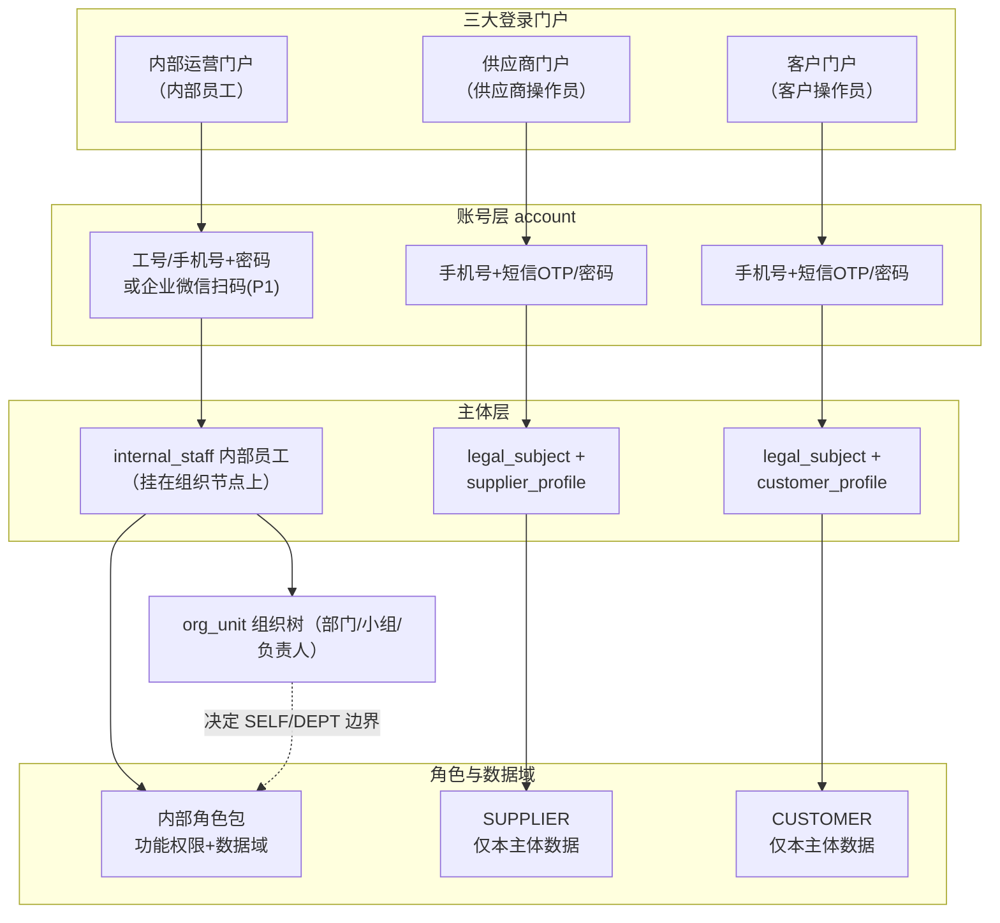
```mermaid
flowchart TB
    subgraph PORTALS["三大登录门户"]
        direction LR
        PP1["内部运营门户<br/>（内部员工）"]
        PP2["供应商门户<br/>（供应商操作员）"]
        PP3["客户门户<br/>（客户操作员）"]
    end
    subgraph ACCT["账号层 account"]
        direction LR
        A1["工号/手机号+密码<br/>或企业微信扫码(P1)"]
        A2["手机号+短信OTP/密码"]
        A3["手机号+短信OTP/密码"]
    end
    subgraph SUBJ["主体层"]
        direction LR
        S1["internal_staff 内部员工<br/>（挂在组织节点上）"]
        S2["legal_subject +<br/>supplier_profile"]
        S3["legal_subject +<br/>customer_profile"]
    end
    subgraph ROLE["角色与数据域"]
        direction LR
        R1["内部角色包<br/>功能权限+数据域"]
        R2["SUPPLIER<br/>仅本主体数据"]
        R3["CUSTOMER<br/>仅本主体数据"]
    end
    ORGX["org_unit 组织树（部门/小组/负责人）"]
    PP1 --> A1 --> S1 --> R1
    PP2 --> A2 --> S2 --> R2
    PP3 --> A3 --> S3 --> R3
    S1 --> ORGX
    ORGX -.->|"决定 SELF/DEPT 边界"| R1
```

> 客户门户是本期从「被动接收报价」升级为「可登录自助门户」的关键变化（新决策 D36）：客户可自助查看当前生效价目表、历史报价与合同、账单与余额、涨价/退役通知。

### 1.2 角色清单与权限概览

| 角色 | 类型 | 核心职责 | 功能权限（模块） | 数据权域（本期新裁定） |
| --- | --- | --- | --- | --- |
| 供应商操作员 | 外部 | 实名、资质、报价、续报、新模型申请 | 供应商门户全部功能 | **仅本主体**（他人报价/平台售价/毛利物理剔除） |
| 客户操作员 | 外部 | 查看价目表/报价/合同/账单、接受报价 | 客户门户全部功能 | **仅本主体** |
| 平台管理员 | 内部 | 系统配置、组织与角色授权、审计查看 | M11 全权，M12 查看/导出，其余查看 | ALL（但**禁止编辑业务数据**） |
| 模型运营 | 内部 | 模型档案、同步确认、涨价第 1 签、资质审核、退役发起 | M1 查/编/审，M2 查/触发/确认，**M3 审（资质冻结/解冻）** | ALL（模型域全量，不触成本金额） |
| 采购/渠道 | 内部 | 供应商引入、报价审批、主供应商锁定、到期处置 | M3 查/编，M4 查/审，**M5 编（主供应商锁定）+ 查** | **SELF：仅本人引入的供应商及其报价**【D33】；**成本视图与比价放开 ALL**（见 1.5 注）；采购主管 = 本部门及下级 |
| 定价运营 | 内部 | 定价策略、价目表、涨价传导、特价审批、成本参数 | M6 编，M7 编/审/冻结，**M5 编（损耗/通道费/税项参数）+ 查** | ALL（定价需全量成本与售价视角） |
| 客户销售 | 内部 | 自有客户报价/合同、特价申请 | M8 查/编/审（特价），M9 编（自身客户），**M1 查（模型库只读，成本列剔除）** | **SELF：仅自身客户**；销售主管 = 本部门及下级 |
| 财务 | 内部 | 汇率锁定、结算对账、授信与押金管理、第二审批人 | M10 编/对账，**M5 编（汇率锁定）+ 查**，M7 查 | ALL（成本/结算/税全量，售价只读） |
| 运营管理员 | 内部 | 运营总控：全量客户与资源监控、跨部门协调 | M1–M9 查看 + 工作台全部 | **ALL：所有客户与资源**【新决策 D34】（只读为主，业务编辑仍归各职能角色） |
| 成本补录（特权） | 内部 | 指定过去生效时间补录报价 | 同采购域 + 补录特权 | 同采购域；授予双人审批、月度报表、频率告警 |
| 审计只读 | 内部 | 老板/投资人/合规/外部审计 | M1–M12 全量只读 + 导出 | ALL（无任何写权限） |

> **职责分离（SOD）关键防线**：① 管理员不碰业务数据；② 定价双人审批；③ 角色互斥——销售不得兼任定价运营或采购（否则可自批特价、自看成本），互斥组合由管理员在「组织与权限」模块配置；④ 补录受控——强制审计理由 + retroactive 标记；⑤ 补录特权防滥用——授予双人审批、当月超 N 次（建议 5）告警、每月报表。

### 1.3 客户与供应商商务档案（新增：付款方式 / 授信额度 / 押金）

客户与供应商档案在身份档案之外，增加**商务与授信属性**，作为计费、风控与门户展示的依据。三类字段的变更仅财务（或客户/采购主管）可改，销售与采购只读，全部留审计。

**客户档案（customer_profile）新增**

| 字段 | 说明 | 联动规则 |
| --- | --- | --- |
| 付款方式 payment_type | 预付充值 / 后付月结 / 按量后付 | 预付：先充值后消费，余额不足自动限流；后付：消费挂账计入授信占用 |
| 授信额度 credit_limit | 平台授予的赊账上限（0 = 仅预付） | 占用 ≥ 80% 预警（通知客户 + 销售待办）；≥ 100% 冻结新调用（阈值可配），还款后自动解冻 |
| 押金 deposit_amount / deposit_status | 未缴 / 已缴 / 冻结 / 已退 | 可抵扣违约与坏账；退户结算后退还；冻结期间可限制新签合同 |
| 账期 billing_cycle | 月结 30 天等 | 与后付付款方式配套 |
| 信用状态 credit_status | 正常 / 超额预警 / 超额冻结 | 由授信占用自动驱动，冻结/解冻全部留痕 |
| 开票类型 invoice_type | 专票 / 普票 / 不需要 | 海外模型无专票时强制 flag 合规风险（见 PRD §7.0） |

**供应商档案（supplier_profile）新增**

| 字段 | 说明 | 联动规则 |
| --- | --- | --- |
| 付款方式 settlement_type | 预付充值 / 后付月结（平台对供应商） | 后付采购金额计入应付账款 |
| 账期 billing_cycle | 月结 30/45 天等 | 影响对账周期 |
| 最低起充 min_recharge | 预付型供应商的最低充值额 | 低于起充额禁止下单 |
| 押金/履约保证金 deposit_amount | 供应商向平台缴纳 | 断供/降智等违约可扣罚；余额不足预警采购 |
| 后付采购额度 credit_line | 平台对该供应商的应付账款上限 | 超额暂停新增采购下单，付款后恢复 |
| 结算状态 settle_status | 正常 / 超额预警 / 超额冻结 | 自动驱动，全程留痕 |

### 1.4 组织管理：部门树与从上往下的域覆盖

内部员工（`internal_staff`）必须挂在**组织树**（`org_unit`）上：公司 → 部门 → 小组，每个节点可设一名负责人。组织树是数据权域的边界来源：

- **普通员工**：数据域 = SELF（仅本人归属的资源，如采购员仅见本人引入的供应商、销售员仅见自身客户）。
- **部门/小组负责人**：数据域 = DEPT_SUB（本节点及**全部下级节点**的数据，从上往下递归覆盖）——采购主管看得见本组所有采购员引入的资源，销售主管看得见本组所有客户。
- **职能角色**（运营/财务/定价等）：数据域 = ALL，与所在组织位置无关。
- **调岗**：由管理员操作并留审计；历史数据归属按归属人快照不变（避免业绩/对账混乱）。

**图 1-2 组织树与数据域覆盖：负责人从上往下递归覆盖，普通员工仅本人数据**

📐 查看 Mermaid 源码（可编辑）

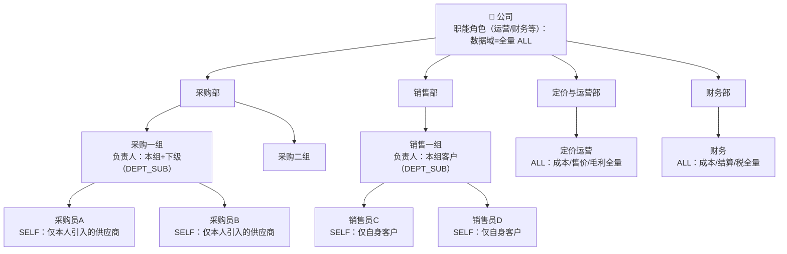
```mermaid
flowchart TB
    CO["🏢 公司<br/>职能角色（运营/财务等）：数据域=全量 ALL"]
    CO --> PU["采购部"] & SA["销售部"] & OP["定价与运营部"] & FI["财务部"]
    PU --> PU1["采购一组<br/>负责人：本组+下级（DEPT_SUB）"] & PU2["采购二组"]
    PU1 --> PA["采购员A<br/>SELF：仅本人引入的供应商"] & PB["采购员B<br/>SELF：仅本人引入的供应商"]
    SA --> SA1["销售一组<br/>负责人：本组客户（DEPT_SUB）"]
    SA1 --> SC["销售员C<br/>SELF：仅自身客户"] & SD["销售员D<br/>SELF：仅自身客户"]
    OP --> PR["定价运营<br/>ALL：成本/售价/毛利全量"]
    FI --> FA["财务<br/>ALL：成本/结算/税全量"]
```

### 1.5 权限模型：角色 = 功能权限 × 数据权域 × 字段剔除

权限与角色强关联，角色装配三类规则：

1. **功能权限**：12 个功能模块 × 操作点（查看 V / 编辑 E / 审批 A / 配置 C / 特权 P），决定门户上「菜单和按钮长什么样」。
2. **数据权域**：SELF（本人归属）/ DEPT（本部门）/ DEPT_SUB（本部门及下级）/ ALL（全量），决定「能看到哪些行的数据」。
3. **字段级剔除**：成本、毛利等敏感字段对销售、供应商在接口层物理剔除（不靠前端隐藏）。

**实际可见范围 = min（角色声明的数据域，组织位置可得的域）**。例如同为「采购/渠道」角色：普通采购员（组织位置=组员）只能看 SELF；采购一组组长（组织位置=负责人）自动扩到本组及下级。资源侧通过**归属人字段**（供应商的引入人 `owner_procurement_operator_id`、客户的归属销售 `owner_sales_operator_id`）做行级过滤。

**图 1-3 角色-权限-权域模型：角色决定功能与数据域，组织位置决定域边界**

📐 查看 Mermaid 源码（可编辑）

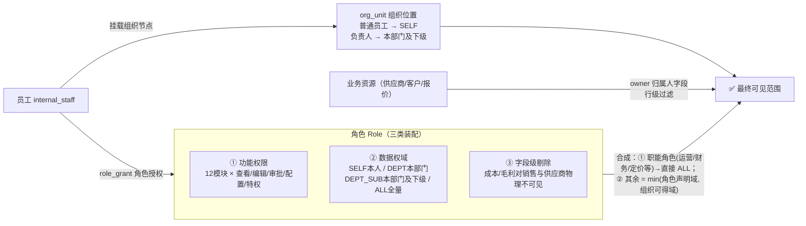
```mermaid
flowchart LR
    subgraph ROLE["角色 Role（三类装配）"]
        direction TB
        R1["① 功能权限<br/>12模块 × 查看/编辑/审批/配置/特权"]
        R2["② 数据权域<br/>SELF本人 / DEPT本部门<br/>DEPT_SUB本部门及下级 / ALL全量"]
        R3["③ 字段级剔除<br/>成本/毛利对销售与供应商物理不可见"]
    end
    E["员工 internal_staff"] -->|"role_grant 角色授权"| ROLE
    E -->|"挂载组织节点"| O["org_unit 组织位置<br/>普通员工 → SELF<br/>负责人 → 本部门及下级"]
    ROLE -->|"合成：① 职能角色(运营/财务/定价等)→直接 ALL；<br/>② 其余 = min(角色声明域, 组织可得域)"| V["✅ 最终可见范围"]
    O --> V
    RES["业务资源（供应商/客户/报价）"] -->|"owner 归属人字段<br/>行级过滤"| V
```

> **本期新增决策（与 PRD §2.2 的差异，以本版为准）**：
> - **D33**：采购/渠道数据域 = 仅本人引入的资源（SELF），主管 = 本部门及下级；PRD 原设计为「供应商与成本域全量可见」，权限矩阵对应行需修订。
> - **D34**：设「运营管理员」角色，可见所有客户与资源（ALL，只读为主）。
> - **D35**：客户/供应商档案新增付款方式、授信额度、押金三类商务属性及联动冻结规则。
> - **D36**：客户门户从被动收单升级为可登录自助门户；三门户登录方案落地。

> **v1.4 补充裁定 · D33 与比价用例的边界（原冲突 R-07）**：采用「**放开比价、收窄商务**」。
> - **放开 ALL**：成本视图、多供应商比价、市场最低价、议价机会、报价异常检测（D2/D4）——比价属于平台级市场信息，SELF 域下"市场最低价"这个比较基准不存在，用例无法成立。
> - **收窄 SELF**：供应商档案的商务字段（结算方式/账期/最低起充/保证金/后付额度）、报价单审批、报价单明细金额。
> - 因此 1.2 角色表中采购行的表述由「仅本人引入的供应商及其报价/**成本**」调整为「仅本人引入的供应商及其报价；成本视图与比价放开 ALL」。

**表 1-5-A　功能模块编号对照表（M1–M12，v1.4 新增）**

| 编号 | 模块 | 编号 | 模块 |
| --- | --- | --- | --- |
| M1 | 模型管理 | M7 | 价目表 |
| M2 | 官方价格同步 | M8 | 客户报价 |
| M3 | 供应商管理 | M9 | 客户管理 |
| M4 | 报价管理 | M10 | 财务结算（授信/押金/对账） |
| M5 | 成本管理 | M11 | 组织与权限 |
| M6 | 定价策略 | M12 | 审计 |

> 操作点：`V` 查看 / `E` 编辑 / `A` 审批 / `C` 配置 / `P` 特权。权限点以「M4:A」形式声明，与设计文档 3.4 一致。

### 1.6 登录门户落地：菜单树与登录路由

门户菜单按角色的功能权限渲染——**菜单即权限**，没有权限的菜单项不下发；数据请求在服务端强制做行级 + 字段级过滤。

**图 1-4 三门户菜单树：按角色渲染，菜单即功能权限**

📐 查看 Mermaid 源码（可编辑）

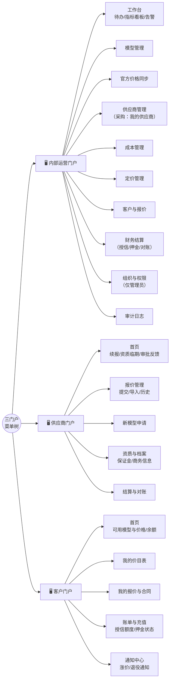
```mermaid
flowchart LR
    R(("三门户<br/>菜单树"))
    R --> A["🖥 内部运营门户"] & B["🖥 供应商门户"] & C["🖥 客户门户"]
    A --> A1["工作台<br/>待办/指标看板/告警"] & A2["模型管理"] & A3["官方价格同步"] & A4["供应商管理<br/>（采购：我的供应商）"] & A5["成本管理"] & A6["定价管理"] & A7["客户与报价"] & A8["财务结算<br/>（授信/押金/对账）"] & A9["组织与权限<br/>（仅管理员）"] & A10["审计日志"]
    B --> B1["首页<br/>续报/资质临期/审批反馈"] & B2["报价管理<br/>提交/导入/历史"] & B3["新模型申请"] & B4["资质与档案<br/>保证金/商务信息"] & B5["结算与对账"]
    C --> C1["首页<br/>可用模型与价格/余额"] & C2["我的价目表"] & C3["我的报价与合同"] & C4["账单与充值<br/>授信额度/押金状态"] & C5["通知中心<br/>涨价/退役通知"]
```

**图 1-5 登录与门户路由：认证 → 角色/组织解析 → 菜单渲染 → 行级+字段级过滤**

📐 查看 Mermaid 源码（可编辑）

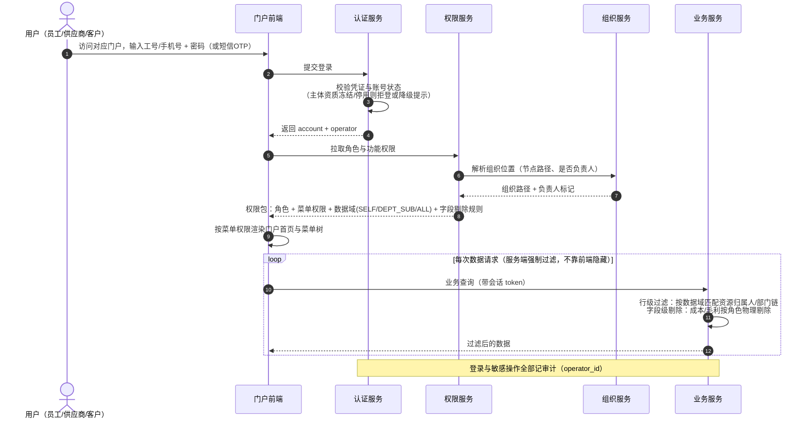
```mermaid
sequenceDiagram
    autonumber
    actor U as 用户（员工/供应商/客户）
    participant P as 门户前端
    participant AUTH as 认证服务
    participant PERM as 权限服务
    participant ORG as 组织服务
    participant BIZ as 业务服务

    U->>P: 访问对应门户，输入工号/手机号 + 密码（或短信OTP）
    P->>AUTH: 提交登录
    AUTH->>AUTH: 校验凭证与账号状态<br/>（主体资质冻结/停用则拒登或降级提示）
    AUTH-->>P: 返回 account + operator
    P->>PERM: 拉取角色与功能权限
    PERM->>ORG: 解析组织位置（节点路径、是否负责人）
    ORG-->>PERM: 组织路径 + 负责人标记
    PERM-->>P: 权限包：角色 + 菜单权限 + 数据域(SELF/DEPT_SUB/ALL) + 字段剔除规则
    P->>P: 按菜单权限渲染门户首页与菜单树
    loop 每次数据请求（服务端强制过滤，不靠前端隐藏）
        P->>BIZ: 业务查询（带会话 token）
        BIZ->>BIZ: 行级过滤：按数据域匹配资源归属人/部门链<br/>字段级剔除：成本/毛利按角色物理剔除
        BIZ-->>P: 过滤后的数据
    end
    Note over AUTH,BIZ: 登录与敏感操作全部记审计（operator_id）
```

**登录路由要点**：

1. 三个门户共用同一认证服务，按门户类型限定账号范围（员工账号不能登供应商门户，反之亦然）。
2. 登录时校验主体状态：供应商资质冻结/停用 → 拒登或降级为只读提示；客户账号停用 → 拒登。
3. 会话（token）携带：operator_id、角色集合、数据域、字段剔除规则；服务端每次请求重新校验，不信任前端传值。
4. 登录、登出、敏感操作（改价、审批、授信调整、押金变动）全部记审计，保留 3 年。

---

---

## 2 系统功能架构

### 2.1 进货/出货两条价格线（业务主流程）

**图 2-1 双链价格总览：成本链与售价链共用模型主数据锚点**

📐 查看 Mermaid 源码（可编辑）

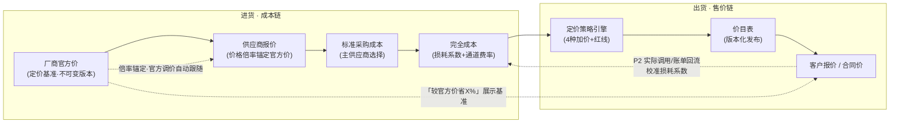
```mermaid
flowchart LR
    subgraph COST["进货 · 成本链"]
        direction LR
        V1["厂商官方价<br/>(定价基准·不可变版本)"] --> V2["供应商报价<br/>(价格倍率锚定官方价)"] --> V3["标准采购成本<br/>(主供应商选择)"] --> V4["完全成本<br/>(损耗系数+通道费率)"]
    end
    subgraph SELL["出货 · 售价链"]
        direction LR
        S1["定价策略引擎<br/>(4种加价+红线)"] --> S2["价目表<br/>(版本化发布)"] --> S3["客户报价 / 合同价"]
    end
    V4 --> S1
    V1 -.->|"倍率锚定·官方调价自动跟随"| V2
    V1 -.->|"「较官方价省X%」展示基准"| S3
    S3 -.->|"P2 实际调用/账单回流<br/>校准损耗系数"| V4
```

### 2.2 总体功能架构

**图 2-2 总体功能架构：三门户 + 六模块 + 跨切服务 + 托管数据层（腾讯云部署建议见 PRD §15）**

📐 查看 Mermaid 源码（可编辑）

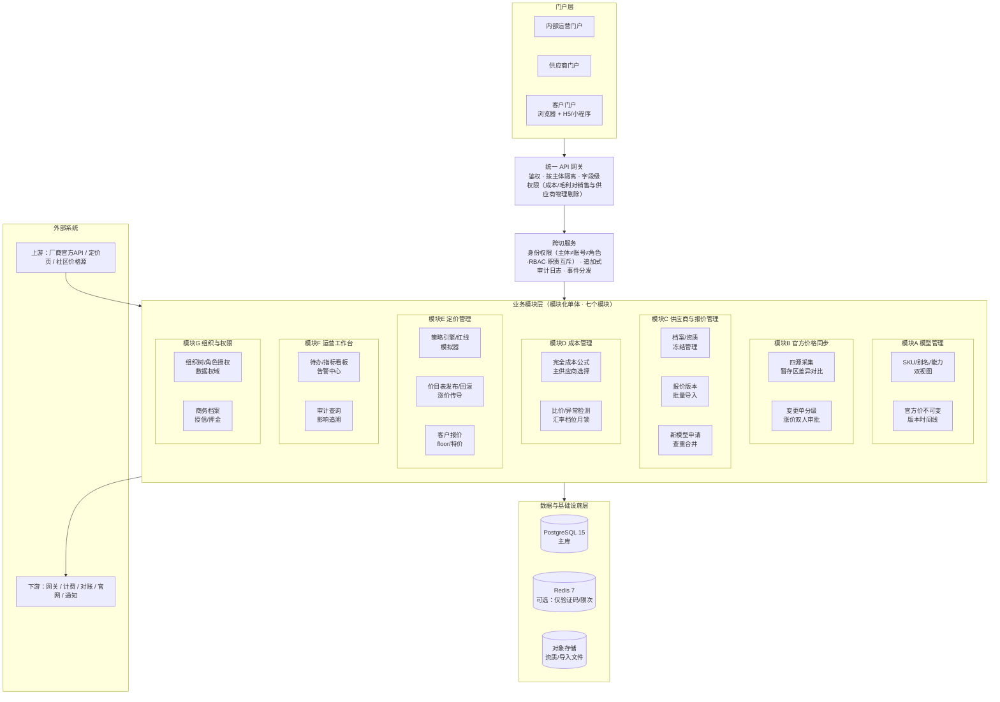
```mermaid
flowchart TB
    subgraph L1["门户层"]
        direction LR
        P1["内部运营门户"]
        P2["供应商门户"]
        P3["客户门户<br/>浏览器 + H5/小程序"]
    end
    GWA["统一 API 网关<br/>鉴权 · 按主体隔离 · 字段级权限（成本/毛利对销售与供应商物理剔除）"]
    X1["跨切服务<br/>身份权限（主体≠账号≠角色·RBAC·职责互斥） · 追加式审计日志 · 事件分发"]
    L1 --> GWA --> X1
    subgraph L2["业务模块层（模块化单体 · 七个模块）"]
        direction TB
        subgraph MA["模块A 模型管理"]
            direction LR
            A1["SKU/别名/能力<br/>双视图"]
            A2["官方价不可变<br/>版本时间线"]
        end
        subgraph MB["模块B 官方价格同步"]
            direction LR
            B1["四源采集<br/>暂存区差异对比"]
            B2["变更单分级<br/>涨价双人审批"]
        end
        subgraph MC["模块C 供应商与报价管理"]
            direction LR
            C1["档案/资质<br/>冻结管理"]
            C2["报价版本<br/>批量导入"]
            C3["新模型申请<br/>查重合并"]
        end
        subgraph MD["模块D 成本管理"]
            direction LR
            D1["完全成本公式<br/>主供应商选择"]
            D2["比价/异常检测<br/>汇率档位月锁"]
        end
        subgraph ME["模块E 定价管理"]
            direction LR
            E1["策略引擎/红线<br/>模拟器"]
            E2["价目表发布/回滚<br/>涨价传导"]
            E3["客户报价<br/>floor/特价"]
        end
        subgraph MF["模块F 运营工作台"]
            direction LR
            F1["待办/指标看板<br/>告警中心"]
            F2["审计查询<br/>影响追溯"]
        end
        subgraph MG["模块G 组织与权限"]
            direction LR
            G1["组织树/角色授权<br/>数据权域"]
            G2["商务档案<br/>授信/押金"]
        end
    end
    X1 --> L2
    subgraph L3["数据与基础设施层"]
        direction LR
        DB1[("PostgreSQL 15<br/>主库")]
        DB2[("Redis 7<br/>可选：仅验证码/限次")]
        DB3[("对象存储<br/>资质/导入文件")]
    end
    L2 --> L3
    subgraph L4["外部系统"]
        direction LR
        EXT1["上游：厂商官方API / 定价页 / 社区价格源"]
        EXT2["下游：网关 / 计费 / 对账 / 官网 / 通知"]
    end
    EXT1 --> L2
    L2 --> EXT2
```

### 2.3 功能分解树

**图 2-3 功能分解树：六模块 → 功能域 → 功能点**

📐 查看 Mermaid 源码（可编辑）

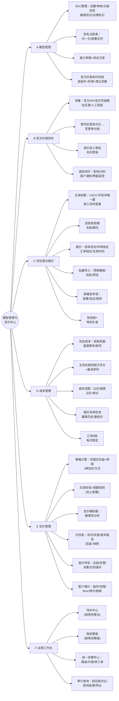
```mermaid
flowchart LR
    R(("模型管理与<br/>定价中心"))
    R --> MA["A 模型管理"] & MB["B 官方价格同步"] & MC["C 供应商与报价"] & MD["D 成本管理"] & ME["E 定价管理"] & MF["F 运营工作台"]
    MA --> MA1["SKU管理：创建/审核/分级标签<br/>敏感标记/出境标记"] & MA2["别名注册表：<br/>归一化/查重合并"] & MA3["能力参数+验证记录"] & MA4["官方价版本时间线<br/>逐组件+阶梯+修正系数"]
    MB --> MB1["采集：官方API/定价页抽取<br/>社区源/人工兜底"] & MB2["暂存区差异对比→<br/>变更单分级"] & MB3["涨价双人审批<br/>毛利预演"] & MB4["退役闭环：影响分析/<br/>客户通知/残留监控"]
    MC --> MC1["主体档案：USCC/手机号唯一键<br/>录入实时查重"] & MC2["资质有效期<br/>冻结/解冻"] & MC3["报价：倍率双向/币种锁定<br/>汇率档位/生效时间"] & MC4["批量导入：预填模板/<br/>校验/预览"] & MC5["新模型申请：<br/>查重/验证/探测"] & MC6["防改账+<br/>特权补录"]
    MD --> MD1["完全成本：损耗系数<br/>通道费率/税项"] & MD2["主供应商四因子评分<br/>+备选序列"] & MD3["成本视图：比价/趋势<br/>议价/单点"] & MD4["报价异常检测<br/>偏离历史/最低价"] & MD5["汇率8档<br/>每月锁定"]
    ME --> ME1["策略引擎：范围优先级×等级<br/>4种加价方式"] & ME2["红线校验+尾数规则<br/>(向上取整)"] & ME3["定价模拟器：<br/>敏感性分析"] & ME4["价目表：定时/灰度/差异报告<br/>回滚=快照"] & ME5["涨价传导：冻结/告警/<br/>决策/合同保护"] & ME6["客户报价：临时/克隆/<br/>floor/特价/刷新"]
    MF --> MF1["待办中心<br/>(按角色聚合)"] & MF2["指标看板<br/>(按角色隔离)"] & MF3["统一告警中心：<br/>路由/升级/转工单"] & MF4["审计查询：前后值对比/<br/>影响追溯/导出"]
```

### 2.4 功能点清单与阶段规划

| 模块 | 功能域 | 功能点 | 阶段 |
| --- | --- | --- | --- |
| A 模型管理 | 档案管理 | SKU 增删改查、系列/型号双视图、批量操作、分级标签（旗舰/主力/经济/长尾）、敏感标记、数据出境标记 | **MVP** |
| A | 别名注册表 | 别名表、名称归一化、编辑距离 Top3 查重建议、一键合并、拒绝并回填反馈 | **MVP** |
| A | 能力参数 | 能力字段、兼容协议、能力验证状态记录（验证人/时间/方式，MVP 人工） | **MVP** |
| A | 能力探测 | 自动探针（协议兼容、上下文、tool call、实际延迟） | P1 |
| A | 官方价管理 | 不可变价格版本、逐组件计价（含官方缓存维度）、阶梯规则、修正系数、时间线查询 | **MVP** |
| B 官方价格同步 | 采集 | 厂商 /v1/models API 同步（每日 03:00） | **MVP** |
| B | 采集 | 定价页抓取 + LLM 结构化抽取、社区源交叉校验、官方博客/发布会触发器 | P1 |
| B | 采集 | 官方价手工录入 / 批量 Excel 导入 | **MVP** |
| B | 变更审批 | 暂存区差异对比、变更单分级（低危自动/降价单人/涨价双人/退役）、毛利预演 | **MVP**（人工触发）P1（自动化） |
| B | 退役闭环 | 影响分析、替代型号推荐、客户通知（≥30天）、双人审批、残留调用监控 | **MVP**（简化）P1（完整） |
| B | 任务管理 | 定时任务可视化（上次执行/结果/失败原因/手动重跑） | **MVP** |
| C 供应商与报价 | 主体与档案 | USCC/手机号唯一键、录入实时查重提示、资质有效期管理（提前30天提醒）、冻结/解冻 | **MVP** |
| C | 报价提交 | 倍率/价格双向录入、币种锁模型币种、汇率档位选择、逐组件存储、整单倍率入口、生效时间预约、不可变版本 | **MVP** |
| C | 报价导入 | 预填模板（含官方价基准只读列）、筛选式子集导出、逐行校验、预览确认 | **MVP** |
| C | 报价审批 | 差异对比视图（对比上一版/官方价/最优）、整单倍率失真提示（缓存维度标红）、毛利预演 | **MVP** |
| C | 报价生命周期 | 状态机、到期分级预警（7/3天）、宽限期、人工剔除确认（禁止全自动） | **MVP** |
| C | 新模型申请 | 自动查重、别名合并、审批、能力验证（MVP 人工 / P1 探测）、超时提醒 | **MVP** P1 |
| C | 防改账 | 过去时间钳制、特权补录（审计理由 + retroactive 标记 + 重算范围限制） | **MVP** |
| D 成本管理 | 完全成本 | 损耗系数（可按模型/供应商覆盖）、通道费率、可配置税项 | **MVP** |
| D | 主供应商选择 | 四因子评分（0.55/0.25/0.12/0.08）、手动锁定（理由）、备选序列、成本区间 | **MVP** |
| D | 成本视图 | 多供应商比价、90天趋势、议价机会看板、单点依赖告警、报价异常检测 | **MVP**（核心）P2（评分） |
| D | 汇率管理 | 8 固定档位、每月 1 号锁定（记录选择人/时间/档位）、月中调整双人审批、超时告警 | **MVP** |
| E 定价管理 | 策略引擎 | 作用范围优先级 × 客户等级、4 种加价方式（MVP 先做目标毛利率 + 官方价锚定）、红线校验、尾数规则 | **MVP** |
| E | 模拟器 | 用量假设、收入/成本/毛利预测、逐模型贡献排名、敏感性分析、行业参数模板（标注已/未校准） | P1 |
| E | 价目表 | 版本化发布、定时/灰度生效、差异报告、涨价提前通知任务、回滚=新版本快照 | **MVP** |
| E | 涨价传导 | 成本真实跟涨、价目表自动冻结、决策队列（毛利预演）、合同价保护、倒挂持续高亮 | **MVP** |
| E | 客户报价 | 临时报价/克隆、版本化调整、floor 拦截、特价审批、模型变动刷新提示、分币种报价 | **MVP**（核心）P1（PDF） |
| F 运营工作台 | 待办与看板 | 按角色聚合待办（数量角标/优先级/超时高亮）、角色化指标卡 | **MVP** |
| F | 告警中心 | 告警源归一、订阅/路由（站内+邮件/IM）、标记处理、转工单、超时升级 | **MVP**（IM 推送 P1） |
| F | 审计查询 | 多维筛选、变更前后值对比视图、影响追溯、导出 | **MVP** |

> **MVP 刻意不做自动抓价**：抓价的工程量和维护成本很高，手工录入几百个主力模型的价格一次也就半天。先把两条定价线跑通产生业务价值，P1 再补自动化（决策点 1 已确认）。

---

## 3 用例模型

按七模块组织为 9 组用例图，共 65 条用例规约（含 «include»/«extend» 子用例）。每条给出「主参与者 / 前置条件 / 主流程 / 扩展与异常 / PRD 出处」，可直接拆开发任务。用例编号：`A/B/C/D/E/F + 序号`。

### 3.1 模块 A · 模型管理（模型数据中心）

**图 3-1 模块 A 用例图：模型主数据中心**

📐 查看 Mermaid 源码（可编辑）

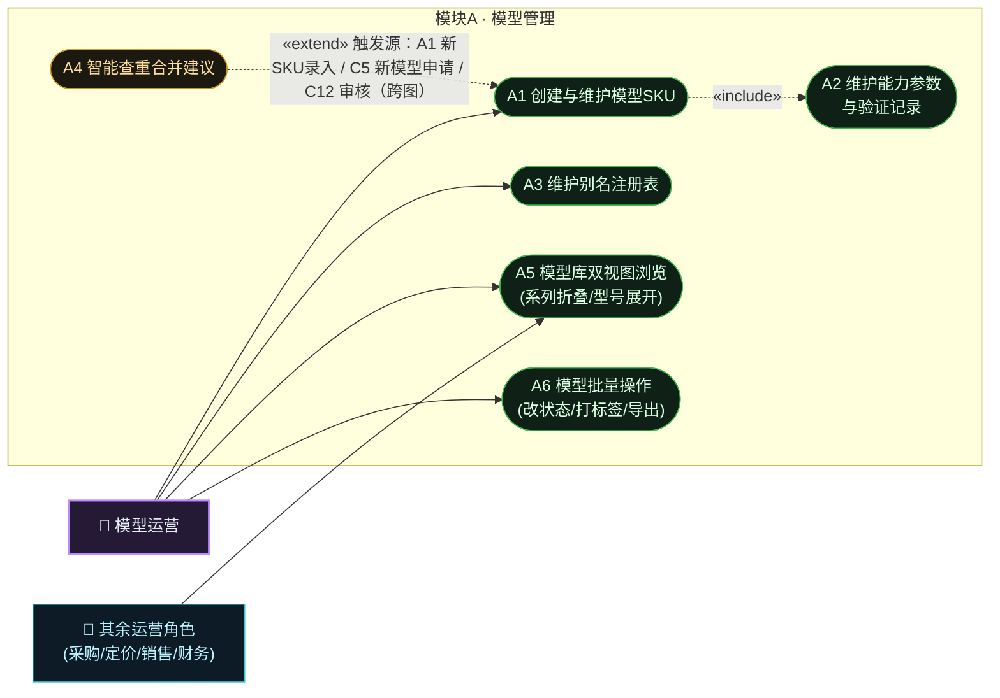
```mermaid
flowchart LR
    classDef actor fill:#241a35,stroke:#bc8cff,stroke-width:2px,color:#e6edf3
    classDef uc fill:#0f2016,stroke:#3fb950,color:#dcffe3
    classDef ext fill:#1c1a10,stroke:#d29922,color:#ffdf9e
    classDef ro fill:#0d1b26,stroke:#39c5cf,color:#bdf3ff

    MO["👤 模型运营"]:::actor
    RD["👤 其余运营角色<br/>(采购/定价/销售/财务)"]:::ro

    subgraph SG["模块A · 模型管理"]
        direction TB
        A1(["A1 创建与维护模型SKU"]):::uc
        A2(["A2 维护能力参数<br/>与验证记录"]):::uc
        A3(["A3 维护别名注册表"]):::uc
        A4(["A4 智能查重合并建议"]):::ext
        A5(["A5 模型库双视图浏览<br/>(系列折叠/型号展开)"]):::uc
        A6(["A6 模型批量操作<br/>(改状态/打标签/导出)"]):::uc
    end

    MO --> A1
    MO --> A3
    MO --> A5
    MO --> A6
    RD --> A5
    A1 -.->|"«include»"| A2
    A4 -.->|"«extend» 触发源：A1 新SKU录入 / C5 新模型申请 / C12 审核（跨图）"| A1
```

| ID | 用例名称 | 主参与者 | 前置条件 | 主流程（简） | 扩展与异常 | PRD |
| --- | --- | --- | --- | --- | --- | --- |
| A1 | 创建与维护模型 SKU | 模型运营 | 持有 M1 编辑权限 | 录入标识与归属（厂商/系列/官方名/类型）、能力参数、运营属性（分级标签/敏感/出境标记）→ 保存为「草稿/待验证」 | 新模型申请（C5）亦产生 SKU 入库；敏感与出境标记决定可售范围 | §4.1 |
| A2 | 维护能力参数与验证记录 | 模型运营 | SKU 已存在 | 维护上下文/模态/兼容协议等字段；记录验证状态（未验证/人工/自动探测）+ 验证人 + 验证时间 | MVP 仅人工验证；P1 接自动探测（C12 触发） | §4.1 |
| A3 | 维护别名注册表 | 模型运营 | SKU 已存在 | 增删别名（多对一）；别名需下发网关供调用解析 | 一个别名只能指向一个 SKU | §3.2 |
| A4 | 智能查重合并建议 | 模型运营 | 新 SKU 录入或新模型申请触发 | 名称归一化（去前缀/日期/小写/分隔符）+ 编辑距离 → Top3 疑似匹配 → 一键合并为别名 | 拒绝并说明「已合并到 X」，供应商侧可见反馈 | §3.2 |
| A5 | 模型库双视图浏览 | 全部内部角色 | 持查看权限 | 系列折叠 / 型号展开双视图；按厂商/类型/状态/能力多维筛选；默认列含标准成本/毛利率（按角色裁剪） | 销售视图剔除成本/毛利列 | §4.3 |
| A6 | 模型批量操作 | 模型运营 | — | 批量改状态、批量打标签、批量导出 | — | §4.3 |

### 3.2 模块 B · 官方价格同步（原「情报同步与变更审批」）

**图 3-2 模块 B 用例图：多源采集 → Diff → 分级审批 → 生效**

📐 查看 Mermaid 源码（可编辑）

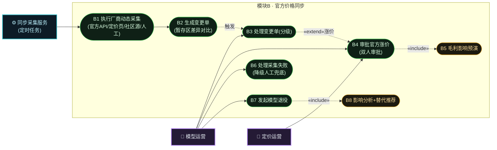
```mermaid
flowchart LR
    classDef actor fill:#241a35,stroke:#bc8cff,stroke-width:2px,color:#e6edf3
    classDef sys fill:#0d1b26,stroke:#39c5cf,stroke-width:2px,color:#bdf3ff
    classDef uc fill:#0f2016,stroke:#3fb950,color:#dcffe3
    classDef ext fill:#1c1a10,stroke:#d29922,color:#ffdf9e

    ENG["⚙️ 同步采集服务<br/>(定时任务)"]:::sys
    MO["👤 模型运营"]:::actor
    PO["👤 定价运营"]:::actor

    subgraph SG["模块B · 官方价格同步"]
        direction TB
        B1(["B1 执行厂商动态采集<br/>(官方API/定价页/社区源/人工)"]):::uc
        B2(["B2 生成变更单<br/>(暂存区差异对比)"]):::uc
        B3(["B3 处理变更单(分级)"]):::uc
        B4(["B4 审批官方涨价<br/>(双人审批)"]):::uc
        B5(["B5 毛利影响预演"]):::ext
        B6(["B6 处理采集失败<br/>(降级人工兜底)"]):::uc
        B7(["B7 发起模型退役"]):::uc
        B8(["B8 影响分析+替代推荐"]):::ext
    end

    ENG --> B1
    B1 --> B2
    B2 -.->|"触发"| B3
    MO --> B3
    MO --> B4
    PO --> B4
    MO --> B6
    MO --> B7
    B3 -.->|"«extend»涨价"| B4
    B4 -.->|"«include»"| B5
    B7 -.->|"«include»"| B8
```

| ID | 用例名称 | 主参与者 | 前置条件 | 主流程（简） | 扩展与异常 | PRD |
| --- | --- | --- | --- | --- | --- | --- |
| B1 | 执行厂商动态采集 | 同步采集服务 | 数据源可达 | 定时采集：模型清单 03:00 / 官方定价 04:00 + 事件触发 / 社区源 05:00；结果写入暂存区 | 任务可视化、失败原因、手动重跑按钮（B6） | §5.2/§5.4 |
| B2 | 生成变更单 | 同步采集服务 | 暂存区与生产数据有差异 | 差异对比生成变更单；同一字段多源不一致时按优先级取值，**但存在不一致必须进人工确认队列，禁止静默取值** | 官方博客/发布会日历命中关键词 → 提前拉高采集频率 | §5.3 |
| B3 | 处理变更单（分级） | 模型运营 | 变更单在队列 | 按类型分级：新增模型→自动入库「待验证」；能力参数变更→自动生效记日志；价格下降→1 人审批；涨价→转 B4；标记退役→转 B7；采集失败→B6 | 价格下降生效后触发售价重算提醒 | §5.3 |
| B4 | 审批官方涨价 | 模型运营 + 定价运营 | 毛利影响预演已跑 | 双人审批 → 新建不可变官方价版本并关闭旧版本生效期 → 触发供应商倍率报价自动跟随 + 成本重算 + 售价链告警（涨价传导） | 驳回则保留旧价 | §5.3/§8.4.1 |
| B5 | 毛利影响预演 | 系统（供审批人） | — | 预演「若生效，各模型成本变化与毛利影响」 | 涨价审批必读材料 | §5.3 |
| B6 | 处理采集失败 | 模型运营/运维 | 采集任务失败告警 | 告警到运维 → 降级为人工兜底录入 → **绝不清空原数据** | 页面改版需修抽取规则 | §5.3 |
| B7 | 发起模型退役 | 模型运营 | 模型「已上架」 | 七步闭环：发起 → 影响分析（必读材料，缺失则不允许提交审批）→ 替代方案 → 客户通知（≥30天）→ 双人审批 → 下线执行（事件通知网关）→ 残留调用监控 | 合同期客户仍可调用原模型（合同价保护）；历史报价/价目表保留可查 | §5.5 |
| B8 | 影响分析 + 替代推荐 | 系统（供发起人） | — | 自动生成清单：哪些在售价目表/客户合同/客户报价/进行中调用在引用该 SKU；推荐替代 SKU | 「进行中调用」数据在网关/计费，MVP 降级为仅列价目表/合同/报价引用 | §5.5 |

### 3.3 模块 C · 供应商门户（供应商侧）

**图 3-3 模块 C 用例图（供应商侧）：身份 → 资质 → 报价三段式**

📐 查看 Mermaid 源码（可编辑）

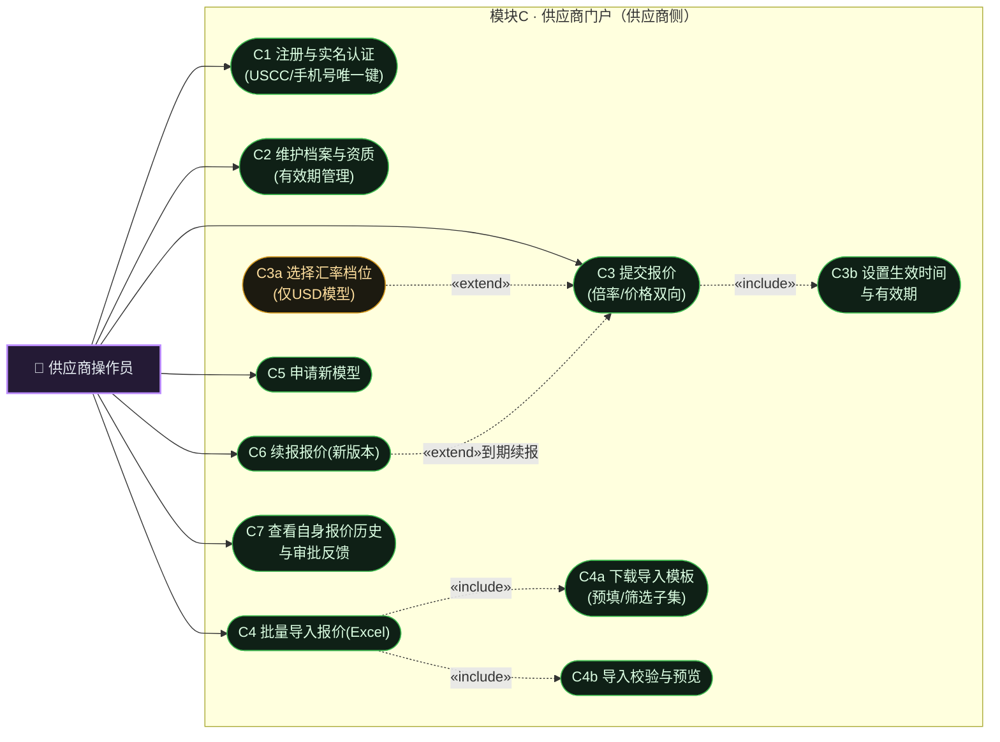
```mermaid
flowchart LR
    classDef actor fill:#241a35,stroke:#bc8cff,stroke-width:2px,color:#e6edf3
    classDef uc fill:#0f2016,stroke:#3fb950,color:#dcffe3
    classDef ext fill:#1c1a10,stroke:#d29922,color:#ffdf9e

    SU["👤 供应商操作员"]:::actor

    subgraph SG["模块C · 供应商门户（供应商侧）"]
        direction TB
        C1(["C1 注册与实名认证<br/>(USCC/手机号唯一键)"]):::uc
        C2(["C2 维护档案与资质<br/>(有效期管理)"]):::uc
        C3(["C3 提交报价<br/>(倍率/价格双向)"]):::uc
        C3a(["C3a 选择汇率档位<br/>(仅USD模型)"]):::ext
        C3b(["C3b 设置生效时间<br/>与有效期"]):::uc
        C4(["C4 批量导入报价(Excel)"]):::uc
        C4a(["C4a 下载导入模板<br/>(预填/筛选子集)"]):::uc
        C4b(["C4b 导入校验与预览"]):::uc
        C5(["C5 申请新模型"]):::uc
        C6(["C6 续报报价(新版本)"]):::uc
        C7(["C7 查看自身报价历史<br/>与审批反馈"]):::uc
    end

    SU --> C1
    SU --> C2
    SU --> C3
    SU --> C4
    SU --> C5
    SU --> C6
    SU --> C7
    C3a -.->|"«extend»"| C3
    C3 -.->|"«include»"| C3b
    C4 -.->|"«include»"| C4a
    C4 -.->|"«include»"| C4b
    C6 -.->|"«extend»到期续报"| C3
```

| ID | 用例名称 | 主参与者 | 前置条件 | 主流程（简） | 扩展与异常 | PRD |
| --- | --- | --- | --- | --- | --- | --- |
| C1 | 注册与实名认证 | 供应商操作员 | USCC / 手机号未被占用 | 公司：USCC 18 位校验位算法 + 法人实名；个人：手机号 + 短信 OTP；录入时实时查重提示「已存在 → 直接关联」 | 营业执照 OCR / 工商库比对为可选增强；身份证实名为可选（唯一键仍为手机号） | §2.1 |
| C2 | 维护档案与资质 | 供应商操作员 | 已实名 | 上传营业执照 / 厂商授权书 / 结算账号证明（每项含有效期）→ 平台审核 | 到期前 30 天提醒（C10 冻结联动）；资质过期自动冻结报价提交/下单能力 | §6.1 |
| C3 | 提交报价 | 供应商操作员 | 资质有效；已获报价角色 | 从模型库勾选 SKU（禁止自由填写模型名）→ 币种锁定为模型币种 → 倍率/价格双向实时互转（官方价基准）→ 逐组件设倍率（整单倍率入口可展开，落库逐组件）→ 填非价格约束（并发/RPM/TPM/配额/实际上下文/兼容度）→ 设置生效时间与有效期 → 提交生成不可变版本 | 官方调价时倍率报价展示层实时跟随 + 自动落带触发原因的静默版本；绝对价模式不自动跟随 | §6.2 |
| C3a | 选择汇率档位 | 供应商操作员 | 报价对象为 USD 模型 | 从 8 档（6.5~7.0）选择，默认带出当月锁定值，用于该笔 USD 报价折算人民币（内部对账） | CNY 模型不出现此环节 | §6.2/§7.0 |
| C3b | 设置生效时间与有效期 | 供应商操作员 | — | 生效时间必填，可为未来（预约生效）；到期后系统自动激活并触发成本重算；与已生效报价重叠时以新报价生效时间为覆盖起点 | 未显式填过去时间 → 一律以提交时刻生效（防改账）；特权例外见 C11 | §6.2 |
| C4 | 批量导入报价 | 供应商操作员 | 同 C3 | 下载模板 → 离线填写 → 上传 → 逐行校验 → 预览（OK/告警/错误）→ 确认 → 整文件生成一条报价单版本进审批 | 一个文件 = 一个版本，与手工录入共用状态机，不跳过审批 | §6.2.1 |
| C4a | 下载导入模板 | 供应商操作员 | — | 预填模板（每活跃 SKU 一行，模型标识锁定 + 官方价基准只读列）或空白模板；大库提供筛选式导出（按厂商/系列/历史报价/活跃态），默认「历史报价 + 活跃」子集 | 模板绝不含其他供应商报价 / 平台成本 / 毛利（隔离红线） | §6.2.1 |
| C4b | 导入校验与预览 | 系统 | 文件已上传 | 逐行校验：model_id 命中库内 SKU / 币种锁定 / 倍率与绝对价自洽 / 过去时间钳制为提交时刻 / USD 行必选汇率档位 | 校验不通过的行不静默入库，必须修正或剔除；提交时官方价已变 → 按实时值重算并标注「基准已变动」 | §6.2.1 |
| C5 | 申请新模型 | 供应商操作员 | 资质有效 | 填写模型名/厂商/类型/能力参数/官方文档链接/报价 → 自动查重 → 合并为别名 或 入库「待验证」→（P1 探测）→「可采购」 | 驳回原因回填；超时未处理自动提醒；进度供应商侧可见 | §6.4 |
| C6 | 续报报价 | 供应商操作员 | 报价即将到期 | 提交新版本（含生效时间）→ 审批 → 到达生效时间无缝覆盖并重算成本 | 旧版本保留可查 | §6.3 |
| C7 | 查看自身报价历史 | 供应商操作员 | 本主体数据 | 按 SKU / 生效时间区间 / 状态筛选；任意历史报价（含被覆盖/过期/驳回）可追溯倍率、价格与审批结论 | 不可见他人报价与平台售价/毛利（接口层物理剔除） | §6.3 |

### 3.4 模块 C · 报价审批与异常处置（平台侧）

**图 3-4 模块 C 用例图（平台侧）：审批 + 断供闭环 + 特权回溯**

📐 查看 Mermaid 源码（可编辑）

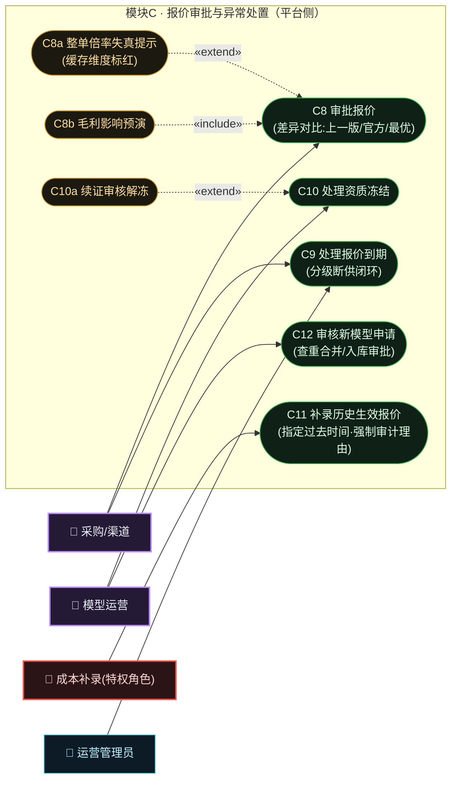
```mermaid
flowchart LR
    classDef actor fill:#241a35,stroke:#bc8cff,stroke-width:2px,color:#e6edf3
    classDef priv fill:#2a1416,stroke:#f85149,stroke-width:2px,color:#ffd7d5
    classDef uc fill:#0f2016,stroke:#3fb950,color:#dcffe3
    classDef ext fill:#1c1a10,stroke:#d29922,color:#ffdf9e
    classDef ro fill:#0d1b26,stroke:#39c5cf,color:#bdf3ff

    PU["👤 采购/渠道"]:::actor
    MO["👤 模型运营"]:::actor
    RO["👤 成本补录(特权角色)"]:::priv
    OA["👤 运营管理员"]:::ro

    subgraph SG["模块C · 报价审批与异常处置（平台侧）"]
        direction TB
        C8(["C8 审批报价<br/>(差异对比:上一版/官方/最优)"]):::uc
        C8a(["C8a 整单倍率失真提示<br/>(缓存维度标红)"]):::ext
        C8b(["C8b 毛利影响预演"]):::ext
        C9(["C9 处理报价到期<br/>(分级断供闭环)"]):::uc
        C10(["C10 处理资质冻结"]):::uc
        C10a(["C10a 续证审核解冻"]):::ext
        C11(["C11 补录历史生效报价<br/>(指定过去时间·强制审计理由)"]):::uc
        C12(["C12 审核新模型申请<br/>(查重合并/入库审批)"]):::uc
    end

    PU --> C8
    PU --> C9
    OA --> C9
    MO --> C10
    MO --> C12
    RO --> C11
    C8a -.->|"«extend»"| C8
    C8b -.->|"«include»"| C8
    C10a -.->|"«extend»"| C10
```

| ID | 用例名称 | 主参与者 | 前置条件 | 主流程（简） | 扩展与异常 | PRD |
| --- | --- | --- | --- | --- | --- | --- |
| C8 | 审批报价 | 采购/渠道 | 报价单处于「审批中」 | 以**报价单为单位整体审批**（不逐条改价）；差异对比视图：本次 vs 上一版本 vs 官方价 vs 当前最优供应商价；直接算出「若采纳，各模型成本变化和毛利影响」→ 通过/驳回 | 驳回填原因，供应商修订后重新提交新版本 | §6.3 |
| C8a | 整单倍率失真提示 | 系统（供审批人） | 供应商使用了整单倍率入口 | 差异对比视图高亮「该报价各组件倍率相同（均为 m）」，提示实际市场倍率往往不同；**缓存维度标红**——倍率被拉平极易引发缓存倒挂 | 审批人重点复核 | §6.3 |
| C8b | 毛利影响预演 | 系统（供审批人） | — | 计算采纳后各模型成本与毛利变化 | — | §6.3 |
| C9 | 处理报价到期 | 采购/运营 | 报价进入到期窗口 | 分级闭环：前 7 天自动提醒供应商续报 + 工作台高亮 → 前 3 天升级告警、人工催办（外呼/工单）→ 到期日进宽限期（如 3 天，暂缓剔除）→ 宽限期满**人工确认剔除（禁止全自动）** | 单点依赖模型阈值提前至 14/7 天 + 最高级告警；须确认兜底方案（临时锁定备用供应商/限流/客户通知）后方可剔除 | §6.3 |
| C10 | 处理资质冻结 | 模型运营 | 任一必备资质过期 | 供应商自动置「资质冻结」：冻结报价提交/下单能力；**自动从主供应商降权**（历史报价保留至自然到期、仅供对账）；是否彻底剔除出备选序列由运营确认 | 不影响历史已生效报价的执行与对账 | §6.1 |
| C10a | 续证审核解冻 | 模型运营 | 供应商已重新上传资质 | 审核通过 → 解冻，恢复报价提交能力 | — | §6.1 |
| C11 | 补录历史生效报价 | 成本补录（特权角色） | 特权经双人审批授予 | 指定过去时间作为生效起点 → **必须填写审计理由** → 标记 retroactive=true，记录操作人/时间/理由原文 → 成本重算仅限「指定生效时间起至今」，不向更早回灌 | 当月补录超过 N 次（建议 5）触发告警；每月输出补录操作报表供管理层复核 | §6.2/§2.2 |
| C12 | 审核新模型申请 | 模型运营 | 申请已提交 | 查重 Top3 疑似匹配 → 一键合并为别名（回填反馈）；或确认新模型 → 审批入库「待验证」→ 能力验证/探测 →「可采购」 | 驳回原因回填；超时自动提醒 | §6.4 |

### 3.5 模块 D · 成本管理（标准采购成本）

**图 3-5 模块 D 用例图：完全成本计算 + 主供应商选择 + 汇率管理**

📐 查看 Mermaid 源码（可编辑）

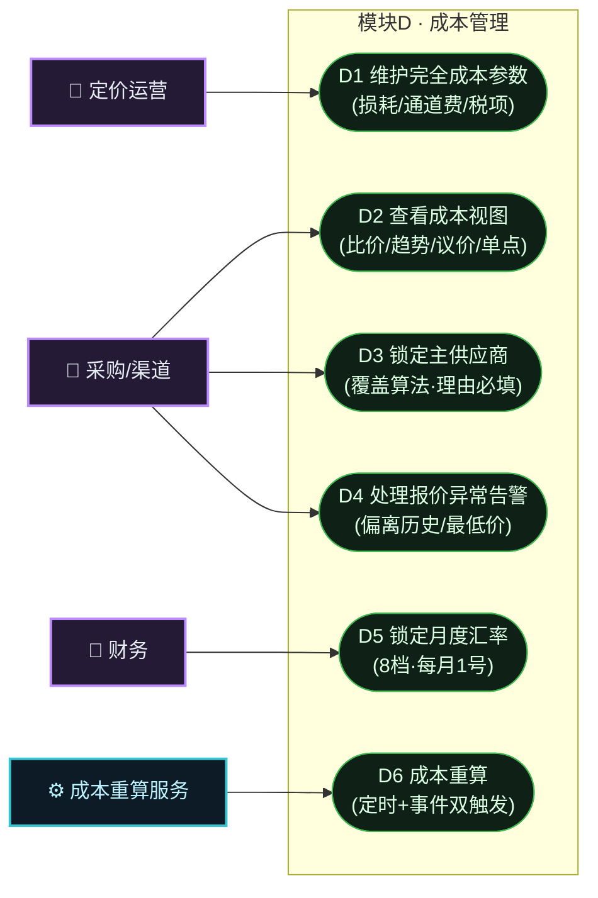
```mermaid
flowchart LR
    classDef actor fill:#241a35,stroke:#bc8cff,stroke-width:2px,color:#e6edf3
    classDef sys fill:#0d1b26,stroke:#39c5cf,stroke-width:2px,color:#bdf3ff
    classDef uc fill:#0f2016,stroke:#3fb950,color:#dcffe3

    PU["👤 采购/渠道"]:::actor
    PO["👤 定价运营"]:::actor
    FI["👤 财务"]:::actor
    SY["⚙️ 成本重算服务"]:::sys

    subgraph SG["模块D · 成本管理"]
        direction TB
        D1(["D1 维护完全成本参数<br/>(损耗/通道费/税项)"]):::uc
        D2(["D2 查看成本视图<br/>(比价/趋势/议价/单点)"]):::uc
        D3(["D3 锁定主供应商<br/>(覆盖算法·理由必填)"]):::uc
        D4(["D4 处理报价异常告警<br/>(偏离历史/最低价)"]):::uc
        D5(["D5 锁定月度汇率<br/>(8档·每月1号)"]):::uc
        D6(["D6 成本重算<br/>(定时+事件双触发)"]):::uc
    end

    PU --> D2
    PU --> D3
    PU --> D4
    PO --> D1
    FI --> D5
    SY --> D6
```

| ID | 用例名称 | 主参与者 | 前置条件 | 主流程（简） | 扩展与异常 | PRD |
| --- | --- | --- | --- | --- | --- | --- |
| D1 | 维护完全成本参数 | 定价运营 | — | 配置损耗系数（默认 3%~5%，**可按模型/供应商单独覆盖**）、通道费率（1%~2%）、可配置税项（进项抵扣默认开 / 预提所得税默认 0） | P2 用实际对账数据反向校准损耗系数 | §7.1 |
| D2 | 查看成本视图 | 采购/渠道 | — | 单模型多供应商比价表（价格+限额+SLA）、近 90 天成本趋势、议价机会看板（主供应商显著高于市场最低价清单）、单点依赖告警（仅 1 供应商的已上架模型） | 单点告警不阻止上架/售卖，需运营确认应急方案 | §7.3 |
| D3 | 锁定主供应商 | 采购/渠道 | 成本已计算 | 算法默认输出：评分 = 价格 0.55 + 稳定性 0.25 + 配额充足度 0.12 + 兼容完整度 0.08；运营可手动锁定并填写理由覆盖算法 | 输出主供应商 + 备选序列（供网关故障转移）+ 成本区间（最低/最高/加权均价，用于议价） | §7.2 |
| D4 | 处理报价异常告警 | 采购/渠道 | 偏离阈值命中 | 报价偏离其上一版本超过 X%（建议 20%）或偏离市场最低价超过 Y%（建议 30%）→ 主动告警 → 运营核实（录错/恶意抬价/上游剧烈波动） | 统一收口到运营工作台告警中心 | §7.3 |
| D5 | 锁定月度汇率 | 财务 | 每月 1 号（日历任务） | 从 8 档（6.5/6.7/6.75/6.8/6.85/6.9/6.95/7.0）选定当月汇率 → 系统记录选择人/时间/档位 → 当月所有 USD↔CNY 折算统一使用 | 1 号未锁定 → 告警财务；月中调整须双人审批并记录理由；**汇率不参与单模型内部 USD→USD 定价** | §7.0 |
| D6 | 成本重算 | 成本重算服务 | 触发条件命中 | 每日 06:00 定时 + 报价审批通过/官方价生效等事件实时触发；成本基线为**不可变版本**（新版本 INSERT + 旧版本关闭生效期），带计算依据快照，**任何历史时点的成本可查** | 变更发 cost_baseline.changed 事件，失效进程内缓存；**值未变则不产生新版本** | §5.4/§7 |

> **完全成本公式（模型币种内计算，汇率不参与）**：完全成本 = 供应商单价（倍率模式：官方价×m；价格模式：直接填入）× (1 + 损耗系数) × (1 + 通道费率) ［+ 可配置税项，默认不计］。单模型成本/售价/毛利一律以模型币种计（海外 USD / 国内 CNY），跨币种折算只发生在供应商 USD 报价折人民币与月报汇总，且一律用当月锁定汇率。

### 3.6 模块 E · 定价管理（价目表侧）

**图 3-6 模块 E 用例图（定价侧）：策略 → 红线 → 发布 → 传导**

📐 查看 Mermaid 源码（可编辑）

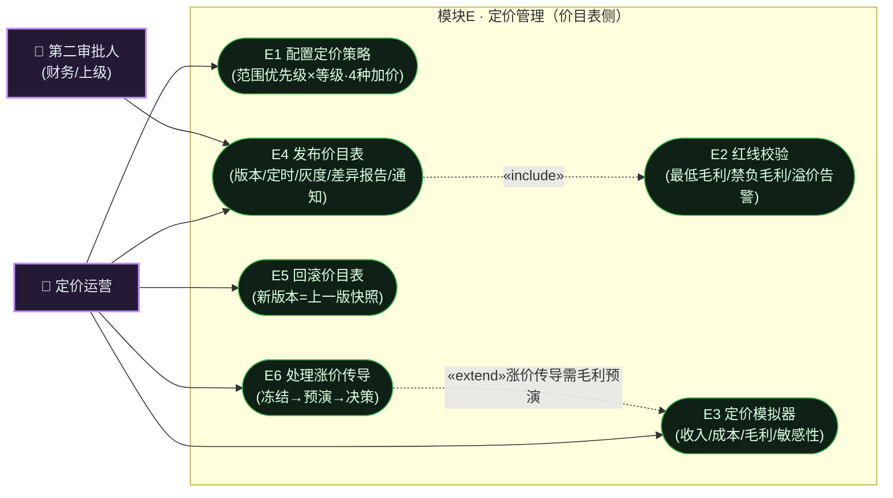
```mermaid
flowchart LR
    classDef actor fill:#241a35,stroke:#bc8cff,stroke-width:2px,color:#e6edf3
    classDef uc fill:#0f2016,stroke:#3fb950,color:#dcffe3
    classDef ext fill:#1c1a10,stroke:#d29922,color:#ffdf9e

    PO["👤 定价运营"]:::actor
    AP["👤 第二审批人<br/>(财务/上级)"]:::actor

    subgraph SG["模块E · 定价管理（价目表侧）"]
        direction TB
        E1(["E1 配置定价策略<br/>(范围优先级×等级·4种加价)"]):::uc
        E2(["E2 红线校验<br/>(最低毛利/禁负毛利/溢价告警)"]):::uc
        E3(["E3 定价模拟器<br/>(收入/成本/毛利/敏感性)"]):::uc
        E4(["E4 发布价目表<br/>(版本/定时/灰度/差异报告/通知)"]):::uc
        E5(["E5 回滚价目表<br/>(新版本=上一版快照)"]):::uc
        E6(["E6 处理涨价传导<br/>(冻结→预演→决策)"]):::uc
    end

    PO --> E1
    PO --> E3
    PO --> E4
    PO --> E5
    PO --> E6
    AP --> E4
    E4 -.->|"«include»"| E2
    E6 -.->|"«extend»涨价传导需毛利预演"| E3
```

| ID | 用例名称 | 主参与者 | 前置条件 | 主流程（简） | 扩展与异常 | PRD |
| --- | --- | --- | --- | --- | --- | --- |
| E1 | 配置定价策略 | 定价运营 | 标准成本已计算 | 作用范围优先级：全局 < 模型类型 < 厂商 < 模型系列 < 单 SKU，叠加 客户等级 < 特定客户；加价方式四选一（目标毛利率 / 成本加成率 / 官方价锚定 / 固定单价）；尾数规则（**向上取整**，可配心理价位） | 全系统默认销售毛利率口径（决策点 3） | §8.1/§8.2 |
| E2 | 红线校验 | 系统 | 策略已配置 | 发布前必须全部通过：最低销售毛利率 15%（低于拦截）/ 禁止负毛利（引流款需显式标记 + 额外审批）/ 溢价超官方价×150% 告警不拦截 / 超过 300% 走定价运营审批 / 单模型月度亏损上限（引流款用） | 缓存倒挂强制校验：对外售卖任一缓存维度必须存在至少一个支持该维度的供应商报价 | §8.2/§8.3 |
| E3 | 定价模拟器 | 定价运营 | 策略已配置 | 输入预估月用量 / 输入输出占比 / 缓存命中率 / 模型分布 / 等级分布 → 输出预测收入/成本/毛利、逐模型毛利贡献排名、敏感性分析（供应商涨价 10% / 汇率 +5% / 缓存命中率翻倍） | P1 冷启动用行业参数模板（对话类输出占比约 30% / 缓存命中约 40% 等），界面标注「已校准 / 未校准」 | §8.3 |
| E4 | 发布价目表 | 定价运营 + 第二审批人 | 红线校验通过 | 按客户等级生成、带版本号和生效时间；支持定时生效、灰度发布（先对部分客户生效）；发布前生成差异报告（涨价/降价/影响客户）；涨价必须提前通知（可配置 30 天），系统自动生成通知任务 | 回滚走 E5，禁止绕过发布流程的一键回滚 | §8.4 |
| E5 | 回滚价目表 | 定价运营 | 历史版本存在 | 发起回滚（理由必填）→ 系统生成**新版本，内容为上一版本的全量快照** → 走与发布完全相同的流程（审批 → price.effective 事件 → 网关缓存失效 → 差异报告标注「回滚至 vX」） | 回滚版本同样不可变、计入版本历史 | §8.4 |
| E6 | 处理涨价传导 | 定价运营 | 标准成本上涨（官方涨价触发） | 受影响价目表自动冻结 + 告警（附「若跟涨各档位毛利影响」预演）→ 通知期内人工决策：跟涨则手动确认新价目表（差异报告 + 影响客户清单）走发布流程；不跟涨则维持冻结价，系统持续高亮「售价-成本倒挂」风险 | 合同价保护：已签合同客户合同期内不调价，差额由平台承担，到期后按新价目表执行 | §8.4.1 |

### 3.7 模块 E · 客户报价（销售侧）

**图 3-7 模块 E 用例图（客户报价侧）：临时报价 → 特价 → 合同价**

📐 查看 Mermaid 源码（可编辑）

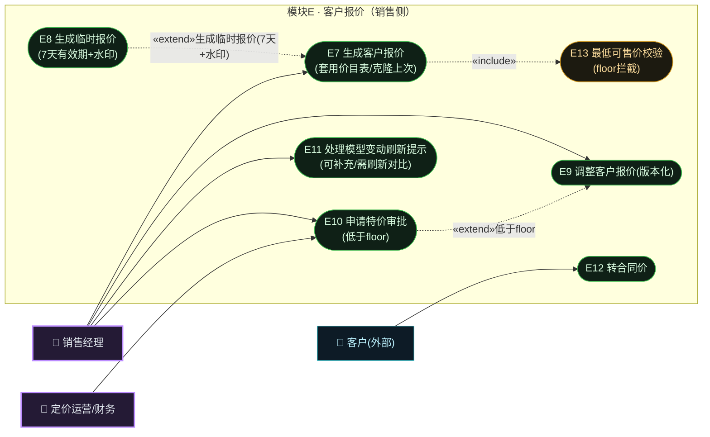
```mermaid
flowchart LR
    classDef actor fill:#241a35,stroke:#bc8cff,stroke-width:2px,color:#e6edf3
    classDef uc fill:#0f2016,stroke:#3fb950,color:#dcffe3
    classDef ext fill:#1c1a10,stroke:#d29922,color:#ffdf9e
    classDef cust fill:#0d1b26,stroke:#39c5cf,color:#bdf3ff

    SE["👤 销售经理"]:::actor
    CU["👤 客户(外部)"]:::cust
    AP["👤 定价运营/财务"]:::actor

    subgraph SG["模块E · 客户报价（销售侧）"]
        direction TB
        E7(["E7 生成客户报价<br/>(套用价目表/克隆上次)"]):::uc
        E8(["E8 生成临时报价<br/>(7天有效期+水印)"]):::uc
        E9(["E9 调整客户报价(版本化)"]):::uc
        E10(["E10 申请特价审批<br/>(低于floor)"]):::uc
        E11(["E11 处理模型变动刷新提示<br/>(可补充/需刷新对比)"]):::uc
        E12(["E12 转合同价"]):::uc
        E13(["E13 最低可售价校验<br/>(floor拦截)"]):::ext
    end

    SE --> E7
    SE --> E9
    SE --> E11
    CU --> E12
    SE --> E10
    AP --> E10
    E7 -.->|"«include»"| E13
    E8 -.->|"«extend»生成临时报价(7天+水印)"| E7
    E10 -.->|"«extend»低于floor"| E9
```

| ID | 用例名称 | 主参与者 | 前置条件 | 主流程（简） | 扩展与异常 | PRD |
| --- | --- | --- | --- | --- | --- | --- |
| E7 | 生成客户报价 | 销售经理 | 客户归属本人（一对一） | 入口一「基于价目表一键套用」：选定客户 + 勾选 SKU，按该客户等级价目表自动带出当前对外价；入口二「克隆上次报价」：复制最近报价单微调 | 客户流转（换销售）需主管操作并留审计，历史报价归属不变 | §8.5.1 |
| E8 | 生成临时报价 | 销售经理 | 同 E7 | 生成「临时」状态草稿：短有效期（如 7 天）、带「此价未经正式审批」水印 → 导出网页链接 / PDF / Excel（带编号、有效期、水印） | 转正式合同价须走 E12 流程 | §8.5.1 |
| E9 | 调整客户报价 | 销售经理 | 存在历史报价 | 打开任一历史报价单 → 改 SKU/数量/档位 → 生成新版本（不可变，旧版本保留可查） | 调整低于毛利红线 → 自动转特价审批（E10） | §8.5.1 |
| E10 | 申请特价审批 | 销售发起 → 定价运营/财务审批 | 报价低于 floor | 低于 floor 被拦截 → 填特价理由 → 展示毛利影响 → 审批 → 通过后生效 / 驳回维持原价 | **floor = 完全成本 /(1 − 最低销售毛利率 15%)**（v1.4 口径修正，与 E2 红线校验同源）；成本/毛利明细对销售不可见 | §8.5/§8.5.1 |
| E11 | 处理模型变动刷新提示 | 销售经理 | 上游发生变动 | 新增模型 → 客户报价维护页标记「可补充 N 个新模型」，一键按当前价目表带价加入；价格变动（涨价传导）→ 引用旧价目表版本的报价被标记「需刷新」并附对比（旧价→新价、对客影响）→ **销售手动确认**是否跟涨 → 刷新落新版本 | 客户报价是价格快照，不实时跟随价目表（对齐合同保护）；不确认则维持原快照直至合同到期 | §8.5.1 |
| E12 | 转合同价 | 客户接受报价 | 正式报价有效 | 客户接受 → 落入该客户专属价目表（合同价）；合同期内价格受保护，官方涨价不传导 | 分币种报价：人民币模型列 CNY 含税价、美元模型列 USD 不含税价 | §8.5 |
| E13 | 最低可售价（floor）校验 | 系统 | — | 销售侧所有报价动作经 floor 硬性下限校验，低于 floor 拦截并强制走特价审批 | **floor = 完全成本 /(1 − 15%)**（完全成本 = 标准采购成本 ×(1+损耗)×(1+通道费)）；价目表外的新 SKU 按当前成本基线现算 floor，避免出现「无 floor 可校验」；floor 以下的具体成本/毛利明细对销售不可见 | §8.5.1 |

> **客户侧展示口径（决策点 14 已确认）**：客户报价默认同时展示绝对价与「价格倍率 X 倍 / 较官方价省 X%」——由倍率自动推导，透明度作为销售卖点。

### 3.8 模块 F · 运营工作台

**图 3-8 模块 F 用例图：待办 + 驾驶舱 + 告警 + 审计四件套**

📐 查看 Mermaid 源码（可编辑）

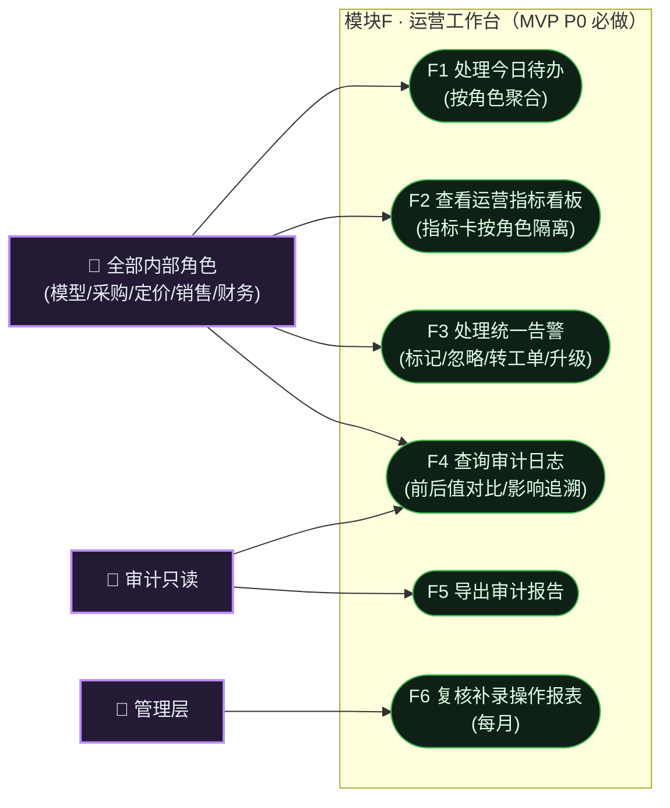
```mermaid
flowchart LR
    classDef actor fill:#241a35,stroke:#bc8cff,stroke-width:2px,color:#e6edf3
    classDef uc fill:#0f2016,stroke:#3fb950,color:#dcffe3
    classDef ext fill:#1c1a10,stroke:#d29922,color:#ffdf9e

    OPS["👤 全部内部角色<br/>(模型/采购/定价/销售/财务)"]:::actor
    AUD["👤 审计只读"]:::actor
    MGT["👤 管理层"]:::actor

    subgraph SG["模块F · 运营工作台（MVP P0 必做）"]
        direction TB
        F1(["F1 处理今日待办<br/>(按角色聚合)"]):::uc
        F2(["F2 查看运营指标看板<br/>(指标卡按角色隔离)"]):::uc
        F3(["F3 处理统一告警<br/>(标记/忽略/转工单/升级)"]):::uc
        F4(["F4 查询审计日志<br/>(前后值对比/影响追溯)"]):::uc
        F5(["F5 导出审计报告"]):::uc
        F6(["F6 复核补录操作报表<br/>(每月)"]):::uc
    end

    OPS --> F1
    OPS --> F2
    OPS --> F3
    OPS --> F4
    AUD --> F4
    AUD --> F5
    MGT --> F6
```

| ID | 用例名称 | 主参与者 | 前置条件 | 主流程（简） | 扩展与异常 | PRD |
| --- | --- | --- | --- | --- | --- | --- |
| F1 | 处理今日待办 | 全部内部角色 | 角色登录 | 按当前角色权限聚合待办（新模型审批 / 价格变更确认 / 报价到期 / 资质到期 / 倒挂处置 / 涨价传导 / 汇率锁定 / 下线审批 / 补录复核 / 报价异常），带数量角标、优先级、超时高亮；点击直达处理界面，不离开待办中心可见上下文 | 超时未处理自动升级优先级 | §9.1 |
| F2 | 查看运营指标看板 | 全部内部角色 | 角色登录 | 角色化指标卡：模型运营（清单一致率、官方价 24h 变更数、待验证 SKU）；采购（7 天内到期、资质冻结数、异常命中）；定价（倒挂/负毛利/单点依赖数、成本变动 TOP10、涨价传导队列）；销售（自身客户待跟进、临时报价临期）；财务（汇率待锁定、成本回流缺口） | 工作台为聚合视图，不新增权限域，可见性严格继承隔离规则 | §9.2 |
| F3 | 处理统一告警 | 全部内部角色 | 告警产生 | 告警源归一（价格红线/倒挂/单点/报价到期/资质过期/报价异常/缓存倒挂/汇率/补录异常）；按角色/模型系列/严重级订阅路由；标记处理中/已解决/忽略（须填理由），状态全角色可见；支持转工单 | 高优告警超时未处理自动升级到上级角色；站内 + 邮件/IM 推送（IM 为 P1） | §9.3 |
| F4 | 查询审计日志 | 全部内部角色（本域） | — | 按 SKU/供应商/客户/操作人（含补录特权）/时间区间/变更类型组合筛选；价格变更前后值逐字段对比（含币种、倍率、净成本、生效时间）+ 触发来源（人工/导入/同步任务 ID/自动跟随静默版本）；影响追溯下钻（影响了哪些价目表/客户合同/在跑调用） | 任何价格字段变更可回答「谁、何时、依据什么、改成什么、影响哪些客户」 | §9.4 |
| F5 | 导出审计报告 | 审计只读 | 持导出权限 | 导出价格变更日志用于外部审计 / 投资人核查 | — | §9.4 |
| F6 | 复核补录操作报表 | 管理层 / 审计 | 每月生成 | 每月输出补录操作报表（谁、何时、改了哪些成本、理由原文），供管理层复核 | 与频率异常实时告警联动（SOD 第 5 条） | §2.2 |

### 3.9 模块 G · 组织与权限管理（M11 落地）

**图 3-9 模块 G 用例图：组织树 + 角色授权 + 商务档案 + 资源归属**

📐 查看 Mermaid 源码（可编辑）

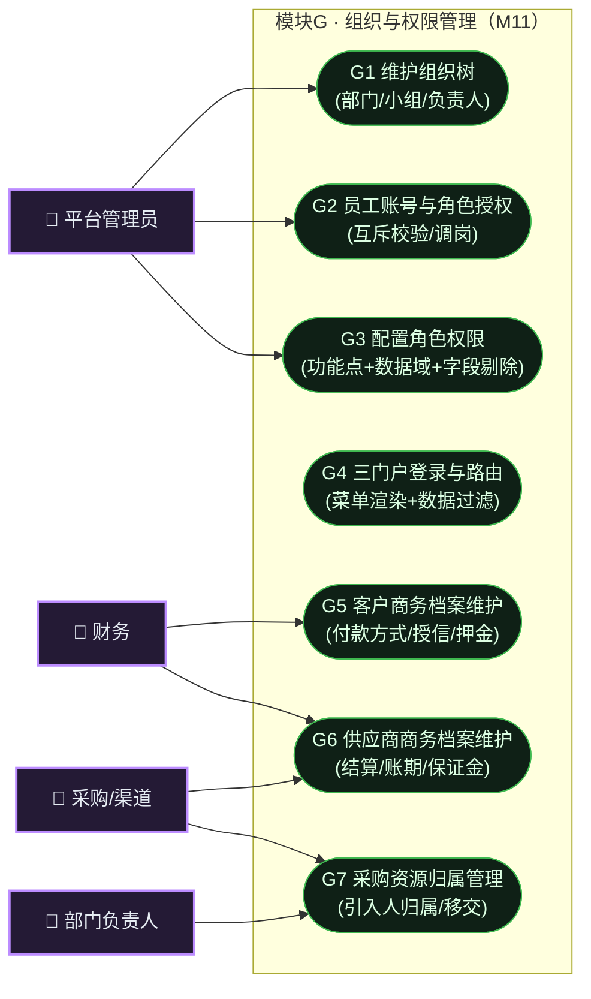
```mermaid
flowchart LR
    classDef actor fill:#241a35,stroke:#bc8cff,stroke-width:2px,color:#e6edf3
    classDef uc fill:#0f2016,stroke:#3fb950,color:#dcffe3
    classDef ext fill:#1c1a10,stroke:#d29922,color:#ffdf9e

    AD["👤 平台管理员"]:::actor
    FI["👤 财务"]:::actor
    PU["👤 采购/渠道"]:::actor
    LD["👤 部门负责人"]:::actor

    subgraph SG["模块G · 组织与权限管理（M11）"]
        direction TB
        G1(["G1 维护组织树<br/>(部门/小组/负责人)"]):::uc
        G2(["G2 员工账号与角色授权<br/>(互斥校验/调岗)"]):::uc
        G3(["G3 配置角色权限<br/>(功能点+数据域+字段剔除)"]):::uc
        G4(["G4 三门户登录与路由<br/>(菜单渲染+数据过滤)"]):::uc
        G5(["G5 客户商务档案维护<br/>(付款方式/授信/押金)"]):::uc
        G6(["G6 供应商商务档案维护<br/>(结算/账期/保证金)"]):::uc
        G7(["G7 采购资源归属管理<br/>(引入人归属/移交)"]):::uc
    end

    AD --> G1
    AD --> G2
    AD --> G3
    FI --> G5
    FI --> G6
    PU --> G6
    PU --> G7
    LD --> G7
```

| ID | 用例名称 | 主参与者 | 前置条件 | 主流程（简） | 扩展与异常 | PRD |
| --- | --- | --- | --- | --- | --- | --- |
| G1 | 维护组织树 | 平台管理员 | M11 配置权限 | 增删改部门/小组节点；设定节点负责人；负责人变更留审计 | 删除非空部门需先迁移人员；负责人变更即时影响数据域覆盖范围 | §1.4（本版新增） |
| G2 | 员工账号与角色授权 | 平台管理员 | 员工已在组织树 | 建号（internal_staff + account）→ 授予角色 → 互斥校验（销售不得兼定价/采购；补录特权须双人审批）→ 生效；调岗/停用留审计 | 互斥冲突时拒绝并提示冲突角色组合 | §2.2/§1.4 |
| G3 | 配置角色权限 | 平台管理员 | — | 配置角色的功能权限点（12 模块 × V/E/A/C/P）、默认数据域（SELF/DEPT/DEPT_SUB/ALL）、字段剔除规则 | 修改即时生效于下次登录；在线会话可强制刷新 | §2.2/§1.5 |
| G4 | 三门户登录与路由 | 全部用户 | 账号有效 | 登录 → 认证 → 解析角色与组织位置 → 下发权限包（菜单 + 数据域 + 字段剔除）→ 渲染门户；数据请求服务端行级 + 字段级过滤 | 主体冻结/停用拒登或降级只读；登录与敏感操作记审计 | §1.6（本版新增） |
| G5 | 客户商务档案维护 | 财务（客户主管可读） | 客户已建档 | 维护付款方式、授信额度、押金、账期、开票类型；系统按占用自动驱动信用状态（正常/预警/冻结） | 超额冻结新调用，还款/提额后解冻；押金与授信变动全部留痕、销售只读 | §1.3（新决策 D35） |
| G6 | 供应商商务档案维护 | 采购/财务 | 供应商已建档 | 维护结算方式、账期、最低起充、履约保证金、后付采购额度；超额暂停新增采购下单 | 保证金不足预警采购；变动留痕 | §1.3（新决策 D35） |
| G7 | 采购资源归属管理 | 采购/渠道、部门负责人 | 供应商被引入 | 供应商建档时引入人自动归属（owner_procurement）；采购员仅见本人引入的供应商及其报价/成本；主管可见本部门及下级；资源移交由主管操作留审计，历史数据按归属快照不变 | 调岗后历史归属不变；移交需双确认 | §1.4/§1.5（新决策 D33） |

---

## 4 交互模型（关键场景时序图）

10 个决定系统成败的关键场景。图中编号即消息顺序，可直接作为接口设计与联调用例依据。

### 4.1 场景一：供应商手工报价提交与审批（UC-C3 / C8）

**参与**：供应商操作员、供应商门户、官方价服务、报价服务、采购审批、成本重算、待办中心　**关键约束**：币种锁模型币种、逐组件落库、生效时间必填、防改账钳制、不可变版本

**图 4-1 供应商手工报价：录入 → 双向换算 → 不可变版本 → 审批 → 定时生效**

📐 查看 Mermaid 源码（可编辑）

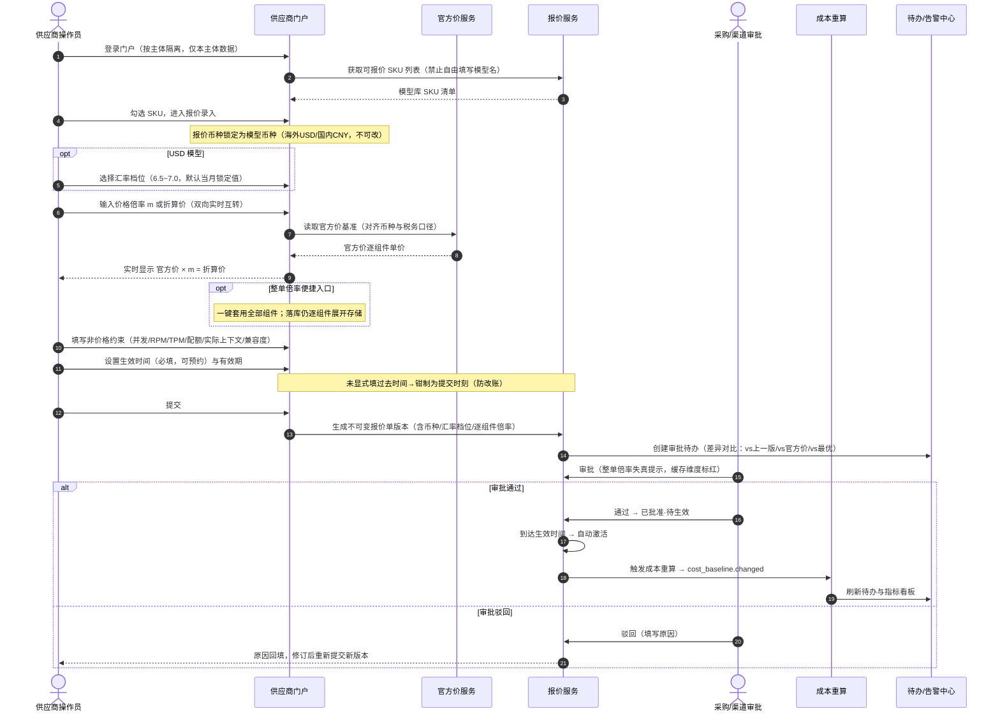
```mermaid
sequenceDiagram
    autonumber
    actor S as 供应商操作员
    participant P as 供应商门户
    participant O as 官方价服务
    participant Q as 报价服务
    actor A as 采购/渠道审批
    participant CB as 成本重算
    participant W as 待办/告警中心

    S->>P: 登录门户（按主体隔离，仅本主体数据）
    P->>Q: 获取可报价 SKU 列表（禁止自由填写模型名）
    Q-->>P: 模型库 SKU 清单
    S->>P: 勾选 SKU，进入报价录入
    Note over P: 报价币种锁定为模型币种（海外USD/国内CNY，不可改）
    opt USD 模型
        S->>P: 选择汇率档位（6.5~7.0，默认当月锁定值）
    end
    S->>P: 输入价格倍率 m 或折算价（双向实时互转）
    P->>O: 读取官方价基准（对齐币种与税务口径）
    O-->>P: 官方价逐组件单价
    P-->>S: 实时显示 官方价 × m = 折算价
    opt 整单倍率便捷入口
        Note over P: 一键套用全部组件；落库仍逐组件展开存储
    end
    S->>P: 填写非价格约束（并发/RPM/TPM/配额/实际上下文/兼容度）
    S->>P: 设置生效时间（必填，可预约）与有效期
    Note over P,Q: 未显式填过去时间→钳制为提交时刻（防改账）
    S->>P: 提交
    P->>Q: 生成不可变报价单版本（含币种/汇率档位/逐组件倍率）
    Q->>W: 创建审批待办（差异对比：vs上一版/vs官方价/vs最优）
    A->>Q: 审批（整单倍率失真提示，缓存维度标红）
    alt 审批通过
        A->>Q: 通过 → 已批准·待生效
        Q->>Q: 到达生效时间 → 自动激活
        Q->>CB: 触发成本重算 → cost_baseline.changed
        CB->>W: 刷新待办与指标看板
    else 审批驳回
        A->>Q: 驳回（填写原因）
        Q-->>S: 原因回填，修订后重新提交新版本
    end
```

### 4.2 场景二：供应商批量导入报价（UC-C4）

**参与**：供应商操作员、导入校验引擎、官方价服务、报价服务、采购审批　**关键约束**：一个文件 = 一个报价单版本；不跳过审批；错误行不静默入库

**图 4-2 批量导入：模板预填 → 逐行校验 → 预览确认 → 同一状态机审批**

📐 查看 Mermaid 源码（可编辑）

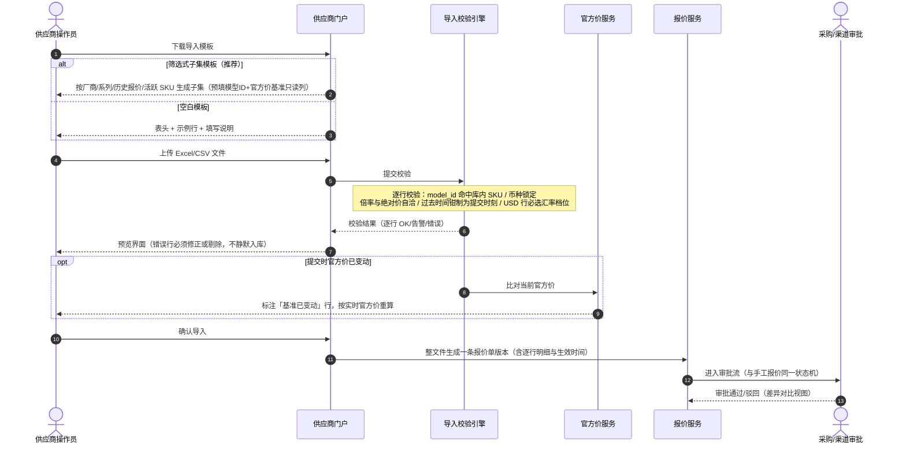
```mermaid
sequenceDiagram
    autonumber
    actor S as 供应商操作员
    participant P as 供应商门户
    participant V as 导入校验引擎
    participant O as 官方价服务
    participant Q as 报价服务
    actor A as 采购/渠道审批

    S->>P: 下载导入模板
    alt 筛选式子集模板（推荐）
        P-->>S: 按厂商/系列/历史报价/活跃 SKU 生成子集（预填模型ID+官方价基准只读列）
    else 空白模板
        P-->>S: 表头 + 示例行 + 填写说明
    end
    S->>P: 上传 Excel/CSV 文件
    P->>V: 提交校验
    Note over V: 逐行校验：model_id 命中库内 SKU / 币种锁定<br/>倍率与绝对价自洽 / 过去时间钳制为提交时刻 / USD 行必选汇率档位
    V-->>P: 校验结果（逐行 OK/告警/错误）
    P-->>S: 预览界面（错误行必须修正或剔除，不静默入库）
    opt 提交时官方价已变动
        V->>O: 比对当前官方价
        O-->>S: 标注「基准已变动」行，按实时官方价重算
    end
    S->>P: 确认导入
    P->>Q: 整文件生成一条报价单版本（含逐行明细与生效时间）
    Q->>A: 进入审批流（与手工报价同一状态机）
    A-->>Q: 审批通过/驳回（差异对比视图）
```

### 4.3 场景三：官方涨价 → 全链路传导（全系统最重要场景）

**参与**：同步采集服务、变更单队列、模型运营、定价运营、官方价版本、报价服务、成本重算、价目表、销售、客户　**关键约束**：成本真实跟涨（内部不准假）、对外售价冻结+人工决策、合同价保护

**图 4-3 涨价传导三段式：双人审批生效 → 成本真实跟涨+售价冻结 → 人工决策**

📐 查看 Mermaid 源码（可编辑）

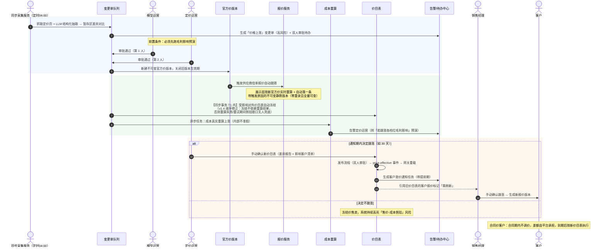
```mermaid
sequenceDiagram
    autonumber
    actor J as 同步采集服务（定时04:00）
    participant CR as 变更单队列
    actor MO as 模型运营
    actor PO as 定价运营
    participant PV as 官方价版本
    participant Q as 报价服务
    participant CB as 成本重算
    participant PB as 价目表
    participant W as 告警/待办中心
    actor SE as 销售经理
    actor CU as 客户

    rect rgba(88,166,255,0.07)
    J->>CR: 抓取定价页 + LLM 结构化抽取 → 暂存区差异对比
    CR->>W: 生成「价格上涨」变更单（高风险）+ 双人审批待办
    Note over MO,PO: 前置条件：必须先跑毛利影响预演
    MO->>CR: 审批通过（第 1 人）
    PO->>CR: 审批通过（第 2 人）
    CR->>PV: 新建不可变官方价版本，关闭旧版本生效期
    end
    rect rgba(63,185,80,0.07)
    PV->>Q: 触发供应商倍率报价自动跟随
    Note over Q: 展示层按新官方价实时重算 + 自动落一条<br/>带触发原因的不可变静默版本（零重录且全量可查）
    CR->>PB: 【同步事务 T1 内】受影响对外价目表自动冻结<br/>（v1.4 顺序修正：冻结不依赖重算结果，<br/>否则重算失败/重试期间倒挂敞口无人兜底）
    CR->>CB: 异步任务：成本真实重算上涨（内部不准假）
    CB->>W: 告警定价运营（附「若跟涨各档位毛利影响」预演）
    end
    rect rgba(210,153,34,0.07)
    alt 通知期内决定跟涨（如 30 天）
        PO->>PB: 手动确认新价目表（差异报告 + 影响客户清单）
        PB->>PB: 发布流程（双人审批）→ price.effective 事件 → 网关重载
        PB->>W: 生成客户涨价通知任务（带提前期）
        PB-->>SE: 引用旧价目表的客户报价标记「需刷新」
        SE->>CU: 手动确认跟涨 → 生成新报价版本
    else 决定不跟涨
        Note over PB: 冻结价售卖，系统持续高亮「售价-成本倒挂」风险
    end
    end
    Note over CU: 合同价客户：合同期内不调价，差额由平台承担，到期后按新价目表执行
```

### 4.4 场景四：报价到期 → 分级断供闭环（UC-C9）

**参与**：定时任务、待办/告警中心、供应商、采购/运营、成本重算　**关键约束**：禁止全自动剔除；单点依赖模型阈值提前 + 最高级告警

**图 4-4 断供分级闭环：7 天提醒 → 3 天催办 → 宽限期 → 人工确认剔除**

📐 查看 Mermaid 源码（可编辑）

```mermaid
sequenceDiagram
    autonumber
    participant T as 定时扫描任务
    participant W as 待办/告警中心
    actor SU as 供应商操作员
    actor OP as 采购/运营
    participant CB as 成本重算

    T->>W: T-7 天：自动提醒供应商续报（普通级）
    W->>SU: 续报提醒（门户/站内信）
    T->>W: T-3 天：升级告警
    W->>OP: 运营主动介入催办（可触发外呼/工单）
    T->>CB: 到期日：进入宽限期（可配置，如 3 天），暂缓剔除
    T->>W: 宽限期满：高亮「待剔除确认」待办（持续存在）
    W->>OP: 等待人工确认（禁止全自动剔除）
    OP->>CB: 确认剔除 → 重算成本，故障转移到备选供应商
    Note over W,CB: 单点依赖模型：阈值提前至 14/7 天 + 最高级告警；<br/>须先确认兜底方案（临时锁定备用供应商/临时限流/客户通知）方可剔除
    opt 供应商到期前已续报
        SU->>T: 新版本报价审批通过并生效
        T->>CB: 成本无缝重算，不中断供应
    end
```

### 4.5 场景五：新模型申请与查重合并（UC-C5 / C12）

**参与**：供应商、查重引擎、模型运营、模型档案库、能力探测（P1）、定价运营　**关键约束**：查重在源头消灭别名灾难

**图 4-5 新模型申请：查重 → 合并别名 或 入库验证 → 可采购 → 上架**

📐 查看 Mermaid 源码（可编辑）

```mermaid
sequenceDiagram
    autonumber
    actor SU as 供应商操作员
    participant DM as 查重引擎
    actor MO as 模型运营
    participant MD as 模型档案库
    participant PR as 能力探测(P1)
    actor PO as 定价运营

    SU->>DM: 提交新模型申请（模型名/厂商/类型/能力/文档链接/报价）
    DM-->>MO: 查重结果：Top3 疑似匹配（名称归一化+编辑距离+厂商匹配）
    alt 疑似已有 SKU 别名
        MO->>DM: 一键合并为别名
        DM->>MD: 写入别名映射
        DM-->>SU: 反馈「已合并为 X 的别名」
    else 确认为新模型
        MO->>MD: 审批通过 → 入库「待验证」
        alt MVP 阶段：人工验证
            MO->>MD: 记录能力验证（验证人/时间/方式）
        else P1 及以后：自动探测
            MD->>PR: 发送探针请求（协议兼容/上下文/tool call/实际延迟）
            PR-->>MD: 探测报告
        end
        MD->>MD: 验证通过 → 「可采购」
        PO->>MD: 决定是否对外上架 → 「已上架」
    else 驳回
        MO-->>SU: 驳回原因回填（处理进度供应商可见）
    end
    Note over SU,MO: 超时未处理 → 自动提醒
```

### 4.6 场景六：模型退役七步闭环（UC-B7）

**参与**：模型运营、影响分析引擎、定价运营/上级、销售、模型档案库、网关、告警中心　**关键约束**：影响清单是审批必读材料；合同期客户不切断

**图 4-6 模型退役：影响分析 → 通知 → 双人审批 → 下线执行 → 残留监控**

📐 查看 Mermaid 源码（可编辑）

```mermaid
sequenceDiagram
    autonumber
    actor MO as 模型运营
    participant IA as 影响分析引擎
    actor PO as 定价运营/上级
    actor SE as 销售经理
    participant MD as 模型档案库
    participant GW as 网关/计费
    participant W as 告警中心

    MO->>IA: 发起退役（选择 SKU + 原因）
    IA-->>MO: 影响清单（引用该 SKU 的价目表/客户合同/客户报价/进行中调用）
    Note over IA: 「进行中调用」数据在网关/计费，MVP 可降级为仅列价目表/合同/报价引用
    IA-->>MO: 推荐替代 SKU
    MO->>SE: 客户迁移建议 + 通知任务（≥30 天提前期）
    MO->>PO: 提交双人审批（影响清单为必读材料，缺失不允许提交）
    PO->>MD: 第 1 签通过（定价运营）
    Note over PO,MD: 第 2 签由上级角色完成（双人审批强制换人）
    MD->>MD: 状态置「即将下线」，从可售/可新采清单移除
    MD->>MD: 到达下线日 → 「已下线」
    MD->>GW: 发出退役事件 → 网关停用路由
    loop 下线后监控
        GW->>W: 残留调用告警（仍有客户命中旧路由）
        W->>MO: 立即处置
    end
    Note over MD,GW: 合同期客户仍可调用原模型（合同价保护）；<br/>历史报价单/价目表/客户报价全部保留可查
```

### 4.7 场景七：价目表发布与回滚（UC-E4 / E5）

**参与**：定价运营、策略引擎、红线校验、第二审批人、价目表版本、网关/计费、客户　**关键约束**：回滚 = 生成上一版快照的新版本，走同一发布流程

**图 4-7 价目表发布：策略计算 → 红线校验 → 双人审批 → 定时/灰度生效；回滚即快照新版本**

📐 查看 Mermaid 源码（可编辑）

```mermaid
sequenceDiagram
    autonumber
    actor PO as 定价运营
    participant EN as 定价策略引擎
    participant RB as 红线校验
    actor AP as 第二审批人(财务/上级)
    participant PB as 价目表版本
    participant GW as 网关/计费
    participant CU as 客户通知

    PO->>EN: 配置策略（范围优先级×等级 / 加价方式 / 红线 / 尾数向上取整）
    EN->>EN: 逐组件计算：售价 = f(完全成本, 策略)
    EN->>RB: 提交发布（红线校验）
    Note over RB: 最低毛利15% / 禁负毛利 / 溢价超150%告警<br/>缓存维度倒挂强制校验
    alt 校验全部通过
        RB->>PB: 生成草稿版本 + 差异报告（涨价/降价/影响客户）
        PB->>AP: 双人审批
        AP->>PB: 通过 → 待生效（支持定时/灰度）
        PB->>GW: 到达生效时间 → price.effective 事件 → 网关缓存失效重载
        PB->>CU: 涨价项生成通知任务（带 30 天提前期）
    else 校验拦截
        RB-->>PO: 拦截原因（红线违规 / 取整修正）
    end
    opt 发起回滚
        PO->>PB: 发起回滚（理由必填）
        PB->>PB: 生成新版本 = 上一版本全量快照
        PB->>RB: 回到红线校验（与发布同一流程）
        RB->>AP: 双人审批
        AP->>PB: 通过 → 待生效（定时/灰度）
        PB->>GW: price.effective 事件 → 网关缓存失效重载
        Note over PB: 走完全相同的发布流程（红线→审批→生效→事件），<br/>差异报告标注「回滚至 vX」；禁止绕过流程的一键回滚
    end
```

### 4.8 场景八：销售临时报价与特价审批（UC-E7~E13）

**参与**：销售经理、客户报价服务、价目表、最低可售价服务、定价运营/财务、客户　**关键约束**：客户一对一归属；成本/毛利不可见，仅见 floor

**图 4-8 临时报价：套用/克隆 → floor 校验 → 特价审批 → 转合同价**

📐 查看 Mermaid 源码（可编辑）

```mermaid
sequenceDiagram
    autonumber
    actor SE as 销售经理
    participant Q as 客户报价服务
    participant PB as 价目表
    participant FL as 最低可售价(floor)服务
    actor AP as 定价运营/财务
    actor CU as 客户

    Note over SE: 仅可见自有客户（一对一归属），成本与毛利构成不可见
    SE->>Q: 选定自有客户
    alt 一键套用价目表
        Q->>PB: 读取该客户等级当前对外价
        PB-->>Q: 逐 SKU 价格（分币种：CNY 含税 / USD 不含税）
    else 克隆上次报价
        Q->>Q: 复制最近报价单，微调 SKU/数量
    end
    Q-->>SE: 临时报价草稿（7 天有效期 + 「此价未经正式审批」水印）
    SE->>CU: 发送网页链接 / PDF / Excel
    alt 报价高于 floor
        CU->>Q: 客户接受 → 转合同价（落入客户专属价目表）<br/>【D36】可经客户门户 / H5 小程序自助完成
    else 低于 floor 被拦截
        Q-->>SE: 拦截提示，引导走特价审批
        SE->>AP: 申请特价（展示毛利影响，成本明细仍不可见）
        AP->>Q: 审批通过 / 驳回
    end
    opt 上游模型变动
        Q->>SE: 标记「可补充 N 个新模型」/「需刷新（附旧价→新价对比）」
        SE->>Q: 手动确认跟涨/补充 → 生成新版本（旧版本保留）
    end
```

### 4.9 场景九：特权补录历史生效报价（UC-C11）

**参与**：成本补录（特权角色）、报价服务、成本重算、审计日志、告警中心　**关键约束**：强制审计理由；重算范围仅限「指定生效时间起至今」

**图 4-9 特权回溯：理由强制 → 标记高亮 → 范围受限的重算 → 月度报表**

📐 查看 Mermaid 源码（可编辑）

```mermaid
sequenceDiagram
    autonumber
    actor RO as 成本补录（特权角色）
    participant Q as 报价服务
    participant CB as 成本重算
    participant AL as 审计日志
    participant W as 告警中心

    Note over RO: 特权经双人审批授予；当月补录超 N 次（建议5）触发告警
    RO->>Q: 选择报价，指定过去生效时间
    Q-->>RO: 强制要求填写审计理由
    RO->>Q: 提交（理由：如「补录上周已口头确认的报价」）
    Q->>AL: 记录操作人/操作时间/理由原文；标记 retroactive=true
    Q->>CB: 成本重算 —— 仅限「指定生效时间起至今」区间
    Note over CB: 绝不向更早时段回灌，避免污染既有对账数据
    AL->>W: 成本变更日志中高亮显示
    W->>W: 每月输出补录操作报表（谁/何时/改了哪些成本/理由原文）供管理层复核
```

### 4.10 场景十：汇率月度锁定（UC-D5）

**参与**：日历任务、待办/告警中心、财务、汇率配置、全部跨币折算场景　**关键约束**：当月锁死；汇率只用于跨币折算，不参与单模型内部定价

**图 4-10 汇率月锁：每月 1 号财务选定档位 → 当月统一使用**

📐 查看 Mermaid 源码（可编辑）

```mermaid
sequenceDiagram
    autonumber
    participant T as 日历任务
    participant W as 待办/告警中心
    actor FI as 财务
    participant FX as 汇率配置
    participant ALL as 全部跨币折算场景

    T->>W: 每月 1 号向财务推送「汇率锁定」待办
    alt 1 号内完成锁定（正常路径）
        FI->>FX: 从 8 档选定（6.5/6.7/6.75/6.8/6.85/6.9/6.95/7.0）
        FX->>ALL: 当月所有 USD↔CNY 折算统一使用该锁定值
        Note over FX: 记录选择人/时间/档位值
    else 超时未锁定
        W->>FI: 告警催办（SLA）
    end
    opt 月中调整（例外路径）
        FI->>FX: 发起调整 → 双人审批 + 记录理由
    end
    Note over ALL: 汇率用途边界：仅用于供应商USD报价折人民币、月报汇总、对账；<br/>不参与单模型内部 USD→USD 定价
```

---

## 5 状态模型（简化状态机）

> **简化原则（本版调整）**：除 **5.3 官方价格变更** 保留完整流程与逻辑外，其余状态机全部简化为主线（一条主干路径 + 备注补充），省略的分支与条件详见 PRD 对应章节。所有状态迁移 100% 写入审计日志。

### 5.1 模型 SKU（简化）

**图 5-1 模型 SKU：草稿 → 待验证 → 可采购 → 已上架 → 即将下线 → 已下线**

📐 查看 Mermaid 源码（可编辑）

```mermaid
stateDiagram-v2
    [*] --> 草稿: 模型运营创建（A1）
    草稿 --> 待验证: 提交 / 新模型申请审批通过（C5·C12）
    待验证 --> 可采购: 能力验证通过（人工 / P1 自动探测）
    可采购 --> 已上架: 定价运营决定上架
    已上架 --> 即将下线: 退役审批通过（B7 双人）
    即将下线 --> 已下线: 到达下线日执行 + 事件通知网关
    已下线 --> [*]
```

> 备注：枚举值与设计文档 2.6 状态字典对应（草稿 `DRAFT` / 待验证 `PENDING_VERIFY` / 可采购 `PURCHASABLE` / 已上架 `PUBLISHED` / 即将下线 `DEPRECATING` / 已下线 `OFFLINE`）。v1.4 已补齐 v1.3 简图中缺失的「草稿」与「可采购」。合同期客户在已下线后仍可调用原模型（合同价保护）。

### 5.2 供应商报价单（简化）

**图 5-2 报价单状态机：核心是「已批准·待生效」补齐审批与生效之间的真空**

📐 查看 Mermaid 源码（可编辑）

```mermaid
stateDiagram-v2
    [*] --> 草稿: 手工录入 / 批量导入确认
    草稿 --> 已提交: 提交
    已提交 --> 审批中: 进入采购待办
    审批中 --> 已批准待生效: 审批通过（C8）
    审批中 --> 已驳回: 驳回（终态，修订需新版本）
    已批准待生效 --> 已生效: 到达生效时间自动激活<br/>（同事务关闭旧的已生效版本）
    已生效 --> 已结束: 过期 / 作废 / 被新版本覆盖
    已生效 --> 已结束: 宽限期满人工确认剔除
    已驳回 --> [*]
    已结束 --> [*]
```

> 备注：① **「审批中」= C8 用例的前置状态**（v1.4 补齐，v1.3 简图中缺失导致用例无落点）；② 审批驳回 = 修改后重新提交**新版本**（旧版本保留），不回到草稿态；③ 「已批准·待生效」= 审批通过但生效时间在未来，到达时间自动激活，**激活时同事务把旧的已生效版本关闭**，保证同一供应商同一时点只有一条生效报价；④ 已生效不可编辑，改价 = 提交新版本；⑤ 到期处置见 4.4 分级断供闭环。枚举值：草稿 `DRAFT` / 已提交 `SUBMITTED` / 审批中 `APPROVING` / 已批准·待生效 `APPROVED_PENDING` / 已生效 `EFFECTIVE` / 已结束 `EXPIRED`·`VOIDED` / 已驳回 `REJECTED`。

### 5.3 官方价格变更（**保留完整流程与逻辑**）

这是全系统最重要的状态流——厂商官方价从采集到传导至客户的完整生命周期：

**图 5-3 变更单：分级处理 —— 低危自动、降价单人、涨价双人**

📐 查看 Mermaid 源码（可编辑）

```mermaid
stateDiagram-v2
    direction TB
    state "采集入库（暂存区）" as S0
    state "差异对比生成变更单" as S1
    state "人工确认队列" as S2
    state "低风险自动生效" as S3
    state "降价：单人审批" as S4
    state "涨价：双人审批＋毛利预演" as S5
    state "已生效（新官方价版本）" as S6
    state "已拒绝" as S7
    state "采集失败告警" as S8
    state "退役：双人审批＋影响清单" as S9

    [*] --> S0: 定时采集（04:00）或事件触发<br/>（官方博客/发布会关键词命中提频）
    S0 --> S1: 暂存区 vs 生产数据差异对比
    S1 --> S2: 多源数据不一致（禁止静默取值）
    S1 --> S3: 新增模型 / 能力参数变更（低风险）
    S1 --> S4: 价格下降
    S1 --> S5: 价格上涨
    S1 --> S9: 标记退役（B7，影响清单必读，缺失拒绝提交）
    S1 --> S8: 页面改版 / 采集失败
    S8 --> S0: 修复抽取规则后重跑（绝不清空原数据）
    S2 --> S4: 确认为降价
    S2 --> S5: 确认为涨价
    S2 --> S7: 人工拒绝
    S3 --> S6: 自动生效（新增模型入「待验证」）
    S4 --> S6: 单人审批通过（触发售价重算提醒）
    S4 --> S7: 审批拒绝（保留原价）
    S5 --> S6: 模型运营 + 定价运营双签通过<br/>（前置：毛利影响预演已跑）
    S5 --> S7: 任一审批人拒绝
    S9 --> S6: 双人审批通过 → 状态置「即将下线」<br/>→ 下线日执行「已下线」+ 事件通知网关
    S9 --> S7: 任一审批人拒绝
    S6 --> [*]
```

**「已生效」的下游连锁逻辑（关键，全部自动触发）**：

1. **新建不可变官方价版本**：关闭旧版本生效期，官方价变更时间线全量可查（谁、何时、来源、置信度、触发任务 ID）。
2. **供应商倍率报价自动跟随**：展示层按新官方价实时重算（零重录）；同时自动落一条带触发原因的不可变静默版本（`trigger=official_price_change`，记录原值/新值），计入报价历史可逐条查询。绝对价（价格模式）报价不自动跟随，需供应商主动修订。
3. **标准成本真实重算上涨**：内部成本数据必须反映真实情况，不得为"账面好看"而冻结成本。
4. **受影响对外价目表自动冻结**：不立即跟涨，触发告警给定价运营，附"若跟涨，各客户档位毛利影响"预演。
5. **通知期内人工决策（半自动传导）**：
   - **跟涨**：定价运营手动确认新价目表（差异报告 + 影响客户清单），走双人审批发布流程，生成客户涨价通知任务（带提前期，如 30 天）；引用旧价目表的客户报价被标记「需刷新」，销售手动确认。
   - **不跟涨**：维持冻结价售卖，系统持续高亮「售价-成本倒挂」风险直至解决。
6. **合同价保护**：已签合同客户合同期内不调价，官方涨价与合同价的差额由平台承担，到期后按新价目表执行。

### 5.4 价目表版本（简化）

**图 5-4 价目表版本：回滚不是特殊动作，而是「快照新版本」**

📐 查看 Mermaid 源码（可编辑）

```mermaid
stateDiagram-v2
    [*] --> 草稿: 定价策略引擎生成
    草稿 --> 已生效: 红线校验通过 → 双人审批 → 到达生效时间
    已生效 --> 已替代: 被新版本 / 回滚版本取代
    已替代 --> [*]
```

> 备注：① 支持定时生效与灰度发布（先对部分客户生效）；② 回滚 = 生成新版本（内容为上一版全量快照），走同一发布流程，不是特殊一键动作；③ 生效时发 price.effective 事件，网关缓存失效重载。

### 5.5 客户报价（简化）

**图 5-5 客户报价：价格快照语义 —— 不实时跟随价目表，调整即新版本**

📐 查看 Mermaid 源码（可编辑）

```mermaid
stateDiagram-v2
    [*] --> 草稿: 销售创建（套用价目表 / 克隆上次）
    草稿 --> 临时: 生成临时报价（7天有效期+水印，E8）
    临时 --> 已报价: 转正式（客户接受 / 特价审批通过）
    草稿 --> 已报价: 直接生成正式报价
    已报价 --> 特价审批中: 低于 floor（E10）
    特价审批中 --> 已报价: 审批通过
    特价审批中 --> 草稿: 驳回（维持原价）
    已报价 --> 成交: 客户接受 → 转合同价（E12）
    已报价 --> 已过期: 有效期届满
    临时 --> 已过期: 7 天有效期届满
    成交 --> [*]
    已过期 --> [*]
```

> 备注：① 客户报价是价格快照，不实时跟随价目表；调整/刷新 = 生成新版本；② 低于 floor 被拦截须走特价审批；③ 「需刷新」是标志位而非状态（价格变动对比提示，销售手动确认）；④ v1.4 补齐 v1.3 缺失的「临时」与「特价审批中」。枚举值：草稿 `DRAFT` / 临时 `TEMP` / 已报价 `FORMAL` / 成交 `CONTRACT` / 已过期 `EXPIRED`（见设计文档 2.6）。

### 5.6 供应商资质（简化）

**图 5-6 供应商资质：临期预警 → 过期冻结 → 续证解冻**

📐 查看 Mermaid 源码（可编辑）

```mermaid
stateDiagram-v2
    [*] --> 有效: 资质审核通过
    有效 --> 已冻结: 到期前30天提醒 → 过期
    已冻结 --> 有效: 重新上传资质 + 审核通过
    已冻结 --> [*]: 长期未续证停用
```

> 备注：冻结报价提交/下单能力；自动从主供应商降权（历史报价保留至自然到期、仅供对账）；不影响历史已生效报价的执行与对账。

### 5.7 新模型申请（简化）

**图 5-7 新模型申请：八成申请是别名，查重合并是主路径**

📐 查看 Mermaid 源码（可编辑）

```mermaid
stateDiagram-v2
    [*] --> 已提交: 供应商发起申请
    已提交 --> 已入库: 查重确认新模型 + 审批通过（入「待验证」）
    已提交 --> 已关闭: 合并为别名 / 驳回
    已入库 --> [*]: 验证通过 → 可采购（定价运营决定是否上架）
    已关闭 --> [*]
```

> 备注：超时未处理自动提醒；处理进度与驳回原因供应商侧可见。

### 5.8 供应商档案（简化）

**图 5-8 供应商档案：冻结不影响历史数据，只限制新动作**

📐 查看 Mermaid 源码（可编辑）

```mermaid
stateDiagram-v2
    [*] --> 活跃: 资质审核通过
    活跃 --> 已冻结: 任一必备资质过期
    已冻结 --> 活跃: 续证审核通过
    活跃 --> 已停用: 合规违规 / 人工停用
    已停用 --> [*]
```

> 备注：冻结期间断供风险按报价到期分级闭环升级处理（见 4.4）。

---

## 6 数据模型与外部接口

### 6.1 核心实体关系

**图 6-1 核心实体关系（沿用 PRD §10，字段说明见 PRD 核心表说明）**

📐 查看 Mermaid 源码（可编辑）

```mermaid
erDiagram
    ORG_UNIT ||--o{ ORG_UNIT : parent
    ORG_UNIT ||--o{ INTERNAL_STAFF : contains
    INTERNAL_STAFF ||--o{ ACCOUNT : logs_in
    INTERNAL_STAFF ||--o{ ROLE_GRANT : holds
    ROLE ||--o{ ROLE_GRANT : granted
    ROLE ||--o{ ROLE_PERMISSION : bundles
    PERMISSION_POINT ||--o{ ROLE_PERMISSION : maps

    VENDOR ||--o{ MODEL_FAMILY : owns
    MODEL_FAMILY ||--o{ MODEL_SKU : contains
    MODEL_SKU ||--o{ MODEL_ALIAS : has
    MODEL_SKU ||--o{ PRICE_VERSION : official_price
    PRICE_VERSION ||--o{ PRICE_COMPONENT : consists_of

    LEGAL_SUBJECT ||--o{ SUBJECT_OPERATOR : has
    SUBJECT_OPERATOR ||--o| ACCOUNT : logs_in
    LEGAL_SUBJECT ||--o| SUPPLIER_PROFILE : is
    LEGAL_SUBJECT ||--o| CUSTOMER_PROFILE : is
    CUSTOMER_PROFILE ||--o{ CREDIT_TXN : has
    CUSTOMER_PROFILE ||--o{ DEPOSIT_TXN : has

    SUPPLIER_PROFILE ||--o{ QUOTE_SHEET : submits
    QUOTE_SHEET ||--o{ QUOTE_ITEM : contains
    QUOTE_ITEM }o--|| MODEL_SKU : quotes
    QUOTE_ITEM ||--o{ QUOTE_COMPONENT : prices

    MODEL_SKU ||--o| COST_BASELINE : computes
    COST_BASELINE ||--o{ COST_COMPONENT : consists_of
    COST_BASELINE }o--|| SUPPLIER_PROFILE : primary_from

    PRICING_POLICY ||--o{ PRICE_BOOK_ITEM : generates
    PRICE_BOOK ||--o{ PRICE_BOOK_ITEM : contains
    PRICE_BOOK_ITEM ||--o{ PRICE_BOOK_COMPONENT : prices
    PRICE_BOOK_ITEM }o--|| MODEL_SKU : sells

    CUSTOMER_PROFILE ||--o{ CUSTOMER_QUOTE : receives
    CUSTOMER_QUOTE ||--o{ CUSTOMER_QUOTE_ITEM : contains
    CUSTOMER_QUOTE_ITEM }o--|| MODEL_SKU : prices
    CUSTOMER_PROFILE ||--o{ CUSTOMER_PRICE_BOOK : contract_price

    SUPPLIER_PROFILE ||--o{ MODEL_APPLICATION : applies
    MODEL_APPLICATION }o--o| MODEL_SKU : merges_into
    SYNC_JOB ||--o{ STAGING_PRICE : produces
    SYNC_JOB ||--o{ CHANGE_REQUEST : produces
    CHANGE_REQUEST ||--o{ APPROVAL_STEP : requires
    CHANGE_REQUEST }o--|| MODEL_SKU : affects
```

| 核心表 | 关键约束 |
| --- | --- |
| model_sku | 全系统唯一锚点，ID 不可变；能力参数内联为 JSON（原 MODEL_CAPABILITY 实体已内联） |
| price_version / price_component | 官方价不可变快照；每次变更新增一条；逐组件计价（缓存维度按厂商官方定义建模，不预置枚举）；**版本生效区间不重叠** |
| quote_sheet / quote_item / **quote_component** | 含状态机、valid_from（必填可预约）；每次提交/修订新增不可变版本；retroactive 标记 + 审计理由；**逐组件价格独立成表**，支撑跨报价比价与缓存倒挂校验 |
| **cost_baseline / cost_component** | **不可变版本**（v1.4 变更）：每次重算新增版本并关闭旧版本生效期，带计算依据快照与 change_reason，**任何历史时点的成本可查**；值未变则不产生新版本 |
| pricing_policy / price_book_item / **price_book_component** | 规则表（作用范围/加价方式/红线/优先级）；结果表必须记录「由哪条策略 + 哪个成本基线算出」；**floor_price = 完全成本 /(1−15%)** |
| **customer_price_book** | **v1.4 新增**：客户专属价目表，承载 E12 合同价（含合同期） |
| legal_subject 族 | USCC（公司）/ 手机号（个人）唯一键，**按 subject_type 作用域隔离**；account 绑定 operator（外部角色由 portal_type 隐式决定）；审计一律记 operator_id |
| audit_log | 全量操作留痕，价格相关操作强制记录变更前后值，保留 3 年；**新增 source_type（HUMAN/CRON/WORKER/AGENT）与 source_id** |
| **idempotency_key** | **v1.4 新增**：幂等表，含 request_id / biz_key / request_hash / 结果快照 |
| **event_outbox** | **v1.4 新增**：对外事件出站（price.effective / model.published 等），供网关与计费消费 |

### 6.2 与主平台集成（数据流）

**图 6-2 上下游集成：本系统是主数据中心，别名映射必须下发网关供调用解析**

📐 查看 Mermaid 源码（可编辑）

```mermaid
flowchart LR
    subgraph SELF["模型管理与定价中心"]
        M1["模型库/别名映射"]
        M2["主备供应商序列+权重"]
        M3["对外价目表"]
        M4["采购成本口径+价格快照"]
        M5["退役/涨价/到期事件"]
    end
    UP["上游：厂商官方API / 定价页 / 社区价格源"] -->|"四源采集"| SELF
    M1 -->|"拉取API+变更事件"| GW["API网关/路由层"]
    M2 --> GW
    M3 -->|"拉取API+price.effective"| BILL["计费系统"]
    M4 -->|"按账期拉取历史快照"| REC["对账系统"]
    M1 -->|"可售清单与展示价"| WEB["前台官网/控制台"]
    M5 -->|"事件订阅"| MSG["通知系统"]
    GW -.->|"P2 实际调用数据回流"| M4
    BILL -.->|"P2 供应商账单回流<br/>校准损耗系数"| M4
```

> 别名映射必须下发网关：客户用 `gpt-5` 调用，网关要能解析到具体 SKU 再路由，否则计费口径会错。

| 关键事件 | 触发时机 | 下游消费者 |
| --- | --- | --- |
| model.published / model.deprecated | 模型上架 / 退役执行 | 网关路由启停、通知系统 |
| price.effective | 价目表生效（含回滚版本） | 计费系统、网关缓存失效重载 |
| cost_baseline.changed | 成本重算（报价生效/官方价变更/补录） | 网关（毛利校验）、指标看板 |
| quote.approved / quote.effective | 报价审批通过 / 到达生效时间激活 | 采购待办、成本重算服务 |
| official_price.changed | 新官方价版本生效 | 报价服务（倍率自动跟随 + 静默版本） |

---

## 7 非功能需求

| 维度 | 要求 |
| --- | --- |
| 数据量级 | 模型 SKU 5000+，供应商 100+，报价明细 50 万+ |
| 查询性能 | 价目表查询 P99 ≤ 50ms（下游高频拉取，建议全量缓存 + 事件失效） |
| 精度 | 价格字段 Decimal，禁用浮点；单价保留 8 位小数；统一内部计价单位「每百万 token」 |
| 币种与税务 | 币种跟随模型（海外 USD 不含税 / 国内 CNY 含税）；成本/售价/毛利在模型币种内核算不统一折算；汇率固定 8 档 + 每月锁定 |
| 时区 | 统一 UTC 存储，展示按用户时区；生效时间按 Asia/Shanghai 判定 |
| 幂等 | 同步任务、报价提交、价目表发布均需幂等 |
| 权限 | 字段级权限控制（成本、毛利字段对销售/供应商物理不可见） |
| 审计 | 价格相关操作 100% 留痕，保留 3 年 |
| 技术栈建议 | 模块化单体 + **PostgreSQL 15**（逐组件价格独立成表；非结构化参数用 JSONB）+ **Redis 7（可选，仅短信验证码与登录限次，非强依赖）**+ 对象存储；单台 CVM 部署（nginx + Go 单进程 + PostgreSQL），事件分发用数据库任务表 + 后台轮询 |
| 时区 | 统一 UTC 存储，展示按用户时区；生效时间按 Asia/Shanghai 判定（与设计文档一致） |

---

## 8 附录：需求追溯表

本文档全部需求条目与 PRD v1.0 章节及 32 个已确认决策点的映射。所有决策点均已拍板，**无遗留开放问题**，可进入 MVP 开发。

| 本文档条目 | PRD 章节 | 关联决策点（已确认） |
| --- | --- | --- |
| 术语对照表 | 全文 | 命名通俗化调整，语义与 PRD 一致 |
| 第 1 章 账号、角色与权限体系 | §2.1 / §2.2 + 本版新增 §1.1–1.6 | #17–#25（同左）+ **D33 采购数据域=本人引入资源（主管=本部门及下级）**、**D34 运营管理员=全量客户与资源**、**D35 客户/供应商商务档案三要素（付款方式/授信额度/押金）**、**D36 三门户登录落地（客户门户升级）** |
| 3.1 模型管理用例 | §3.1–3.3 / §4.1–4.3 | #15 逐组件存储、#16 官方价跟随语义 |
| 3.2 官方价格同步用例 | §5.1–5.5 | — |
| 3.3 供应商侧用例（报价/导入） | §6.1 / §6.2 / §6.2.1 / §6.4 | #2 倍率核心、#26 模板预填、#27 筛选式导出、#28 导入不可跳过审批 |
| 3.4 平台侧用例（审批/断供/补录） | §6.1 / §6.2 / §6.3 | —（防改账与补录监控为 SOD 第 5 条） |
| 3.5 成本管理用例 | §7.0–7.3 | #9 综合评分最优、#11 跨境税务口径 |
| 3.6 定价管理用例 | §8.1–8.4.1 | #3 销售毛利率、#4 红线 15%、#5 允许溢价、#6/#12 多币种对客、#13 涨价半自动传导 |
| 3.7 客户报价用例 | §8.5 / §8.5.1 | #14 倍率对客可见、#29 客户一对一归属、#30 临时报价机制、#31 销售仅见 floor、#32 模型变动刷新提示 |
| 3.8 运营工作台用例 | §9.1–9.4 | —（运营评审 P0-1/P2-4/P2-5 项） |
| 3.9 组织与权限管理用例（模块 G） | 本版新增 §1.3–1.6 / §2.2 | D33–D36；注：采购数据域收窄与 PRD §2.2 原设计（成本域全量可见）冲突，以 D33 为准，PRD 权限矩阵对应行需修订 |
| 第 4 章 交互模型 | §5.3 / §5.5 / §6.2 / §6.2.1 / §6.3 / §7.0 / §8.4 / §8.4.1 / §8.5.1 | 同上各条 |
| 第 5 章 状态模型 | §4.1 / §5.3 / §5.5 / §6.3 / §8.4 / §6.1 / §6.4 | 本版除官方价格变更外全部简化为主线 |
| 第 6 章 数据模型与接口 | §10 / §11 | — |
| 第 7 章 非功能需求 | §12 / §15 | — |

> **最容易被低估的三件事（沿用 PRD 结语，开发排期时重点保障）**：① 别名统一——数据质量地基，做晚了十倍代价清数据；② 价格快照不可变——UPDATE 价格字段会导致对账与争议处理彻底抓瞎；③ 完全成本而非供应商报价——账面 35% 实际可能 20%，永远找不到钱漏在哪。

---

*大模型中转平台 · 模型管理与定价中心 — 需求规格说明书（通俗版）v1.4　|　基于 PRD v1.0 定稿整理　|　2026-09-08　|　配套文档：《详细设计文档 v1.1》《一致性审查报告》《技术选型与修订决议》　|　图表为 Mermaid 源码，可在任意 Markdown/Mermaid 编辑器维护。*
